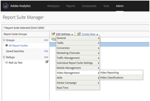
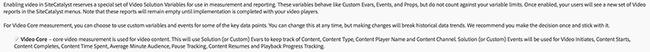
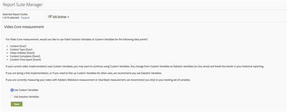
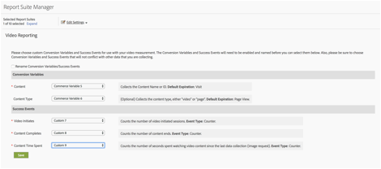

# Milestone overview{#milestone-overview}

>[!CAUTION]
>
>This measurement option has been deprecated.

[Legacy Milestone documentation](milestone_analytics_video.pdf)

## Configuration {#configuration}

### Milestone Video Configuration

To track video, designate a set of *Custom Conversion Variables* (eVars) and *Custom Events* for use in tracking and reporting. One *Custom Insight* variable ( `s.prop` ) is also used for pathing.

The variables you select for each metric are added to the video configuration page. This lets the system automatically generate and format the standard video reports. The *video name* eVar and the *video views* counter are both required. Other variables are optional but recommended for complete measurement. After video tracking is enabled, you can view reports generated from video data you have reported using video tracking.

You can also track any number of additional metrics for video. For example, if you use multiple video players on your site, you might populate an eVar with the player name. Some of the variables you select might also be used in other areas of your site. For example, if used across your site, the *content type* variable can let you measure what percentage of your page views are coming from video, and let you relate conversion events to video.

### Milestone Reporting Configuration

To set-up video reporting for a Milestone implementation, go to **[!UICONTROL Admin > Report Suite Manager].** Select the report suite, then choose **[!UICONTROL Video Management > Video Reporting]:**

<!--
{width="248"}
-->



On the first screen, only Video Core will work with Milestone data. Select **[!UICONTROL Video Core]** and click **[!UICONTROL Save].**



On the next screen, select **[!UICONTROL Use Custom Variables].**

<!--
{width="470"}
-->


On the final screen, select the two eVars and three events to be used with your video measurement:

<!--

-->


## Video variable reference {#video-variable-reference}

The following table contains additional details on the commerce variables and custom events for video:

| Video Metric | Variable Type | Description |
| --- | --- | --- |
| Content | eVar <br/>Default expiration: Visit | (Required) Collects the name of the video, as specified in the implementation.  |
| Content Type | eVar <br/>Default expiration: Page view | Collects data about the type of content viewed by a visitor. Hits sent by video measurement are assigned a content type of `video.` <br/>This variable does not need to be reserved exclusively for video tracking. Having other content report content types using this same variable lets you analyze the distribution of visitors across the different types of content. For example, you could tag other content types using values such as `article` or `product page` using this variable. <br/>From a video measurement perspective, *Content Type* lets you identify video visitors and thereby calculate video conversion rates.  |
| Content Time Spent | Event <br/>Type: Counter | Counts the time, in seconds, spent watching a video since the last data collection process (image request).  |
| Video Initiates | Event <br/>Type: Counter | Indicates that a visitor has viewed some portion of a video. However, it does not provide any information about how much, or what part, of a video the visitor viewed.  |
| Video Completes | Event <br/>Type: Counter | Indicates that a user has viewed a complete video. By default, the complete event is measured 1 second before the end of the video.  <br/>During implementation, you can specify how many seconds from the end of the video you would like to consider a view complete. For live video and other streams that don't have a defined end, you can specify a custom point to measure completes. For example, after a specific time viewed.  |

## Media Module variables {#media-module-variables}

The following variables let you configure video measurement. You must define values for the variables in the Required Variables table. Additionally, to track events in your video player, you must enable autoTrack (for supported players) or implement custom player event tracking using the open, play, stop, and close methods.

| Variable&nbsp;&nbsp;&nbsp; | Description |
| --- | --- |
| `Media.trackUsingContextData` | **Syntax:** <br/><br/> `s.Media.trackUsingContextData = true;` <br/>This option enables integrated video tracking. When set to true, the media module generates context data for media tracking, instead of the legacy `pev3`. <br/>Use `Media.contextDataMapping` to map the context data to the selected eVars and Events.<br/>Default value: `false` |
| `Media.contextDataMapping` | **Syntax:** <br/><br/> `s.Media.contextDataMapping = {`<br/> &nbsp;&nbsp;&nbsp;&nbsp; `"a.media.name":"eVar2, prop2",` <br/>&nbsp;&nbsp;&nbsp;&nbsp; `"a.media.segment":"eVar3",` <br/>&nbsp;&nbsp;&nbsp;&nbsp; `"a.contentType":"eVar1",` <br/>&nbsp;&nbsp;&nbsp;&nbsp; `"a.media.timePlayed":"event3",` <br/>&nbsp;&nbsp;&nbsp;&nbsp; `"a.media.view":"event1",` <br/>&nbsp;&nbsp;&nbsp;&nbsp; `"a.media.segmentView":"event2",` <br/>&nbsp;&nbsp;&nbsp;&nbsp; `"a.media.complete":"event7",` <br/>&nbsp;&nbsp;&nbsp;&nbsp; `"a.media.milestones":{` <br/>&nbsp;&nbsp;&nbsp;&nbsp;&nbsp;&nbsp;&nbsp;&nbsp; `25:"event4",` <br/>&nbsp;&nbsp;&nbsp;&nbsp;&nbsp;&nbsp;&nbsp;&nbsp; `50:"event5",` <br/>&nbsp;&nbsp;&nbsp;&nbsp;&nbsp;&nbsp;&nbsp;&nbsp; `75:"event6"` <br/>&nbsp;&nbsp;&nbsp;&nbsp; ` }` <br/> `};` <br/><br/>An object that defines variable mapping to eVars and Events that you want to use for video measurement. The object must map the following fields: <br/><br/> **a.media.name:** (Required) Populates variables with the video name. Provide the eVar that you selected to store the video name, and the Custom Insight Video variable ( `s.prop` ) you want to use for video pathing. Provide the values in a comma-separated list. <br/><br/> **a.media.segment:** (Optional) The eVar that you want to store the media segment name. a.contentType: (Optional) The eVar that you want to store the video value, which contains visit and visitor tracking enabled to generate video visit and visitor reporting. The variable you select is likely already used to store data such as article slide show or product page <br/><br/> **a.media.view:** (Required) The Event that you want to count media views. <br/><br/> **a.media.segmentView:** (Optional) The Event that you want to count segment views. <br/><br/> **a.media.complete:** (Optional) The Event that you want to count complete views. <br/><br/> **a.media.timePlayed:** (Optional, highly recommended) The numeric Event that you want to store the number of video seconds played. <br/><br/> **a.media.milestones:** (Optional) An object that maps s.Media.trackMilestones milestones to counter Events. Media.segmentByMilestones should be set to true if you define milestones. <br/><br/> **Ad tracking** To track ads, the following context data variables are available: <br/> **a.media.ad.name:** (Required) Populates variables with the ad name. Provide the eVar that you selected to store the ad name, and the Custom Insight Video variable ( `s.prop` ) you want to use for pathing. Provide the values in a comma-separated list. <br/><br/> **a.media.ad.pod:** The position in the primary content the ad was played. <br/><br/> **a.media.ad.podPosition:** The position within the pod where the ad is played. <br/><br/> **a.media.ad.CPM:** The CPM or encrypted CPM (prefixed with a "~") that applies to this playback. <br/><br/> **a.media.ad.view:** Works the same as `a.media.view` <br/><br/> **a.media.ad.clicked:** Count the number of clicks for the ad (`Media.click` calls) <br/><br/> **a.media.ad.timePlayed:** Works the same as `a.media.timePlayed` <br/><br/> **a.media.ad.complete:** Works the same as `a.media.complete` a.media.ad.segment: Works the same as `a.media.segment` <br/><br/> **a.media.ad.segmentView:** Works the same as `a.media.segmentView` <br/><br/> **a.media.ad.milestones:** Works the same as `a.media.milestones` <br/><br/> **a.media.ad.offsetMilestones:** Works the same as `a.media.offsetMilestones` |
| `Media.trackVars` | **Syntax:** <br/><br/> `s.Media.trackVars =` <br/> &nbsp;&nbsp; `"events,` `prop2,` `eVar1,` `eVar2,` `eVar3";` <br/><br/>A comma-separated list of all variables that are set in your video tracking code.  |
| `Media.trackEvents` | **Syntax:** <br/><br/> `s.Media.trackEvents =` <br/> &nbsp;&nbsp; `"event1,` `event2,` `event3,` `event4,` `event5,` `event6,` `event7"` <br/><br/>A comma-separated list of all events that are set in your video tracking code.  | 

## Optional variables {#optional-variables}

| &nbsp;Variable&nbsp;&nbsp;&nbsp; | Description |
| --- | --- |
| `Media.autoTrack` | **Syntax:** <br/><br/> `s.Media.autoTrack = true` <br/><br/>Enables automatic tracking for supported players. Supported players are as follows: <ul> <li> Open Source Media Framework (OSMF) </li> <li> FLVPlayback (Video players created by the import video wizard in Flash Professional) </li> <li> Silverlight </li> <li> MediaDisplay </li> <li> MediaPlayback </li> <li> Brightcove API versions 2 & 3 ( see [Brightcove](https://experienceleague.adobe.com/docs/media-analytics/using/media-overview.html)) </li> <li> Windows Media Player, Quicktime, or Real Player using JavaScript </li> </ul> <br/><br/>If you are not using one of the above players you can use `Media.open` `Media.play` `Media.stop` `Media.close` to track player events.|
| `Media.autoTrackNetStreams` | **Syntax:** <br/><br/> `s.Media.autoTrackNetStreams = true` <br/><br/>Flash 10.3 introduced new functionality to the NetStream component that enables enhanced video tracking. If you are using a custom Flash NetStream player you can enable this variable to enable functionality similar to autoTrack. This method requires that videos are viewed in Flash 10.3 or later.  |
| `Media.completeByCloseOffset` | **Syntax:** <br/><br/> <br/><br/>`s.Media.completeByCloseOffset = true` <br/><br/>This setting lets you count a complete video view a few seconds before the actual end of the video.  <br/><br/>The event is sent based on the number of seconds specified in `completeCloseOffsetThreshold`. This lets you measure completes in video players that never report an offset equal to the length of the video.<br/><br/>By default, this value is set to true and the threshold is set to 1 second. With these defaults the complete event is sent 1 second before the end of the video.  |
| `Media.completeCloseOffsetThreshold` | **Syntax:** <br/><br/> `s.Media.completeCloseOffsetThreshold = 1` <br/><br/>This threshold lets you count a complete video view a few seconds before the actual end of the video.  `Media.completeByCloseOffset` must be set to true to use this threshold.<br/><br/>The integer value you supply determines how far off in seconds the offset can be from the length of the video at close and still count as a complete. This lets you measure completes in video players that never report an offset equal to the length of the video.  <br/><br/>The default threshold is 1 second.  |
| `Media.playerName` | **Syntax:** <br/><br/> `s.Media.playerName = "Custom Player Name"` <br/><br/>Specifies a custom video player name.  |
| `Media.trackSeconds` | **Syntax:** <br/><br/> `s.Media.trackSeconds = 15` <br/><br/>Defines the interval, in seconds, for sending video tracking data to Adobe data collection servers while the video is playing. The value must be set in increments of 5 seconds. <br/><br/> Enabling `Media.trackSeconds` triggers only the events that are defined in `Media.contextDataMapping`. To send additional variables outside of those specified for video measurement, you must use Media.Monitor. |
| `Media.trackMilestones` | Tracks milestones as percentage of the video length.  <br/><br/> **Syntax:** <br/><br/> `s.Media.trackMilestones = "25, 50, 75";` <br/><br/>Defines the interval, as a percentage of the video length, for sending video tracking data to Adobe data collection servers. Specify the milestones as a comma-separated list of whole numbers. For example: 10 = 10%, 23 = 23%.  <br/><br/>Because these milestones are fixed points in the video, if a visitor views past the 10% milestone, then rewinds and passes the 10% milestone again, the media module sends the tracking data multiple times. Similarly, if a visitor fast forwards past a milestone, the media module does not send the tracking data for that milestone.  <br/><br/>Enabling `Media.trackMilestones` triggers only the events that are defined in `Media.contextDataMapping`. To send additional variables outside of those specified for video measurement, you must use Media.Monitor. |
| `Media.trackOffsetMilestones` | Tracks milestones as seconds elapsed from the beginning of the video.  <br/><br/> **Syntax:** <br/><br/> `s.Media.trackOffsetMilestones = "20, 40, 60";` <br/><br/>Defines the interval, as seconds elapsed from the beginning of the video, for sending video tracking data to Adobe data collection servers. Specify the milestones as a comma-separated list of whole numbers. For example: 20 = 20 seconds, 40 = 40 seconds).  <br/><br/>Because these milestones are fixed points in the video, if a visitor views past the 20 seconds milestone, then rewinds and passes the 20 seconds milestone again, the media module sends the tracking data multiple times. Similarly, if a visitor fast forwards past a milestone, the media module does not send the tracking data for that milestone.  <br/><br/> Enabling `Media.trackOffsetMilestones` triggers only the events that are defined in `Media.contextDataMapping`. To send additional variables outside of those specified for video measurement, you must use Media.Monitor. |
| `Media.segmentByMilestones` | **Syntax:** <br/><br/> `s.Media.segmentByMilestones = true;` <br/><br/>Automatically generates the segment name, segment number, and segment length data, based on the length of the media and the milestones specified in `Media.trackMilestones` <br/><br/>Segmenting by milestones is the only way to define segments when using `autoTrack`. <br/><br/>Default value: `false` |
| `Media.segmentByOffsetMilestones` | **Syntax:** <br/><br/> `s.Media.segmentByOffsetMilestones = true;` <br/><br/>Automatically generates the segment name, segment number, and segment length data, based on the length of the media and the milestones specified in `Media.trackOffsetMilestones` <br/><br/>Segmenting by milestones is the only way to define segments when using `autoTrack`.  <br/><br/>Default value: `false` |

## Ad Tracking variables {#ad-tracking-variables}

These variables are used to send ad information in conjunction with the openAd method. See [VAST Video Ad Tracking.](https://experienceleague.adobe.com/docs/media-analytics/using/media-overview.html)

| Variable&nbsp;&nbsp;&nbsp; | Description |
| --- | --- |
| `Media.adTrackSeconds` | **Syntax:** <br/><br/> `s.Media.adTrackSeconds = 15;` <br/><br/>Defines the interval, in seconds, for sending video ad tracking data to Adobe data collection servers while the video is playing. The value must be set in increments of 5 seconds.  <br/><br/> Enabling `Media.adTrackSeconds` triggers only the events that are defined in `Media.contextDataMapping`. To send additional variables outside of those specified for video measurement, you must use `Media.monitor`.|
| `Media.adTrackMilestones` | Tracks ad milestones as percentage of the ad length.  <br/><br/> **Syntax:** <br/><br/> `s.Media.adTrackMilestones = "25, 50, 75";` <br/><br/>Defines the interval, as a percentage of the ad length, for sending ad tracking data to Adobe data collection servers. Specify the milestones as a comma-separated list of whole numbers. For example: 10 = 10%, 23 = 23%).  <br/><br/>Because these milestones are fixed points in the ad, if a visitor views past the 10% milestone, then rewinds and passes the 10% milestone again, the media module sends the tracking data multiple times. Similarly, if a visitor fast forwards past a milestone, the media module does not send the tracking data for that milestone.  <br/><br/> Enabling `Media.adTrackMilestones` triggers only the events that are defined in `Media.contextDataMapping`. To send additional variables outside of those specified for video measurement, you must use `Media.monitor`.|
| `Media.adTrackOffsetMilestones` | Tracks ad milestones as seconds elapsed from the beginning of the ad.  <br/><br/> **Syntax:** <br/><br/> `s.Media.adTrackOffsetMilestones = "20, 40, 60";` <br/><br/>Defines the interval, as seconds elapsed from the beginning of the ad, for sending ad tracking data to Adobe data collection servers. Specify the milestones as a comma-separated list of whole numbers. For example: 20 = 20 seconds, 40 = 40 seconds).  <br/><br/>Because these milestones are fixed points in the ad, if a visitor views past the 20 seconds milestone, then rewinds and passes the 20 seconds milestone again, the media module sends the tracking data multiple times. Similarly, if a visitor fast forwards past a milestone, the media module does not send the tracking data for that milestone.  <br/><br/> Enabling `Media.adTrackOffsetMilestones` triggers only the events that are defined in `Media.contextDataMapping`. To send additional variables outside of those specified for video measurement, you must use `Media.monitor`.|
| `Media.adSegmentByMilestones` | **Syntax:** <br/><br/> `s.Media.adSegmentByMilestones = true;` <br/><br/>Automatically generates the segment name, segment number, and segment length data, based on the length of the media and the milestones specified in `Media.adTrackMilestones` <br/><br/>Segmenting by milestones is the only way to define segments when using `autoTrack`.  <br/><br/>Default value: `false` |
| `Media.adSegmentByOffsetMilestones` | **Syntax:** <br/><br/> `s.Media.adSegmentByOffsetMilestones = true;` <br/><br/>Automatically generates the segment name, segment number, and segment length data, based on the length of the media and the milestones specified in `Media.adTrackOffsetMilestones` <br/><br/>Segmenting by milestones is the only way to define segments when using `autoTrack`. <br/><br/>Default value: `false` | 

## Media Module methods {#media-module-methods}

The media module methods are used to manually tracking player events and to track additional metrics that are not part of the standard video reports.

If you are using `Media.autoTrack` and are not tracking additional metrics, you do not need to call any of these methods directly. All arguments are required unless specified as optional.

| Method&nbsp;&nbsp;&nbsp; | Description |
| --- | --- |
| `Media.open` | **Syntax:** <br/><br/> `s.Media.open(mediaName, mediaLength, mediaPlayerName)` <br/><br/>Prepares the media module to collect video tracking data. This method takes the following parameters: <ul><li> **mediaName:** (Required) The name of the video as you want it to appear in video reports. </li><li>  **mediaLength:** (Required) The length of the video in seconds.  </li><li> **mediaPlayerName:** (Required) The name of the media player used to view the video, as you want it to appear in video reports. </li></ul> |
| `Media.openAd` | **Syntax:** <br/><br/> `s.Media.openAd(name, length, playerName, parentName,`<br/>&nbsp;&nbsp; `parentPod, parentPodPosition, CPM)` <br/><br/>Prepares the media module to collect ad tracking data. This method takes the following parameters: <ul> <li> **name:** (Required) The name or ID of the ad.  </li> <li> **length:** (Required) The length of the ad.  </li> <li> **playerName:** (Required) The name of the media player used to view the ad.  </li> <li> **parentName:** The name or ID of the primary content where the ad is embedded.  </li> <li> **parentPod:** The position in the primary content the ad was played.  </li> <li> **parentPodPosition:** The position within the pod where the ad is played.  </li> <li> **CPM:** The CPM or encrypted CPM (prefixed with a "~") that applies to this playback.  </li> </ul> |
| `Media.click` | **Syntax:** <br/><br/> `s.Media.click(name, offset)` <br/><br/>Track when an ad is clicked in a video. This method takes the following parameters: <ul> <li> **name:** The name of the ad. This must match the name used in Media.openAd.  </li> <li> **offset:** The offset into the ad when the click occurred.  </li> </ul> |
| `Media.close` | **Syntax:** <br/><br/> `s.Media.close(mediaName)` <br/><br/>Ends video data collection and sends information to Adobe data collection servers. Call this method at the end of the video. This method takes the following parameter: <br/><br/> **mediaName:** The name of the video. This must match the name used in `Media.open`. |
| `Media.complete` | **Syntax:** <br/><br/> `s.Media.complete(name, offset)` <br/><br/>This method manually tracks a complete event. This method is used when you need to trigger events using special logic that can't be handled using `Media.completeByCloseOffset`. <br/><br/>For example, if you are measuring a live stream that has no defined end, you might trigger a complete after a user views a live stream for X seconds. You might measure a complete using a percentage calculation based on the length and type of content. This method takes the following parameters: <ul> <li> **mediaName:** The name of the video. This must match the name used in Media.open.  </li> <li> **mediaOffset:** The number of seconds into the video when the complete event should be sent. Specify the offset based on the video starting at second zero. <br/><br/>If your media player tracks using milliseconds, make sure the value is converted to seconds before you call Media.complete.  </li> </ul> If you plan to call complete manually, set <br/><br/> `s.Media.completeByCloseOffset = false`. |
| `Media.play` | **Syntax:** <br/><br/> `s.Media.play(name, offset, segmentNum, segment, segmentLength)` <br/><br/>Call this method anytime a video starts playing. When using manual video measurement, you can provide the current segment data when sending video measurement data.  <br/><br/>If your player changes from one segment to another, for whatever reason, you should call `Media.stop` `Media.play`. <br/><br/>This method takes the following parameters: <br/><br/> **mediaName:** The name of the video. This must match the name used in Media.open.  <br/><br/> **mediaOffset:** The number of seconds into the video that play begins. Specify the offset based on the video starting at second zero. If your media player tracks using milliseconds, make sure the value is converted to seconds before you call Media.play.  <br/><br/> **segmentNum:** (Optional) The current segment number, which marketing reports use to order the display of segments in reports. The segmentNum parameter must be greater than zero.  <br/><br/> **segment:** (Optional) The current segment name.  <br/><br/> **segmentLength:** (Optional) <br/><br/>The current segment length, in seconds.  <br/><br/>For example: <br/><br/> `s.Media.play("My Video", 1800, 2,"Second Quarter", 1800)` <br/><br/> `s.Media.play("My Video", 0, 1,"Preroll", 30)` |
| `Media.stop` | **Syntax:** <br/><br/> `s.Media.stop(mediaName, mediaOffset)` <br/><br/>Tracks a stop event (stop, pause, etc.) for the specified video. This method takes the following parameters: <ul> <li> **mediaName:** The name of the video. This must match the name used in `Media.open`.  </li> <li> **mediaOffset:** The number of seconds into the video that the stop or pause event occurs. Specify the offset based on the video starting at second zero.  </li> </ul> |
| `Media.monitor` | **Syntax:** <br/><br/> `s.Media.monitor(s, media)` <br/><br/> **Silverlight Syntax:** <br/><br/> `s.Media.monitor =` <br/>&nbsp;&nbsp; `new AppMeasurement_Media_Monitor(myMediaMonitor);` <br/><br/>The Silverlight app media monitor implements the Objective-C delegate design pattern. The `myMediaMonitor` class method takes the `s` and `media` parameters. <br/><br/>Use this method to send additional video metrics. You can setup additional variables (Props, eVars, Events) and send them using `Media.track` based on the current state of the video as it is playing. <br/><br/>See [Measuring Additional Metrics using Media.monitor.](https://experienceleague.adobe.com/docs/media-analytics/using/media-overview.html) <br/><br/>This method takes the following parameters: <br/><br/>  **s:** The `AppMeasurement` instance (or JavaScript `s` object). <br/><br/> **media:** An object with members providing the state of the video. These members include:  <ul><li> `media.name:` The name of the video. This must match the name used in `Media.open`; </li><li> `media.length:` The length of the video in seconds given in the call to `Media.open`; </li><li> `media.playerName:` The name of the media player given in the call to `Media.open`; </li><li> `media.openTime:` An NSDate object containing data about when `Media.open` was called; </li><li> `media.offset:` The current offset, in seconds, (actual point in the video) into the video. The offset starts at zero (the first second of the video is second 0); </li><li> `media.percent:` The current percentage of the video that has played, based on the video length and the current offset.;  </li><li> `media.timePlayed:` The total number of seconds played so far;  </li><li> `media.eventFirstTime:` Indicates if this was the first time this media event was called for this video; </li><li> `media.mediaEvent:` A string containing the event name that caused the monitor call. </li></ul> |
| | `media.mediaEvent` events: <ul><li> `OPEN:` When playback is first observed through `Media.autoTrack` or a call to `Media.play`; </li><li> `CLOSE:` When playback ends at the completion of the video through `Media.autoTrack` or at a call to `Media.close`;</li><li> `PLAY:` When playback resumes after being paused or scrubbing through `Media.autoTrack` or a second call to `Media.play`;</li><li> `STOP:` When playback stops due to a pause of the beginning of scrubbing through `Media.autoTrack` or a call to `Media.stop`;</li><li> `MONITOR:` When our automatic monitoring checks the state of the video while it's playing (every second);</li><li> `SECONDS:` At the second interval defined by the `Media.trackSeconds` variable;</li><li> `MILESTONE:` At the milestones defined by the `Media.trackMilestones` variable; </li></ul> |
| `Media.track` | **Syntax:** <br/><br/> `s.Media.track(mediaName)` <br/><br/>Immediately sends the current video state, along with any `Media.trackVars` and Media.trackEvents you've defined. This method is used within `Media.monitor`. <br/><br/>See [Measuring Additional Metrics using Media.monitor.](https://experienceleague.adobe.com/docs/media-analytics/using/media-overview.html) <br/><br/>Call `Media.open` and `Media.play` on the video before calling this method. This method takes the following parameter: <ul> <li> **mediaName**: The name of the video. This must match the name used in `Media.open`.</li> </ul> This method is the only way to send additional variables while the video is playing. It resets the seconds interval and percent milestone counters to zero to prevent multiple tracking hits.  | 


## Track video player events {#track-video-player-events}

You can track media players by creating functions attached to the video player event handlers. This lets you call `Media.open`, `Media.play`, `Media.stop`, and `Media.close` at the appropriate times. For example:

* **Load:** Call `Media.open` and `Media.play`
* **Pause:** Call `Media.stop`. For example, if a user pauses a video after 15 seconds, call `s.Media.stop("Video1", 15)`
* **Buffer:** Call `Media.stop` while the video buffers. Call `Media.play` when playback resumes.
* **Resume:** Call `Media.play`. For example, when a user resumes a video after initially playing 15 seconds of the video, call `s.Media.play("Video1", 15)`.
* **Scrub (slider):** When the user drags the video slider, call `Media.stop`. When the user releases the video slider, call `Media.play`.
* **End:** Call `Media.stop`, then `Media.close`. For example, at the end of a 100-second video, call `s.Media.stop("Video1", 100)`, then `s.Media.close("Video1")`.

To accomplish this, you can define four custom functions that you can call from the media player event handlers. The various parameters passed into `Media.open`, `Media.play`, `Media.stop`, and `Media.close` come from the player. The following pseudocode demonstrates how this might be done:

```javascript
/* Call on video load */ 
function startMovie() { 
    s.Media.open(mediaName, mediaLength, mediaPlayerName); 
    playMovie(); 
} 
 
/* Call on video resume from pause and slider release */ 
function playMovie() { 
    s.Media.play(mediaName, 
                 mediaOffset,  
                 segmentNum,  
                 segment,  
                 segmentLength); 
} 
/* Call on video pause and slider grab */ 
function stopMovie() { 
    s.Media.stop(mediaName, mediaOffset); 
} 
 
/* Call on video end */ 
/* Measuring Video for Developers 43 */ 
function endMovie() { 
    stopMovie(); 
    s.Media.close(mediaName); 
} 

```

## JavaScript autotrack {#javascript-autotrack}

The JavaScript media module identifies all `<embed>` or `<object>` tags in the page HTML. It then searches the data in each tag to determine which media player, if any, is being used. If the player is Windows Media Player, Quicktime, or Real Player, `autoTrack` can be used, though `autoTrack` for Windows media player works only with Internet Explorer. Manual tracking for Windows Media Player is required to support all other browsers.

You must have the `classid` attribute set on the object you want to track. The `classid` is required to expose the event handlers used by the Media Module to automatically track the video.

```javascript
s.Media.autoTrack = true
```

## JavaScript sample code {#javascript-sample-code}

```javascript
// Sample implementation 
s.usePlugins=true 
function s_doPlugins(s) { 
    /* Add manual calls to modules and plugins here */ 
} 
 
s.doPlugins=s_doPlugins 
 
/*********Media Module Calls**************/ 
s.loadModule("Media") 
 
/*Configure Media Module Functions */ 
s.Media.autoTrack= true; 
s.Media.trackVars="events, prop2, eVar1, eVar2, eVar3"; 
s.Media.trackEvents="event1, event2, event3, event4, event5, event6, event7" 
s.Media.trackMilestones="25, 50, 75"; 
s.Media.playerName="My Media Player"; 
s.Media.segmentByMilestones = true; 
s.Media.trackUsingContextData = true; 
s.Media.contextDataMapping = { 
    "a.media.name":"eVar2, prop2", 
    "a.media.segment":"eVar3", 
    "a.contentType":"eVar1", 
    "a.media.timePlayed":"event3", 
    "a.media.view":"event1", 
    "a.media.segmentView":"event2", 
    "a.media.complete":"event7", 
    "a.media.milestones":{ 
        25:"event4", 
        50:"event5", 
        75:"event6" 
    } 
} 
 
s.Media.monitor = function (s, media) { } //If Needed

/* Turn on and configure debugging here */ 
s.debugTracking = true; 
s.trackLocal = true; 
 
/* WARNING: Changing any of the below variables will cause drastic changes to how your visitor 
data is collected. Changes should only be made when instructed to do so by your account 
manager.*/ 
s.visitorNamespace = "yourNamespace"; 
s.trackingServer="metrics.mysite.com" //Use only if using first party cookies 
s.trackingServerSecure="smetrics.mysite.com" // Use only if using first party cookies in  
                                             // conjunction with SSL 
s.dc = '122'; 
 
/************************** PLUGINS SECTION *************************/ 
/* Insert any plugins code you want to use here. */ 
 
/****************************** MODULES *****************************/ 
/* Insert the media module tracking code here. */ 

```
