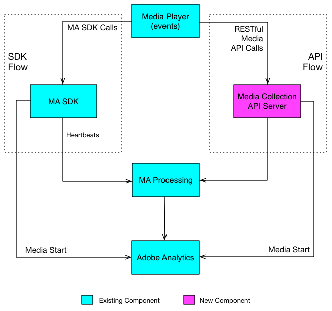

# Overview{#overview}

## Introduction {#section_ill_jj3_vbb}

The Media Collection API is Adobe's RESTful alternative to the client-side Media SDK. With the Media Collection API your player can track audio and video events using RESTful HTTP calls. The Media Collection API offers the same realtime tracking of the Media SDK, plus one additional feature:

* **Downloaded Content Tracking** 

   This feature provides you with the ability to track media while a user is offline, through local storing of event data until the user's device returns online. (See [Track downloaded content](track-downloaded-content.md) for details.)

The Media Collection API is essentially an adapter, acting as a server-side version of the Media SDK. This means that some aspects of the Media SDK documentation are also relevant to the Media Collection API. For example, both solutions use the same [Audio and Video Parameters](../metrics-and-metadata/audio-video-parameters.md), and the collected Audio and Video tracking data leads to the same [Reporting and Analysis.](../media-reports/media-reports-enable.md)

## Media Tracking Data Flows {#section_pwq_n34_qbb}

A media player implementing the Media Collection API makes RESTful API tracking calls directly to the media tracking back-end server, whereas a player implementing the Media SDK makes tracking calls to the SDK APIs inside the player app. One effect of making calls over the web is that the player implementing the Media Collection API needs to handle some of the processing that the Media SDK handles automatically. (Details in [Media Collection Implementation.](mc-api-impl/mc-api-quick-start.md))

The tracking data captured with the Media Collection API is sent and initially processed differently than the tracking data captured in a Media SDK player, but the same processing engine on the back-end is used for both solutions.



## API Overview {#section_y4n_mcl_kcb}

**URI:** Obtain this from your Adobe representative.

**HTTP Method:** POST, with JSON request body.

### API Calls {#mc-api-calls}

* **`sessions` -** Establishes a session with the server, and returns a Session ID used in subsequent `events` calls. Your app calls this once at the start of a tracking session. 

  ```
  {uri}/api/v1/sessions
  ```

* **`events` -** Sends media tracking data. 

  ```
  {uri}/api/v1/sessions/{session-id}/events
  ```

### Request Body {#mc-api-request-body}

```
{ 
    "playerTime": { 
        "playhead": {playhead position in seconds}, 
        "ts": {timestamp in milliseconds} 
    }, 
    "eventType": {event-type}, 
    "params": { 
        {parameter-name}: {parameter-value}, 
        ... 
        {parameter-name}: {parameter-value} 
    }, 
    "qoeData" : { 
        {parameter-name}: {parameter-value}, 
        ... 
        {parameter-name}: {parameter-value} 
    }, 
    "customMetadata": { 
        {parameter-name}: {parameter-value}, 
        ... 
        {parameter-name}: {parameter-value} 
    } 
} 

```

* `playerTime` - Mandatory for all requests.
* `eventType` - Mandatory for all requests. 
* `params` - Mandatory for certain `eventTypes`; check the [JSON validation schema](mc-api-ref/mc-api-json-validation.md) to determine which eventTypes are mandatory, and which are optional. 

* `qoeData` - Optional for all requests.
* `customMetadata` - Optional for all requests, but only sent with `sessionStart`, `adStart`, and `chapterStart` event types.

For each `eventType`, there is a publicly available [JSON validation schema](mc-api-ref/mc-api-json-validation.md) that you should use to verify parameter types and whether a parameter is optional or required for a particular event.

### Event Types {#mc-api-event-types}

* `sessionStart`
* `play`
* `ping`
* `pauseStart`
* `bufferStart`
* `adStart` 
* `adComplete` 
* `adSkip` 
* `adBreakStart` 
* `adBreakComplete` 
* `chapterStart`
* `chapterSkip`
* `chapterComplete`
* `sessionEnd`
* `sessionComplete`

