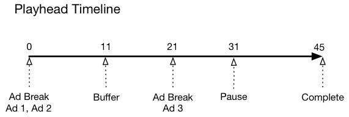
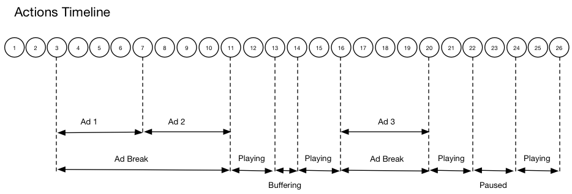

# Timeline 1 - View to end of content{#timeline-view-to-end-of-content}

## VOD, pre-roll ads, pausing, buffering, viewing content to the end

The following diagrams illustrate the playhead timeline and the corresonding timeline of a user's actions. The details for each action and its accompanying requests are presented below.








## Action details

### Action 1 - Start session {#Action-1}

| Action | Action Timeline (Seconds) | Playhead position (Seconds) | Client Request |
| --- | :---: | :---: | --- |
| Auto-play or Play button pressed, video starts loading.  | 0 | 0 | `/api/v1/sessions` |

**Implementation Detail**

This call signals _the user's intention to play_ a video. <br/><br/>It returns a Session ID ( `{sid}`) to the client that is used to identify all subsequent tracking calls within the session. The player state is not yet "playing", but is instead "starting". <br/><br/>[Mandatory session parameters ](/help/media-collection-api/mc-api-ref/mc-api-sessions-req.md) must be included in the `params` map in the request body. <br/><br/>On the backend, this call generates an Adobe Analytics initiate call.

**Sample request body**

```
{
    playerTime: {
        playhead: 0, ts: <timestamp>
    },
    eventType:sessionStart, params: {
        "media.playerName": "sample-html5-api-player",
        "analytics.trackingServer": "[ _YOUR_TS_ ]",
        "analytics.reportSuite": "[ _YOUR_RSID_ ]",
        "analytics.visitorId": "[ _YOUR_VISITOR_ID_ ]",
        "media.contentType": "VOD",
        "media.length": 60.3333333333333,
        "media.id": "VA API Sample Player",
        "visitor.marketingCloudOrgId": "[YOUR_MCID]",
        "media.name": "ClickMe",
        "media.channel": "sample-channel",
        "media.sdkVersion": "va-api-0.0.0",
        "analytics.enableSSL": false
    }
}
```

### Action 2 - Ping timer start {#Action-2}

| Action | Action Timeline (Seconds) | Playhead position (Seconds) | Client Request |
| --- | :---: | :---: | --- |
| App starts ping event timer | 0 | 0 | `/api/v1/sessions/{sid}/events` | |

**Implementation Details**

Start your app's ping timer. First ping event should then fire 1 second in if there are pre-roll ads, 10 seconds in otherwise.  

### Action 3 - Ad break start {#Action-3}

| Action | Action Timeline (Seconds) | Playhead position (Seconds) | Client Request |
| --- | :---: | :---: | --- |
| Track pre-roll ad break start | 0 | 0 | `/api/v1/sessions/{sid}/events` |

**Implementation Detail**

Ads can only be tracked within an ad break.

**Sample request body**

```
{
    playerTime: {
        playhead: 0,
        ts: <timestamp>
    },
    eventType:adBreakStart, params: {
        "media.ad.podFriendlyName": "ad_pod1",
        "media.ad.podIndex": 0,
        "media.ad.podSecond": 0
    }
}
```

### Action 4 - Ad start {#Action-4}

| Action | Action Timeline (Seconds) | Playhead position (Seconds) | Client Request |
| --- | :---: | :---: | --- |
| Track pre-roll Ad #1 start | 0 | 0 | `/api/v1/sessions/{sid}/events` |

**Implementation Detail**

Start tracking the first pre-roll ad, which is 15 seconds long. Including custom metadata with this `adStart` .

**Sample request body**

```
{
    playerTime: {
        playhead: 0,
        ts: &lt;timestamp&gt;
    },
    eventType:adStart,
    params: {
        "media.ad.podFriendlyName": "ad_pod1",
        "media.ad.name": "Ad 1",
        "media.ad.id": "001",
        "media.ad.length": 15,
        "media.ad.podPosition": 1,
        "media.ad.playerName": "Sample Player",
        "media.ad.advertiser": "Ad Guys",
        "media.ad.campaignId": "1",
        "media.ad.creativeId": "42",
        "media.ad.siteId": "XYZ",
        "media.ad.creativeURL": "https://xyz_creative.com",
        "media.ad.placementId": "sample_placement"
    },
    customMetadata: {
        "myCustomData1": "CustomData1",
        "myCustomData2": "CustomData2"
    }
}
```

**NOTE: Between AdBreakStart and AdStart events there shouldn't be any additional playback events.**

### Action 5 - Ad pings {#Action-5}

#### Action 5.1 - Ad ping 1 {#Action-5-1}

| Action | Action Timeline (Seconds) | Playhead position (Seconds) | Client Request |
| --- | :---: | :---: | --- |
| App sends ping event | 1 | 0 | `/api/v1/sessions/{sid}/events` |

**Implementation Detail**

Ping the backend every 1 second while inside an ad.

**Sample request body**

```
{
    playerTime: {
        playhead: 0,
        ts: <timestamp>
    },
    eventType:ping
}
```

#### Action 5.2 - Ad ping 2 {#Action-5-2}

| Action | Action Timeline (Seconds) | Playhead position (Seconds) | Client Request |
| --- | :---: | :---: | --- |
| App sends ping event | 2 | 0 | `/api/v1/sessions/{sid}/events` |

**Implementation Detail**

Ping the backend every 1 second while inside an ad.

**Sample request body**

```
{
    playerTime: {
        playhead: 0,
        ts: <timestamp>
    },
    eventType:ping
}
```

#### Action 5.3 - Ad ping 3 {#Action-5-3}


| Action | Action Timeline (Seconds) | Playhead position (Seconds) | Client Request |
| --- | :---: | :---: | --- |
| App sends ping event | 3 | 0 | `/api/v1/sessions/{sid}/events` |

**Implementation Detail**

Ping the backend every 1 second while inside an ad.

>[!NOTE]
>
>Subsequent ads in the timeline will skip showing the series of one-second pings
>in the interest of brevity...

**Sample request body**

```
{
    playerTime: {
        playhead: 0,
        ts: <timestamp>
    },
    eventType:ping
}
```

### Action 6 - Ad complete {#Action-6}

| Action | Action Timeline (Seconds) | Playhead position (Seconds) | Client Request |
| --- | :---: | :---: | --- |
| Track pre-roll Ad #1 complete | 15 | 0 | `/api/v1/sessions/{sid}/events` |

**Implementation Detail**

Track the end of the first pre-roll ad.

**Sample request body**

```
{
    playerTime: {
        playhead: 0,
        ts: <timestamp>
    },
    eventType:adComplete
}
```

### Action 7 - Ad start {#Action-7}

| Action | Action Timeline (Seconds) | Playhead position (Seconds) | Client Request |
| --- | :---: | :---: | --- |
| Track pre-roll Ad #2 start | 15 | 0 | `/api/v1/sessions/{sid}/events` |

**Implementation Detail**

Track the start of the second pre-roll ad, which is 7 seconds long.

**Sample request body**

```
{
    playerTime: {
        playhead: 0,
        ts: <timestamp>
    },
    eventType:adStart, params: {
        "media.ad.podFriendlyName": "ad_pod1",
        "media.ad.name": "Ad 2",
        "media.ad.id": "002",
        "media.ad.length": 7,
        "media.ad.podPosition": 1,
        "media.ad.playerName": "Sample Player",
        "media.ad.advertiser": "Ad Guys",
        "media.ad.campaignId": "2",
        "media.ad.creativeId": "44",
        "media.ad.siteId": "XYZ",
        "media.ad.creativeURL": "https://xyz_creative.com",
        "media.ad.placementId": "sample_placement2"
    },
}
```

### Action 8 - Ad pings {#Action-8}

| Action | Action Timeline (Seconds) | Playhead position (Seconds) | Client Request |
| --- | :---: | :---: | --- |
| App sends ping event | 20 | 0 | `/api/v1/sessions/{sid}/events` |

**Implementation Detail**

Ping the backend every 1 second.

**Sample request body**

```
{
    playerTime: {
        playhead: 0,
        ts: <timestamp>
    },
    eventType:ping
}
```

### Action 9 - Ad complete {#Action-9}

| Action | Action Timeline (Seconds) | Playhead position (Seconds) | Client Request |
| --- | :---: | :---: | --- |
| Track pre-roll Ad #2 complete | 22 | 0 | `/api/v1/sessions/{sid}/events` |

**Implementation Detail**

Track the end of the second pre-roll ad.

**Sample request body**

```
{
    playerTime: {
        playhead: 0,
        ts: <timestamp>
    },
    eventType:adComplete
}
```

### Action 10 - Ad break complete {#Action-10}

| Action | Action Timeline (Seconds) | Playhead position (Seconds) | Client Request |
| --- | :---: | :---: | --- |
| Track pre-roll ad break complete | 22 | 0 | `/api/v1/sessions/{sid}/events` |

**Implementation Detail**

The ad break is over. Throughout the ad break, the play state has remained "playing".

**Sample request body**

```
{
    playerTime: {
        playhead: 0,
        ts: <timestamp>
    },
    eventType:adBreakComplete
}
```

### Action 11 - Play content {#Action-11}

| Action | Action Timeline (Seconds) | Playhead position (Seconds) | Client Request |
| --- | :---: | :---: | --- |
| Track play event | 22 | 0 | `/api/v1/sessions/{sid}/events` |

**Implementation Detail**

After the `adBreakComplete` event, put the player in the "playing" state using the `play` event.

**Sample request body**

```
{
    playerTime: {
        playhead: 0,
        ts: <timestamp>
    },
    eventType:play
}
```

### Action 12 - Ping {#Action-12}

| Action | Action Timeline (Seconds) | Playhead position (Seconds) | Client Request |
| --- | :---: | :---: | --- |
| App sends ping event | 30 | 8 | `/api/v1/sessions/{sid}/events` |

**Implementation Detail**

Ping the backend every 10 seconds.

**Sample request body**

```
{
    playerTime: {
        playhead: 8,
        ts: <timestamp>
    },
    eventType:ping
}
```

### Action 13 - Buffer start {#Action-13}

| Action | Action Timeline (Seconds) | Playhead position (Seconds) | Client Request |
| --- | :---: | :---: | --- |
| Buffer start event occurred | 33 | 11 | `/api/v1/sessions/{sid}/events` |

**Implementation Detail**

Track the player's move to the "buffering" state.

**Sample request body**

```
{
    playerTime: {
        playhead: 11,
        ts: <timestamp>
    }, eventType:bufferStart
}
```

### Action 14 - Buffer end {#Action-14}

| Action | Action Timeline (Seconds) | Playhead position (Seconds) | Client Request |
| --- | :---: | :---: | --- |
| Buffering ended, the app tracks resumption of content | 36 | 11 | `/api/v1/sessions/{sid}/events` |

**Implementation Detail**

Buffering ends after 3 seconds, so put the player back to the "playing" state. You must send another track play event coming out of buffering.  **The `play` call after a `bufferStart` infers a "bufferEnd" call to the back end,** so there is no need for a `bufferEnd` event.

**Sample request body**

```
{
    playerTime: {
        playhead: 11,
        ts: <timestamp>
    },
    eventType:play
}
```

### Action 15 - Ping {#Action-15}

| Action | Action Timeline (Seconds) | Playhead position (Seconds) | Client Request |
| --- | :---: | :---: | --- |
| App sends ping event | 40 | 15 | `/api/v1/sessions/{sid}/events` |

**Implementation Detail**

Ping the backend every 10 seconds.

**Sample request body**

```
{
    playerTime: {
        playhead: 15,
        ts: <timestamp>
    }, eventType:ping
}
```

### Action 16 - Ad break start {#Action-16}

| Action | Action Timeline (Seconds) | Playhead position (Seconds) | Client Request |
| --- | :---: | :---: | --- |
| Track mid-roll ad break start | 46 | 21 | `/api/v1/sessions/{sid}/events` |

**Implementation Detail**

Mid-roll ad of 8 seconds duration: send `adBreakStart` .

**Sample request body**

```
{
    playerTime: {
        playhead: 21,
        ts: <timestamp>
    },
    eventType:adBreakStart,
    params: {
        "media.ad.podFriendlyName": "ad_pod2",
        "media.ad.podIndex": 1,
        "media.ad.podSecond": 21
    }
}
```

### Action 17 - Ad start {#Action-17}

| Action | Action Timeline (Seconds) | Playhead position (Seconds) | Client Request |
| --- | :---: | :---: | --- |
| Track mid-roll Ad #3 start | 46 | 21 | `/api/v1/sessions/{sid}/events` |

**Implementation Detail**

Track the mid-roll ad.

**Sample request body**

```
{
    playerTime: {
        playhead: 21,
        ts: <timestamp>
    },
    eventType:adStart, params: {
        "media.ad.podFriendlyName": "ad_pod2",
        "media.ad.name": "Ad 3",
        "media.ad.id": "003",
        "media.ad.length": 8,
        "media.ad.podPosition": 2,
        "media.ad.playerName": "Sample Player",
        "media.ad.advertiser": "Ad Guys",
        "media.ad.campaignId": "7",
        "media.ad.creativeId": "40",
        "media.ad.siteId": "XYZ",
        "media.ad.creativeURL": "https://xyz_creative.com",
        "media.ad.placementId": "sample_placement2"
    },
}
```

### Action 18 - Ad ping {#Action-18}

| Action | Action Timeline (Seconds) | Playhead position (Seconds) | Client Request |
| --- | :---: | :---: | --- |
| App sends ping event | 50 | 21 | `/api/v1/sessions/{sid}/events` |

**Implementation Detail**

Ping the backend every 10 seconds.

**Sample request body**

```
{
    playerTime: {
        playhead: 21,
        ts: <timestamp>
    }, eventType:ping
}
```

### Action 19 - Ad complete {#Action-19}

| Action | Action Timeline (Seconds) | Playhead position (Seconds) | Client Request |
| --- | :---: | :---: | --- |
| Track mid-roll Ad #1 complete | 54 | 21 | `/api/v1/sessions/{sid}/events` |

**Implementation Detail**

The mid-roll ad is complete.

**Sample request body**

```
{
    playerTime: {
        playhead: 21,
        ts: <timestamp>
    },
    eventType:adComplete
}
```

### Action 20 - Ad break complete {#Action-20}

| Action | Action Timeline (Seconds) | Playhead position (Seconds) | Client Request |
| --- | :---: | :---: | --- |
| Track mid-roll ad break complete | 54 | 21 | `/api/v1/sessions/{sid}/events` |

**Implementation Detail**

The ad break is complete.

**Sample request body**

```
{
    playerTime: {
        playhead: 21,
        ts: <timestamp>
    },
    eventType:adBreakComplete
}
```

### Action 21 - Ping {#Action-21}

| Action | Action Timeline (Seconds) | Playhead position (Seconds) | Client Request |
| --- | :---: | :---: | --- |
| App sends ping event | 60 | 27 | `/api/v1/sessions/{sid}/events` |

**Implementation Detail**

Ping the backend every 10 seconds.

**Sample request body**

```
{
    playerTime: {
        playhead: 27,
        ts: <timestamp>
    },
    eventType:ping
}
```

### Action 22 - Pause {#Action-22}

| Action | Action Timeline (Seconds) | Playhead position (Seconds) | Client Request |
| --- | :---: | :---: | --- |
| User pressed Pause | 64 | 31 | `/api/v1/sessions/{sid}/events` |

**Implementation Detail**

The user's action moves the play state to "paused".

**Sample request body**

```
{
    playerTime: {
        playhead: 31,
        ts: <timestamp>
    },
    eventType:pauseStart
}
```

### Action 23 - Ping {#Action-23}

| Action | Action Timeline (Seconds) | Playhead position (Seconds) | Client Request |
| --- | :---: | :---: | --- |
| App sends ping event | 70 | 31 | `/api/v1/sessions/{sid}/events` |

**Implementation Detail**

Ping the backend every 10 seconds. Player is still in the "buffering" state; the user is stuck at 20 seconds of content. Fuming...

**Sample request body**

```
{
    playerTime: {
        playhead: 31,
        ts: <timestamp>
    }, eventType:ping
}
```

### Action 24 - Play {#Action-24}

| Action | Action Timeline (Seconds) | Playhead position (Seconds) | Client Request |
| --- | :---: | :---: | --- |
| User pressed Play to resume main content | 74 | 31 | `/api/v1/sessions/{sid}/events` |

**Implementation Detail**

Move the play state to "playing".  **The `play` call after a `pauseStart` infers a "resume" call to the back end,** so there is no need for a `resume` event.

**Sample request body**

```
{
    playerTime: {
        playhead: 31,
        ts: <timestamp>
    }, eventType:play
}
```

### Action 25 - Ping {#Action-25}

| Action | Action Timeline (Seconds) | Playhead position (Seconds) | Client Request |
| --- | :---: | :---: | --- |
| App sends ping event | 80 | 37 | `/api/v1/sessions/{sid}/events` |

**Implementation Detail**

Ping the backend every 10 seconds.

**Sample request body**

```
{
    playerTime: {
        playhead: 37,
        ts: <timestamp>
    }, eventType:ping
}
```

### Action 26 - Session complete {#Action-26}

| Action | Action Timeline (Seconds) | Playhead position (Seconds) | Client Request |
| --- | :---: | :---: | --- |
| The user finishes watching the content to the end.  | 88 | 45 | `/api/v1/sessions/{sid}/events` |

**Implementation Detail**

Send `sessionComplete` to the backend to indicate that the user finished watching the entire content.

**Sample request body**

```
{
    playerTime: {
        playhead: 45,
        ts: <timestamp>
    }, eventType:sessionComplete
}
```

>[!NOTE]
>
>**No Seek Events? -** There is no explicit support in the Media Collection API for `seekStart` or `seekComplete` events. This is because certain players generate a very large number of such events when the end-user is scrubbing, and several hundred users could easily bottleneck the network bandwidth of a backend service. Adobe works around explicit support for seek events by computing heartbeat duration based on device timestamp, rather than playhead position.
