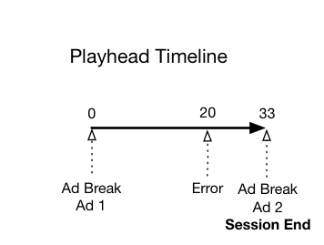
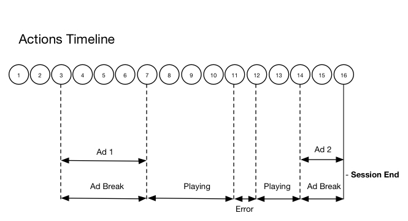

# Timeline 2 - User abandons session {#timeline--2-user-abandons-session}

## VOD, Pre-roll ad, mid-roll ads, user abandons content early

The following diagrams illustrate the playhead timeline and the corresponding timeline of a user's actions. The details for each action and its accompanying requests are presented below.








## Action details

### Action 1 - Start session {#Action-1}

| Action | Action Timeline (Seconds) | Playhead Position (Seconds) | Client Request |
| --- | :---: | :---: | --- |
| Auto-play or Play button pressed | 0 | 0 | `/api/v1/sessions`  |

**Implementation Details**

This call signals _the user's intention to play_ a video. It returns a Session ID ( `{sid}` ) to the client that is used to identify all subsequent tracking calls within the session. The player state is not yet "playing", but is instead "starting".  [Mandatory session parameters](/help/media-collection-api/mc-api-ref/mc-api-sessions-req.md) must be included in the `params` map in the request body.  On the backend, this call generates an Adobe Analytics initiate call.

**Sample request body**

```
{
    playerTime: {
        playhead: 0,
        ts: <timestamp>
    },
    eventType:sessionStart, params: {
        "media.playerName": "sample-html5-api-player",
        "analytics.trackingServer": "[ _YOUR-TS_ ]",
        "analytics.reportSuite": "[ _YOUR-RSID_ ]",
        "analytics.visitorId": "[ _YOUR-VISITOR-ID_ ]",
        "media.contentType": "VOD",
        "media.length": 60.3333333333333,
        "media.id": "VA API Sample Player",
        "visitor.marketingCloudOrgId": "[YOUR-MCID]",
        "media.name": "ClickMe",
        "media.channel": "sample-channel",
        "media.sdkVersion": "va-api-0.0.0",
        "analytics.enableSSL": false
    }
}
```

### Action 2 - Ping timer start {#Action-2}

| Action | Action Timeline (Seconds) | Playhead Position (Seconds) | Client Request |
| --- | :---: | :---: | --- |
| App starts ping event timer | 0 | 0 | |

**Implementation Details**

Start your app's ping timer. First ping event should then fire 1 second in if there are pre-roll ads, 10 seconds in otherwise.

### Action 3 - Ad break start {#Action-3}

| Action | Action Timeline (Seconds) | Playhead Position (Seconds) | Client Request |
| --- | :---: | :---: | --- |
| Track pre-roll ad break start | 0 | 0 | `/api/v1/sessions/{sid}/events`  |

**Implementation Details**

Pre-roll ads must be tracked. Ads can only be tracked within an ad break.

**Sample request body**

```
{
    playerTime: {
        playhead: 0,
        ts: <timestamp>
    },
    eventType:adBreakStart, params: {
        "media.ad.podFriendlyName": "ad_pod1",
        "media.ad.podIndex": 0,
        "media.ad.podSecond": 0
    }
}
```

### Action 4 - Ad start {#Action-4}

| Action | Action Timeline (Seconds) | Playhead Position (Seconds) | Client Request |
| --- | :---: | :---: | --- |
| Track pre-roll Ad #1 start | 0 | 0 | `/api/v1/sessions/{sid}/events`  |

**Implementation Details**

A 12 second ad starts.

**Sample request body**

```
{
    playerTime: {
        playhead: 0,
        ts: <timestamp>
    },
    eventType:adStart, params: {
        "media.ad.podFriendlyName": "ad_pod1",
        "media.ad.name": "Ad 1",
        "media.ad.id": "002",
        "media.ad.length": 7,
        "media.ad.podPosition": 1,
        "media.ad.playerName": "Sample Player",
        "media.ad.advertiser": "Ad Guys",
        "media.ad.campaignId": "1",
        "media.ad.creativeId": "42",
        "media.ad.siteId": "XYZ",
        "media.ad.creativeURL": "https://xyz-creative.com",
        "media.ad.placementId": "sample-placement2"
    },
}
```

### Action 5 - Ad pings {#Action-5}

| Action | Action Timeline (Seconds) | Playhead Position (Seconds) | Client Request |
| --- | :---: | :---: | --- |
| App sends ping event | 1 | 0 | `/api/v1/sessions/{sid}/events`  |

**Implementation Details**

Ping the backend every 1 second. (Subsequent ad pings not shown, in the interest of brevity.)

**Sample request body**

```
{
    playerTime: {
        playhead: 0,
        ts: <timestamp>
    },
    eventType:ping
}
```

### Action 6 - Ad complete {#Action-6}

| Action | Action Timeline (Seconds) | Playhead Position (Seconds) | Client Request |
| --- | :---: | :---: | --- |
| Track pre-roll Ad #1 complete | 12 | 0 | `/api/v1/sessions/{sid}/events`  |

**Implementation Details**

The first pre-roll ad is over.

**Sample request body**

```
{
    playerTime: {
        playhead: 0,
        ts: <timestamp>
    },
    eventType:adComplete
}
```

### Action 7 - Ad break complete {#Action-7}

| Action | Action Timeline (Seconds) | Playhead Position (Seconds) | Client Request |
| --- | :---: | :---: | --- |
| Track pre-roll ad break complete | 12 | 0 | `/api/v1/sessions/{sid}/events`  |

**Implementation Details**

The ad break is over. Throughout the ad break, the player has remained in the "playing" state.

**Sample request body**

```
{
    playerTime: {
        playhead: 0,
        ts: <timestamp>
    },
    eventType:adBreakComplete
}
```

### Action 8 - Play content {#Action-8}

| Action | Action Timeline (Seconds) | Playhead Position (Seconds) | Client Request |
| --- | :---: | :---: | --- |
| Track play event | 12 | 0 | `/api/v1/sessions/{sid}/events`  |

**Implementation Details**

Move the player to the "playing" state; begin tracking the start of content playback.

**Sample request body**

```
{
    playerTime: {
        playhead: 0,
        ts: <timestamp>
    },
    eventType:play,
    qoeData: { bitrate: 10000 }
}
```

### Action 9 - Ping {#Action-9}

| Action | Action Timeline (Seconds) | Playhead Position (Seconds) | Client Request |
| --- | :---: | :---: | --- |
| App sends ping event | 20 | 8 | `/api/v1/sessions/{sid}/events`  |

**Implementation Details**

Ping the backend every 10 seconds.

**Sample request body**

```
{
    playerTime: {
        playhead: 8ß,
        ts: <timestamp>
    },
    eventType:ping
}
```

### Action 10 - Ping {#Action-10}

| Action | Action Timeline (Seconds) | Playhead Position (Seconds) | Client Request |
| --- | :---: | :---: | --- |
| App sends ping event | 30 | 18 | `/api/v1/sessions/{sid}/events`  |

**Implementation Details**

Ping the backend every 10 seconds.

**Sample request body**

```
{
    playerTime: {
        playhead: 18,
        ts: <timestamp>
    },
    eventType:ping
}
```

### Action 11 - Error {#Action-11}

| Action | Action Timeline (Seconds) | Playhead Position (Seconds) | Client Request |
| --- | :---: | :---: | --- |
| Error occurs, app sends error information.  | 32 | 20 | `/api/v1/sessions/{sid}/events`  |

**Implementation Details**


**Sample request body**

```
{
    playerTime: {
        playhead: 20,
        ts: <timestamp>
    },
    eventType:error
}
```

### Action 12 - Play content {#Action-12}

| Action | Action Timeline (Seconds) | Playhead Position (Seconds) | Client Request |
| --- | :---: | :---: | --- |
| App recovers from error, user presses Play | 37 | 20 | `/api/v1/sessions/{sid}/events`  |

**Implementation Details**


**Sample request body**

```
{
    playerTime: {
        playhead: 18,
        ts: <timestamp>
    },
    eventType:play, qoeData: { bitrate: 10000 }
}
```

### Action 13 - Ping {#Action-13}

| Action | Action Timeline (Seconds) | Playhead Position (Seconds) | Client Request |
| --- | :---: | :---: | --- |
| App sends ping event | 40 | 28 | `/api/v1/sessions/{sid}/events`  |

**Implementation Details**

Ping the backend every 10 seconds.

**Sample request body**

```
{
    playerTime: {
        playhead: 28,
        ts: <timestamp>
    },
    eventType:ping
}
```

### Action 14 - Ad break start {#Action-14}

| Action | Action Timeline (Seconds) | Playhead Position (Seconds) | Client Request |
| --- | :---: | :---: | --- |
| Track mid-roll ad break start | 45 | 33 | `/api/v1/sessions/{sid}/events`  |

**Implementation Details**

Mid-roll ad of 8 seconds duration: send `adBreakStart` .

**Sample request body**

```
{
    playerTime: {
        playhead: 33,
        ts: <timestamp>
    },
    eventType:adBreakStart, params: {
        "media.ad.podFriendlyName": "ad_pod2",
        "media.ad.podIndex": 1,
        "media.ad.podSecond": 33
    }
}
```

### Action 15 - Ad start {#Action-15}

| Action | Action Timeline (Seconds) | Playhead Position (Seconds) | Client Request |
| --- | :---: | :---: | --- |
| Track mid-roll Ad #1 start | 45 | 33 | `/api/v1/sessions/{sid}/events`  |

**Implementation Details**

Track the mid-roll ad.

**Sample request body**

```
{
    playerTime: { playhead: 33, ts: <timestamp>
    },
    eventType:adStart, params: {
        "media.ad.podFriendlyName": "ad_pod1",
        "media.ad.name": "Ad 1",
        "media.ad.id": "002",
        "media.ad.length": 8,
        "media.ad.podPosition": 1,
        "media.ad.playerName": "Sample Player",
        "media.ad.advertiser": "Ad Guys",
        "media.ad.campaignId": "7",
        "media.ad.creativeId": "40",
        "media.ad.siteId": "XYZ",
        "media.ad.creativeURL": "https://xyz_creative.com",
        "media.ad.placementId": "sample_placement2"
    },
}
```

### Action 16 - Close app {#Action-16}

| Action | Action Timeline (Seconds) | Playhead Position (Seconds) | Client Request |
| --- | :---: | :---: | --- |
| User closes the app. The app determines that the user has abandoned viewing and isn't returning to this session.  | 48 | 33 | `/api/v1/sessions/{sid}/events`  |

**Implementation Details**

Send `sessionEnd` to the VA backend to indicate that the session should be closed immediately, with no further processing.

**Sample request body**

```
{
    playerTime: {
        playhead: 33,
        ts: <timestamp>
    },
    eventType:sessionEnd
}
```
