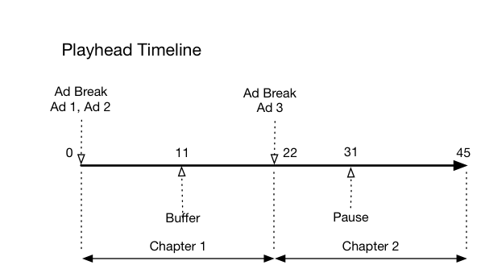
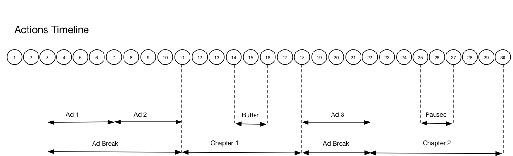

# Timeline 3 - Chapters{#timeline-chapters}

## VOD, pre-roll ads, pausing, buffering, viewing content to the end

| Action # | Action | Action Timeline (Seconds) | Playhead position (Seconds) | Client Request | Implementation Details |
| --- | --- | --- | --- | --- | --- |
| 1 | Auto-play or Play button pressed, video starts loading.  | 0 | 0 | `/api/v1/sessions` `{ playerTime:{ playhead: 0, ts: <timestamp> }, eventType:sessionStart, params:{ "media.playerName": "sample-html5-api-player", "analytics.trackingServer": "[ _YOUR-TS_ ]", "analytics.reportSuite": "[ _YOUR_RSID_ ]", "analytics.visitorId": "[ _YOUR_VISITOR_ID_ ]", "media.contentType": "VOD", "media.length": 60.3333333333333, "media.id": "VA API Sample Player", "visitor.marketingCloudOrgId": "[YOUR_MCID]", "media.name": "ClickMe", "media.channel": "sample-channel", "media.sdkVersion": "va-api-0.0.0", "analytics.enableSSL": false } }` | This call signals _the intention of the user to play_ a video. It returns a Session ID ( `{sid}` ) to the client that is used to identify all subsequent tracking calls within the session. The player state is not yet "playing", but is instead "starting".  [Mandatory session parameters](../../media-collection-api/mc-api-ref/mc-api-sessions-req.md) must be included in the `params` map in the request body.  On the backend, this call generates an Adobe Analytics initiate call.  |
| 2 | App starts ping event timer | 0 | 0 | | Start your 10-second ping timer. The first ping event should then fire 10 seconds into the session.  |
| 3 | Track pre-roll ad break start | 0 | 0 | `/api/v1/sessions/{sid}/events` `{ playerTime:{ playhead: 0, ts: <timestamp> }, eventType:adBreakStart, params: { "media.ad.podFriendlyName": "ad_pod1", "media.ad.podIndex": 0, "media.ad.podSecond": 0 } }` | Ads can only be tracked within an ad break.  |
| 4 | Track pre-roll Ad #1 start | 0 | 0 | `/api/v1/sessions/{sid}/events` `{ playerTime:{ playhead: 0, ts: <timestamp> }, eventType:adStart, params: { "media.ad.podFriendlyName": "ad_pod1", "media.ad.name": "Ad 1", "media.ad.id": "001", "media.ad.length": 15, "media.ad.podPosition": 1, "media.ad.playerName": "Sample Player", "media.ad.advertiser": "Ad Guys", "media.ad.campaignId": "1", "media.ad.creativeId": "42", "media.ad.siteId": "XYZ", "media.ad.creativeURL": "https://xyz_creative.com", "media.ad.placementId": "sample_placement" }, customMetadata:{ "myCustomData1": "CustomData1", "myCustomData2": "CustomData2" } }` | Start tracking the first pre-roll ad, which is 15 seconds long. Including custom metadata with this `adStart` .  |
| 5 | App sends ping event | 10 | 0 | `/api/v1/sessions/{sid}/events` `{ playerTime:{ playhead: 0, ts: <timestamp> }, eventType:ping }` | Ping the backend every 10 seconds.  |
| 6 | Track pre-roll Ad #1 complete | 15 | 0 | `/api/v1/sessions/{sid}/events` `{ playerTime:{ playhead: 0, ts: <timestamp> }, eventType:adComplete }` | Track the end of the first pre-roll ad.  |
| 7 | Track pre-roll Ad #2 start | 15 | 0 | `/api/v1/sessions/{sid}/events` `{ playerTime:{ playhead: 0, ts: <timestamp> }, eventType:adStart, params: { "media.ad.podFriendlyName": "ad_pod1", "media.ad.name": "Ad 2", "media.ad.id": "002", "media.ad.length": 7, "media.ad.podPosition": 1, "media.ad.playerName": "Sample Player", "media.ad.advertiser": "Ad Guys", "media.ad.campaignId": "2", "media.ad.creativeId": "44", "media.ad.siteId": "XYZ", "media.ad.creativeURL": "https://xyz_creative.com", "media.ad.placementId": "sample_placement2" }, }` | Track the start of the second pre-roll ad, which is 7 seconds long.  |
| 8 | App sends ping event | 20 | 0 | `/api/v1/sessions/{sid}/events` `{ playerTime:{ playhead: 0, ts: <timestamp> }, eventType:ping }` | Ping the backend every 10 seconds.  |
| 9 | Track pre-roll Ad #2 complete | 22 | 0 | `/api/v1/sessions/{sid}/events` `{ playerTime:{ playhead: 0, ts: <timestamp> }, eventType:adComplete }` | Track the end of the second pre-roll ad.  |
| 10 | Track pre-roll ad break complete | 22 | 0 | `/api/v1/sessions/{sid}/events` `{ playerTime:{ playhead: 0, ts: <timestamp> }, eventType:adBreakComplete }` | The ad break is over. Throughout the ad break, the play state has remained "playing".  |
| 11 | Track play event | 22 | 0 | `/api/v1/sessions/{sid}/events` `{ playerTime:{ playhead: 0, ts: <timestamp> }, eventType:play }` | After the `adBreakComplete` event, put the player is in the "playing" state using the `play` event.  |
| 12 | Track chapter start event | 23 | 1 | `/api/v1/sessions/{sid}/events` `{ playerTime:{ playhead: 0, ts: <timestamp> }, eventType:chapterStart, params: { "media.chapter.index": 1, "media.chapter.offset": 0, "media.chapter.length": 20, "media.chapter.friendlyName": "Chapter Uno" }, }` | After the play event, track the start of the first chapter.  |
| 13 | App sends ping event | 30 | 8 | `/api/v1/sessions/{sid}/events` `{ playerTime:{ playhead: 8, ts: <timestamp> }, eventType:ping }` | Ping the backend every 10 seconds.  |
| 14 | Buffer start event occurred | 33 | 11 | `/api/v1/sessions/{sid}/events` `{ playerTime:{ playhead: 11, ts: <timestamp> }, eventType:bufferStart }` | Track the move to the "buffering" state.  |
| 15 | Buffering ended, the app tracks resumption of content | 36 | 11 | `/api/v1/sessions/{sid}/events` `{ playerTime:{ playhead: 11, ts: <timestamp> }, eventType:play }` | Buffering ends after 3 seconds, so put the player back to the "playing" state. You must send another track play event coming out of buffering.  **The `play` call after a `bufferStart` infers a "bufferEnd" call to the back end,** so there is no need for a `bufferEnd` event.  |
| 16 | App sends ping event | 40 | 15 | `/api/v1/sessions/{sid}/events` `{ playerTime:{ playhead: 15, ts: <timestamp> }, eventType:ping }` | Ping the backend every 10 seconds.  |
| 17 | App tracks chapter end | 45 | 20 | `/api/v1/sessions/{sid}/events` `{ playerTime:{ playhead: 20, ts: <timestamp> }, eventType:chapterEnd }` | The first chapter ends, right before the second ad break.  |
| 18 | Track mid-roll ad break start | 46 | 21 | `/api/v1/sessions/{sid}/events` `{ playerTime:{ playhead: 21, ts: <timestamp> }, eventType:adBreakStart, params: { "media.ad.podFriendlyName": "ad_pod2", "media.ad.podIndex": 1, "media.ad.podSecond": 21 } }` | Mid-roll ad of 8 seconds duration: send `adBreakStart` .  |
| 19 | Track mid-roll Ad #3 start | 46 | 21 | `/api/v1/sessions/{sid}/events` `{ playerTime:{ playhead: 21, ts: <timestamp> }, eventType:adStart, params: { "media.ad.podFriendlyName": "ad_pod2", "media.ad.name": "Ad 3", "media.ad.id": "003", "media.ad.length": 8, "media.ad.podPosition": 2, "media.ad.playerName": "Sample Player", "media.ad.advertiser": "Ad Guys", "media.ad.campaignId": "7", "media.ad.creativeId": "40", "media.ad.siteId": "XYZ", "media.ad.creativeURL": "https://xyz_creative.com", "media.ad.placementId": "sample_placement2" }, }` | Track the mid-roll ad.  |
| 20 | App sends ping event | 50 | 21 | `/api/v1/sessions/{sid}/events` `{ playerTime:{ playhead: 21, ts: <timestamp> }, eventType:ping }` | Ping the backend every 10 seconds.  |
| 21 | Track mid-roll Ad #1 complete | 54 | 21 | `/api/v1/sessions/{sid}/events` `{ playerTime:{ playhead: 21, ts: <timestamp> }, eventType:adComplete }` | The mid-roll ad is complete.  |
| 22 | Track mid-roll ad break complete | 54 | 21 | `/api/v1/sessions/{sid}/events` `{ playerTime:{ playhead: 21, ts: <timestamp> }, eventType:adBreakComplete }` | The ad break is complete.  |
| 23 | Track the start of Chapter 2 | 55 | 22 | `/api/v1/sessions/{sid}/events` `{ playerTime:{ playhead: 22, ts: <timestamp> }, eventType:chapterStart, params: { "media.chapter.index": 2, "media.chapter.offset": 22, "media.chapter.length": 22, "media.chapter.friendlyName": "Chapter Dos" }, }` | |
| 24 | App sends ping event | 60 | 27 | `/api/v1/sessions/{sid}/events` `{ playerTime:{ playhead: 27, ts: <timestamp> }, eventType:ping }` | Ping the backend every 10 seconds.  |
| 25 | User pressed Pause | 64 | 31 | `/api/v1/sessions/{sid}/events` `{ playerTime:{ playhead: 31, ts: <timestamp> }, eventType:pauseStart }` | The user action moves the play state to "paused".  |
| 26 | App sends ping event | 70 | 31 | `/api/v1/sessions/{sid}/events` `{ playerTime:{ playhead: 31, ts: <timestamp> }, eventType:ping }` | Ping the backend every 10 seconds. Player is still in the "buffering" state; the user is stuck at 20 seconds of content. Fuming...  |
| 27 | User pressed Play to resume main content | 74 | 31 | `/api/v1/sessions/{sid}/events` `{ playerTime:{ playhead: 31, ts: <timestamp> }, eventType:play }` | Move the play state to "playing".  **The `play` call after a `pauseStart` infers a "resume" call to the back end**, so there is no need for a `resume` event.  |
| 28 | App sends ping event | 80 | 37 | `/api/v1/sessions/{sid}/events` `{ playerTime:{ playhead: 37, ts: <timestamp> }, eventType:ping }` | Ping the backend every 10 seconds.  |
| 29 | Chapter 2 ends | 87 | 44 | `/api/v1/sessions/{sid}/events` `{ playerTime:{ playhead: 0, ts: <timestamp> }, eventType:chapterEnd }` | Track the end of the second and final chapter.  |
| 30 | The user finishes watching the content to the end.  | 88 | 45 | `/api/v1/sessions/{sid}/events` `{ playerTime:{ playhead: 45, ts: <timestamp> }, eventType:sessionComplete }` | Send `sessionComplete` to the backend to indicate that the user finished watching the entire content.  | 

<!--
<table id="table_nq2_swp_qbb">  
 <thead> 
  <tr> 
   <th class="entry"> Action # </th> 
   <th class="entry"> Action </th> 
   <th class="entry"> Action Timeline (Seconds) </th> 
   <th class="entry"> Playhead position (Seconds) </th> 
   <th align="center" class="entry"> Client Request </th> 
   <th class="entry"> Implementation Details </th> 
  </tr> 
 </thead>
 <tbody> 
  <tr> 
   <td> 1 </td> 
   <td> Auto-play or Play button pressed, video starts loading. </td> 
   <td> 0 </td> 
   <td> 0 </td> 
   <td>  /api/v1/sessions  
    <codeblock scale="70" class="syntax json">
      { 
     
&nbsp;&nbsp;playerTime:{ 
     
&nbsp;&nbsp;&nbsp;&nbsp;playhead:&nbsp;0, 
     
&nbsp;&nbsp;&nbsp;&nbsp;ts:&nbsp;&lt;timestamp&gt; 
     
&nbsp;&nbsp;}, 
     
&nbsp;&nbsp;eventType:sessionStart, 
     
&nbsp;&nbsp;params:{ 
     
&nbsp;&nbsp;&nbsp;&nbsp;"media.playerName":&nbsp;"sample-html5-api-player", 
     
&nbsp;&nbsp;&nbsp;&nbsp;"analytics.trackingServer":&nbsp;"[ 
     <i>YOUR_TS</i>]", 
     
&nbsp;&nbsp;&nbsp;&nbsp;"analytics.reportSuite":&nbsp;"[ 
     <i>YOUR_RSID</i>]", 
     
&nbsp;&nbsp;&nbsp;&nbsp;"analytics.visitorId":&nbsp;"[ 
     <i>YOUR_VISITOR_ID</i>]", 
     
&nbsp;&nbsp;&nbsp;&nbsp;"media.contentType":&nbsp;"VOD", 
     
&nbsp;&nbsp;&nbsp;&nbsp;"media.length":&nbsp;60.3333333333333, 
     
&nbsp;&nbsp;&nbsp;&nbsp;"media.id":&nbsp;"VA&nbsp;API&nbsp;Sample&nbsp;Player", 
     
&nbsp;&nbsp;&nbsp;&nbsp;"visitor.marketingCloudOrgId":&nbsp;"[YOUR_MCID]", 
     
&nbsp;&nbsp;&nbsp;&nbsp;"media.name":&nbsp;"ClickMe", 
     
&nbsp;&nbsp;&nbsp;&nbsp;"media.channel":&nbsp;"sample-channel", 
     
&nbsp;&nbsp;&nbsp;&nbsp;"media.sdkVersion":&nbsp;"va-api-0.0.0", 
     
&nbsp;&nbsp;&nbsp;&nbsp;"analytics.enableSSL":&nbsp;false 
     
&nbsp;&nbsp;} 
     
} 
    </codeblock> </td> 
   <td> This call signals <i>the user's intention to play</i> a video. It returns a Session ID (  {sid} ) to the client that is used to identify all subsequent tracking calls within the session. The player state is not yet "playing", but is instead "starting". <a href="../../media-collection-api/mc-api-ref/mc-api-sessions-req.md"> Mandatory session parameters </a> must be included in the  params  map in the request body. 
On the backend, this call generates an Adobe Analytics initiate call.
 </td> 
  </tr> 
  <tr> 
   <td> 2 </td> 
   <td> App starts ping event timer </td> 
   <td> 0 </td> 
   <td> 0 </td> 
   <td>  </td> 
   <td> Start your app's 10-second ping timer. First ping event should then fire 10 seconds into the session. </td> 
  </tr> 
  <tr> 
   <td> 3 </td> 
   <td> Track pre-roll ad break start </td> 
   <td> 0 </td> 
   <td> 0 </td> 
   <td>  /api/v1/sessions/{sid}/events  
    <codeblock scale="70" class="syntax json">
      { 
     
&nbsp;&nbsp;playerTime:{ 
     
&nbsp;&nbsp;&nbsp;&nbsp;playhead:&nbsp;0, 
     
&nbsp;&nbsp;&nbsp;&nbsp;ts:&nbsp;&lt;timestamp&gt; 
     
&nbsp;&nbsp;}, 
     
&nbsp;&nbsp;eventType:adBreakStart, 
     
&nbsp;&nbsp;params:&nbsp;{ 
     
&nbsp;&nbsp;&nbsp;&nbsp;"media.ad.podFriendlyName":&nbsp;"ad_pod1", 
     
&nbsp;&nbsp;&nbsp;&nbsp;"media.ad.podIndex":&nbsp;0, 
     
&nbsp;&nbsp;&nbsp;&nbsp;"media.ad.podSecond":&nbsp;0 
     
&nbsp;&nbsp;} 
     
} 
    </codeblock> </td> 
   <td> Ads can only be tracked within an ad break. </td> 
  </tr> 
  <tr> 
   <td> 4 </td> 
   <td> Track pre-roll Ad #1 start </td> 
   <td> 0 </td> 
   <td> 0 </td> 
   <td>  /api/v1/sessions/{sid}/events  
    <codeblock scale="70" class="syntax json">
      { 
     
&nbsp;&nbsp;playerTime:{ 
     
&nbsp;&nbsp;&nbsp;&nbsp;playhead:&nbsp;0, 
     
&nbsp;&nbsp;&nbsp;&nbsp;ts:&nbsp;&lt;timestamp&gt; 
     
&nbsp;&nbsp;}, 
     
&nbsp;&nbsp;eventType:adStart, 
     
&nbsp;&nbsp;params:&nbsp;{ 
     
&nbsp;&nbsp;&nbsp;&nbsp;"media.ad.podFriendlyName":&nbsp;"ad_pod1", 
     
&nbsp;&nbsp;&nbsp;&nbsp;"media.ad.name":&nbsp;"Ad&nbsp;1", 
     
&nbsp;&nbsp;&nbsp;&nbsp;"media.ad.id":&nbsp;"001", 
     
&nbsp;&nbsp;&nbsp;&nbsp;"media.ad.length":&nbsp;15,&nbsp; 
     
&nbsp;&nbsp;&nbsp;&nbsp;"media.ad.podPosition":&nbsp;1, 
     
&nbsp;&nbsp;&nbsp;&nbsp;"media.ad.playerName":&nbsp;"Sample&nbsp;Player", 
     
&nbsp;&nbsp;&nbsp;&nbsp;"media.ad.advertiser":&nbsp;"Ad&nbsp;Guys", 
     
&nbsp;&nbsp;&nbsp;&nbsp;"media.ad.campaignId":&nbsp;"1", 
     
&nbsp;&nbsp;&nbsp;&nbsp;"media.ad.creativeId":&nbsp;"42", 
     
&nbsp;&nbsp;&nbsp;&nbsp;"media.ad.siteId":&nbsp;"XYZ", 
     
&nbsp;&nbsp;&nbsp;&nbsp;"media.ad.creativeURL":&nbsp;"https://xyz_creative.com", 
     
&nbsp;&nbsp;&nbsp;&nbsp;"media.ad.placementId":&nbsp;"sample_placement" 
     
&nbsp;&nbsp;}, 
     
&nbsp;&nbsp;customMetadata:{ 
     
&nbsp;&nbsp;&nbsp;&nbsp;"myCustomData1":&nbsp;"CustomData1", 
     
&nbsp;&nbsp;&nbsp;&nbsp;"myCustomData2":&nbsp;"CustomData2" 
     
&nbsp;&nbsp;} 
     
} 
    </codeblock> </td> 
   <td> Start tracking the first pre-roll ad, which is 15 seconds long. Including custom metadata with this  adStart . </td> 
  </tr> 
  <tr> 
   <td> 5 </td> 
   <td> App sends ping event </td> 
   <td> 10 </td> 
   <td> 0 </td> 
   <td>  /api/v1/sessions/{sid}/events  
    <codeblock scale="70" class="syntax json">
      { 
     
&nbsp;&nbsp;playerTime:{ 
     
&nbsp;&nbsp;&nbsp;&nbsp;playhead:&nbsp;0, 
     
&nbsp;&nbsp;&nbsp;&nbsp;ts:&nbsp;&lt;timestamp&gt; 
     
&nbsp;&nbsp;}, 
     
&nbsp;&nbsp;eventType:ping 
     
} 
    </codeblock> </td> 
   <td> Ping the backend every 10 seconds. </td> 
  </tr> 
  <tr> 
   <td> 6 </td> 
   <td> Track pre-roll Ad #1 complete </td> 
   <td> 15 </td> 
   <td> 0 </td> 
   <td>  /api/v1/sessions/{sid}/events  
    <codeblock scale="70" class="syntax json">
      { 
     
&nbsp;&nbsp;playerTime:{ 
     
&nbsp;&nbsp;&nbsp;&nbsp;playhead:&nbsp;0, 
     
&nbsp;&nbsp;&nbsp;&nbsp;ts:&nbsp;&lt;timestamp&gt; 
     
&nbsp;&nbsp;}, 
     
&nbsp;&nbsp;eventType:adComplete 
     
} 
    </codeblock> </td> 
   <td> Track the end of the first pre-roll ad. </td> 
  </tr> 
  <tr> 
   <td> 7 </td> 
   <td> Track pre-roll Ad #2 start </td> 
   <td> 15 </td> 
   <td> 0 </td> 
   <td>  /api/v1/sessions/{sid}/events  
    <codeblock scale="70" class="syntax json">
      { 
     
&nbsp;&nbsp;playerTime:{ 
     
&nbsp;&nbsp;&nbsp;&nbsp;playhead:&nbsp;0, 
     
&nbsp;&nbsp;&nbsp;&nbsp;ts:&nbsp;&lt;timestamp&gt; 
     
&nbsp;&nbsp;}, 
     
&nbsp;&nbsp;eventType:adStart, 
     
&nbsp;&nbsp;params:&nbsp;{ 
     
&nbsp;&nbsp;&nbsp;&nbsp;"media.ad.podFriendlyName":&nbsp;"ad_pod1", 
     
&nbsp;&nbsp;&nbsp;&nbsp;"media.ad.name":&nbsp;"Ad&nbsp;2", 
     
&nbsp;&nbsp;&nbsp;&nbsp;"media.ad.id":&nbsp;"002", 
     
&nbsp;&nbsp;&nbsp;&nbsp;"media.ad.length":&nbsp;7,&nbsp; 
     
&nbsp;&nbsp;&nbsp;&nbsp;"media.ad.podPosition":&nbsp;1, 
     
&nbsp;&nbsp;&nbsp;&nbsp;"media.ad.playerName":&nbsp;"Sample&nbsp;Player", 
     
&nbsp;&nbsp;&nbsp;&nbsp;"media.ad.advertiser":&nbsp;"Ad&nbsp;Guys", 
     
&nbsp;&nbsp;&nbsp;&nbsp;"media.ad.campaignId":&nbsp;"2", 
     
&nbsp;&nbsp;&nbsp;&nbsp;"media.ad.creativeId":&nbsp;"44", 
     
&nbsp;&nbsp;&nbsp;&nbsp;"media.ad.siteId":&nbsp;"XYZ", 
     
&nbsp;&nbsp;&nbsp;&nbsp;"media.ad.creativeURL":&nbsp;"https://xyz_creative.com", 
     
&nbsp;&nbsp;&nbsp;&nbsp;"media.ad.placementId":&nbsp;"sample_placement2" 
     
&nbsp;&nbsp;}, 
     
} 
    </codeblock> </td> 
   <td> Track the start of the second pre-roll ad, which is 7 seconds long. </td> 
  </tr> 
  <tr> 
   <td> 8 </td> 
   <td> App sends ping event </td> 
   <td> 20 </td> 
   <td> 0 </td> 
   <td>  /api/v1/sessions/{sid}/events  
    <codeblock scale="70" class="syntax json">
      { 
     
&nbsp;&nbsp;playerTime:{ 
     
&nbsp;&nbsp;&nbsp;&nbsp;playhead:&nbsp;0, 
     
&nbsp;&nbsp;&nbsp;&nbsp;ts:&nbsp;&lt;timestamp&gt; 
     
&nbsp;&nbsp;}, 
     
&nbsp;&nbsp;eventType:ping 
     
} 
    </codeblock> </td> 
   <td> Ping the backend every 10 seconds. </td> 
  </tr> 
  <tr> 
   <td> 9 </td> 
   <td> Track pre-roll Ad #2 complete </td> 
   <td> 22 </td> 
   <td> 0 </td> 
   <td>  /api/v1/sessions/{sid}/events  
    <codeblock scale="70" class="syntax json">
      { 
     
&nbsp;&nbsp;playerTime:{ 
     
&nbsp;&nbsp;&nbsp;&nbsp;playhead:&nbsp;0, 
     
&nbsp;&nbsp;&nbsp;&nbsp;ts:&nbsp;&lt;timestamp&gt; 
     
&nbsp;&nbsp;}, 
     
&nbsp;&nbsp;eventType:adComplete 
     
} 
    </codeblock> </td> 
   <td> Track the end of the second pre-roll ad. </td> 
  </tr> 
  <tr> 
   <td> 10 </td> 
   <td> Track pre-roll ad break complete </td> 
   <td> 22 </td> 
   <td> 0 </td> 
   <td>  /api/v1/sessions/{sid}/events  
    <codeblock scale="70" class="syntax json">
      { 
     
&nbsp;&nbsp;playerTime:{ 
     
&nbsp;&nbsp;&nbsp;&nbsp;playhead:&nbsp;0,&nbsp; 
     
&nbsp;&nbsp;&nbsp;&nbsp;ts:&nbsp;&lt;timestamp&gt; 
     
&nbsp;&nbsp;}, 
     
&nbsp;&nbsp;eventType:adBreakComplete 
     
} 
    </codeblock> </td> 
   <td> The ad break is over. Throughout the ad break, the play state has remained "playing". </td> 
  </tr> 
  <tr> 
   <td> 11 </td> 
   <td> Track play event </td> 
   <td> 22 </td> 
   <td> 0 </td> 
   <td>  /api/v1/sessions/{sid}/events  
    <codeblock scale="70" class="syntax json">
      { 
     
&nbsp;&nbsp;playerTime:{ 
     
&nbsp;&nbsp;&nbsp;&nbsp;playhead:&nbsp;0, 
     
&nbsp;&nbsp;&nbsp;&nbsp;ts:&nbsp;&lt;timestamp&gt; 
     
&nbsp;&nbsp;}, 
     
&nbsp;&nbsp;eventType:play 
     
} 
    </codeblock> </td> 
   <td> After the  adBreakComplete  event, put the player is in the "playing" state using the  play  event. </td> 
  </tr> 
  <tr> 
   <td> 12 </td> 
   <td> Track chapter start event </td> 
   <td> 23 </td> 
   <td> 1 </td> 
   <td>  /api/v1/sessions/{sid}/events  
    <codeblock scale="70" class="syntax json">
      { 
     
&nbsp;&nbsp;playerTime:{ 
     
&nbsp;&nbsp;&nbsp;&nbsp;playhead:&nbsp;0, 
     
&nbsp;&nbsp;&nbsp;&nbsp;ts:&nbsp;&lt;timestamp&gt; 
     
&nbsp;&nbsp;}, 
     
&nbsp;&nbsp;eventType:chapterStart, 
     
&nbsp;&nbsp;params:&nbsp;{ 
     
&nbsp;&nbsp;&nbsp;&nbsp;"media.chapter.index":&nbsp;1, 
     
&nbsp;&nbsp;&nbsp;&nbsp;"media.chapter.offset":&nbsp;0, 
     
&nbsp;&nbsp;&nbsp;&nbsp;"media.chapter.length":&nbsp;20, 
     
&nbsp;&nbsp;&nbsp;&nbsp;"media.chapter.friendlyName":&nbsp;"Chapter&nbsp;Uno" 
     
&nbsp;&nbsp;}, 
     
} 
    </codeblock> </td> 
   <td> After the play event, track the start of the first chapter. </td> 
  </tr> 
  <tr> 
   <td> 13 </td> 
   <td> App sends ping event </td> 
   <td> 30 </td> 
   <td> 8 </td> 
   <td>  /api/v1/sessions/{sid}/events  
    <codeblock scale="70" class="syntax json">
      { 
     
&nbsp;&nbsp;playerTime:{ 
     
&nbsp;&nbsp;&nbsp;&nbsp;playhead:&nbsp;8, 
     
&nbsp;&nbsp;&nbsp;&nbsp;ts:&nbsp;&lt;timestamp&gt; 
     
&nbsp;&nbsp;}, 
     
&nbsp;&nbsp;eventType:ping 
     
} 
    </codeblock> </td> 
   <td> Ping the backend every 10 seconds. </td> 
  </tr> 
  <tr> 
   <td> 14 </td> 
   <td> Buffer start event occurred </td> 
   <td> 33 </td> 
   <td> 11 </td> 
   <td>  /api/v1/sessions/{sid}/events  
    <codeblock scale="70" class="syntax json">
      { 
     
&nbsp;&nbsp;playerTime:{ 
     
&nbsp;&nbsp;&nbsp;&nbsp;playhead:&nbsp;11, 
     
&nbsp;&nbsp;&nbsp;&nbsp;ts:&nbsp;&lt;timestamp&gt; 
     
&nbsp;&nbsp;}, 
     
&nbsp;&nbsp;eventType:bufferStart 
     
} 
    </codeblock> </td> 
   <td> Track the player's move to the "buffering" state. </td> 
  </tr> 
  <tr> 
   <td> 15 </td> 
   <td> Buffering ended, the app tracks resumption of content </td> 
   <td> 36 </td> 
   <td> 11 </td> 
   <td>  /api/v1/sessions/{sid}/events  
    <codeblock scale="70" class="syntax json">
      { 
     
&nbsp;&nbsp;playerTime:{ 
     
&nbsp;&nbsp;&nbsp;&nbsp;playhead:&nbsp;11, 
     
&nbsp;&nbsp;&nbsp;&nbsp;ts:&nbsp;&lt;timestamp&gt; 
     
&nbsp;&nbsp;}, 
     
&nbsp;&nbsp;eventType:play 
     
} 
    </codeblock> </td> 
   <td> Buffering ends after 3 seconds, so put the player back to the "playing" state. You must send another track play event coming out of buffering. 
<b>The  play  call after a  bufferStart  infers a "bufferEnd" call to the back end</b>, so there is no need for a  bufferEnd  event.
 </td> 
  </tr> 
  <tr> 
   <td> 16 </td> 
   <td> App sends ping event </td> 
   <td> 40 </td> 
   <td> 15 </td> 
   <td>  /api/v1/sessions/{sid}/events  
    <codeblock scale="70" class="syntax json">
      { 
     
&nbsp;&nbsp;playerTime:{ 
     
&nbsp;&nbsp;&nbsp;&nbsp;playhead:&nbsp;15, 
     
&nbsp;&nbsp;&nbsp;&nbsp;ts:&nbsp;&lt;timestamp&gt; 
     
&nbsp;&nbsp;}, 
     
&nbsp;&nbsp;eventType:ping 
     
} 
    </codeblock> </td> 
   <td> Ping the backend every 10 seconds. </td> 
  </tr> 
  <tr> 
   <td> 17 </td> 
   <td> App tracks chapter end </td> 
   <td> 45 </td> 
   <td> 20 </td> 
   <td>  /api/v1/sessions/{sid}/events  
    <codeblock scale="70" class="syntax json">
      { 
     
&nbsp;&nbsp;playerTime:{ 
     
&nbsp;&nbsp;&nbsp;&nbsp;playhead:&nbsp;20, 
     
&nbsp;&nbsp;&nbsp;&nbsp;ts:&nbsp;&lt;timestamp&gt; 
     
&nbsp;&nbsp;}, 
     
&nbsp;&nbsp;eventType:chapterEnd 
     
} 
    </codeblock> </td> 
   <td> The first chapter ends, right before the second ad break. </td> 
  </tr> 
  <tr> 
   <td> 18 </td> 
   <td> Track mid-roll ad break start </td> 
   <td> 46 </td> 
   <td> 21 </td> 
   <td>  /api/v1/sessions/{sid}/events  
    <codeblock scale="70" class="syntax json">
      { 
     
&nbsp;&nbsp;playerTime:{ 
     
&nbsp;&nbsp;&nbsp;&nbsp;playhead:&nbsp;21, 
     
&nbsp;&nbsp;&nbsp;&nbsp;ts:&nbsp;&lt;timestamp&gt; 
     
&nbsp;&nbsp;}, 
     
&nbsp;&nbsp;eventType:adBreakStart, 
     
&nbsp;&nbsp;params:&nbsp;{ 
     
&nbsp;&nbsp;&nbsp;&nbsp;"media.ad.podFriendlyName":&nbsp;"ad_pod2", 
     
&nbsp;&nbsp;&nbsp;&nbsp;"media.ad.podIndex":&nbsp;1, 
     
&nbsp;&nbsp;&nbsp;&nbsp;"media.ad.podSecond":&nbsp;21 
     
&nbsp;&nbsp;} 
     
} 
    </codeblock> </td> 
   <td> Mid-roll ad of 8 seconds duration: send  adBreakStart . </td> 
  </tr> 
  <tr> 
   <td> 19 </td> 
   <td> Track mid-roll Ad #3 start </td> 
   <td> 46 </td> 
   <td> 21 </td> 
   <td>  /api/v1/sessions/{sid}/events  
    <codeblock scale="70" class="syntax json">
      { 
     
&nbsp;&nbsp;playerTime:{&nbsp; 
     
&nbsp;&nbsp;&nbsp;&nbsp;playhead:&nbsp;21, 
     
&nbsp;&nbsp;&nbsp;&nbsp;ts:&nbsp;&lt;timestamp&gt; 
     
&nbsp;&nbsp;}, 
     
&nbsp;&nbsp;eventType:adStart, 
     
&nbsp;&nbsp;params:&nbsp;{ 
     
&nbsp;&nbsp;&nbsp;&nbsp;"media.ad.podFriendlyName":&nbsp;"ad_pod2", 
     
&nbsp;&nbsp;&nbsp;&nbsp;"media.ad.name":&nbsp;"Ad&nbsp;3", 
     
&nbsp;&nbsp;&nbsp;&nbsp;"media.ad.id":&nbsp;"003", 
     
&nbsp;&nbsp;&nbsp;&nbsp;"media.ad.length":&nbsp;8,&nbsp; 
     
&nbsp;&nbsp;&nbsp;&nbsp;"media.ad.podPosition":&nbsp;2, 
     
&nbsp;&nbsp;&nbsp;&nbsp;"media.ad.playerName":&nbsp;"Sample&nbsp;Player", 
     
&nbsp;&nbsp;&nbsp;&nbsp;"media.ad.advertiser":&nbsp;"Ad&nbsp;Guys", 
     
&nbsp;&nbsp;&nbsp;&nbsp;"media.ad.campaignId":&nbsp;"7", 
     
&nbsp;&nbsp;&nbsp;&nbsp;"media.ad.creativeId":&nbsp;"40", 
     
&nbsp;&nbsp;&nbsp;&nbsp;"media.ad.siteId":&nbsp;"XYZ", 
     
&nbsp;&nbsp;&nbsp;&nbsp;"media.ad.creativeURL":&nbsp;"https://xyz_creative.com", 
     
&nbsp;&nbsp;&nbsp;&nbsp;"media.ad.placementId":&nbsp;"sample_placement2" 
     
&nbsp;&nbsp;}, 
     
} 
    </codeblock> </td> 
   <td> Track the mid-roll ad. </td> 
  </tr> 
  <tr> 
   <td> 20 </td> 
   <td> App sends ping event </td> 
   <td> 50 </td> 
   <td> 21 </td> 
   <td>  /api/v1/sessions/{sid}/events  
    <codeblock scale="70" class="syntax json">
      { 
     
&nbsp;&nbsp;playerTime:{ 
     
&nbsp;&nbsp;&nbsp;&nbsp;playhead:&nbsp;21, 
     
&nbsp;&nbsp;&nbsp;&nbsp;ts:&nbsp;&lt;timestamp&gt; 
     
&nbsp;&nbsp;}, 
     
&nbsp;&nbsp;eventType:ping 
     
} 
    </codeblock> </td> 
   <td> Ping the backend every 10 seconds. </td> 
  </tr> 
  <tr> 
   <td> 21 </td> 
   <td> Track mid-roll Ad #1 complete </td> 
   <td> 54 </td> 
   <td> 21 </td> 
   <td>  /api/v1/sessions/{sid}/events  
    <codeblock scale="70" class="syntax json">
      { 
     
&nbsp;&nbsp;playerTime:{ 
     
&nbsp;&nbsp;&nbsp;&nbsp;playhead:&nbsp;21, 
     
&nbsp;&nbsp;&nbsp;&nbsp;ts:&nbsp;&lt;timestamp&gt; 
     
&nbsp;&nbsp;}, 
     
&nbsp;&nbsp;eventType:adComplete 
     
} 
    </codeblock> </td> 
   <td> The mid-roll ad is complete. </td> 
  </tr> 
  <tr> 
   <td> 22 </td> 
   <td> Track mid-roll ad break complete </td> 
   <td> 54 </td> 
   <td> 21 </td> 
   <td>  /api/v1/sessions/{sid}/events  
    <codeblock scale="70" class="syntax json">
      { 
     
&nbsp;&nbsp;playerTime:{ 
     
&nbsp;&nbsp;&nbsp;&nbsp;playhead:&nbsp;21, 
     
&nbsp;&nbsp;&nbsp;&nbsp;ts:&nbsp;&lt;timestamp&gt; 
     
&nbsp;&nbsp;}, 
     
&nbsp;&nbsp;eventType:adBreakComplete 
     
} 
    </codeblock> </td> 
   <td> The ad break is complete. </td> 
  </tr> 
  <tr> 
   <td> 23 </td> 
   <td> Track the start of Chapter 2 </td> 
   <td> 55 </td> 
   <td> 22 </td> 
   <td>  /api/v1/sessions/{sid}/events  
    <codeblock scale="70" class="syntax json">
      { 
     
&nbsp;&nbsp;playerTime:{ 
     
&nbsp;&nbsp;&nbsp;&nbsp;playhead:&nbsp;22, 
     
&nbsp;&nbsp;&nbsp;&nbsp;ts:&nbsp;&lt;timestamp&gt; 
     
&nbsp;&nbsp;}, 
     
&nbsp;&nbsp;eventType:chapterStart, 
     
&nbsp;&nbsp;params:&nbsp;{ 
     
&nbsp;&nbsp;&nbsp;&nbsp;"media.chapter.index":&nbsp;2, 
     
&nbsp;&nbsp;&nbsp;&nbsp;"media.chapter.offset":&nbsp;22, 
     
&nbsp;&nbsp;&nbsp;&nbsp;"media.chapter.length":&nbsp;22, 
     
&nbsp;&nbsp;&nbsp;&nbsp;"media.chapter.friendlyName":&nbsp;"Chapter&nbsp;Dos" 
     
&nbsp;&nbsp;}, 
     
} 
    </codeblock> </td> 
   <td></td> 
  </tr> 
  <tr> 
   <td> 24 </td> 
   <td> App sends ping event </td> 
   <td> 60 </td> 
   <td> 27 </td> 
   <td>  /api/v1/sessions/{sid}/events  
    <codeblock scale="70" class="syntax json">
      { 
     
&nbsp;&nbsp;playerTime:{ 
     
&nbsp;&nbsp;&nbsp;&nbsp;playhead:&nbsp;27, 
     
&nbsp;&nbsp;&nbsp;&nbsp;ts:&nbsp;&lt;timestamp&gt; 
     
&nbsp;&nbsp;}, 
     
&nbsp;&nbsp;eventType:ping 
     
} 
    </codeblock> </td> 
   <td> Ping the backend every 10 seconds. </td> 
  </tr> 
  <tr> 
   <td> 25 </td> 
   <td> User pressed Pause </td> 
   <td> 64 </td> 
   <td> 31 </td> 
   <td>  /api/v1/sessions/{sid}/events  
    <codeblock scale="70" class="syntax json">
      { 
     
&nbsp;&nbsp;playerTime:{ 
     
&nbsp;&nbsp;&nbsp;&nbsp;playhead:&nbsp;31, 
     
&nbsp;&nbsp;&nbsp;&nbsp;ts:&nbsp;&lt;timestamp&gt; 
     
&nbsp;&nbsp;}, 
     
&nbsp;&nbsp;eventType:pauseStart 
     
} 
    </codeblock> </td> 
   <td> The user's action moves the play state to "paused". </td> 
  </tr> 
  <tr> 
   <td> 26 </td> 
   <td> App sends ping event </td> 
   <td> 70 </td> 
   <td> 31 </td> 
   <td>  /api/v1/sessions/{sid}/events  
    <codeblock scale="70" class="syntax json">
      { 
     
&nbsp;&nbsp;playerTime:{ 
     
&nbsp;&nbsp;&nbsp;&nbsp;playhead:&nbsp;31, 
     
&nbsp;&nbsp;&nbsp;&nbsp;ts:&nbsp;&lt;timestamp&gt; 
     
&nbsp;&nbsp;}, 
     
&nbsp;&nbsp;eventType:ping 
     
} 
    </codeblock> </td> 
   <td> Ping the backend every 10 seconds. Player is still in the "buffering" state; the user is stuck at 20 seconds of content. Fuming... </td> 
  </tr> 
  <tr> 
   <td> 27 </td> 
   <td> User pressed Play to resume main content </td> 
   <td> 74 </td> 
   <td> 31 </td> 
   <td>  /api/v1/sessions/{sid}/events  
    <codeblock scale="70" class="syntax json">
      { 
     
&nbsp;&nbsp;playerTime:{ 
     
&nbsp;&nbsp;&nbsp;&nbsp;playhead:&nbsp;31, 
     
&nbsp;&nbsp;&nbsp;&nbsp;ts:&nbsp;&lt;timestamp&gt; 
     
&nbsp;&nbsp;}, 
     
&nbsp;&nbsp;eventType:play 
     
} 
    </codeblock> </td> 
   <td> Move the play state to "playing". 
<b>The  play  call after a  pauseStart  infers a "resume" call to the back end</b>, so there is no need for a  resume  event.
 </td> 
  </tr> 
  <tr> 
   <td> 28 </td> 
   <td> App sends ping event </td> 
   <td> 80 </td> 
   <td> 37 </td> 
   <td>  /api/v1/sessions/{sid}/events  
    <codeblock scale="70" class="syntax json">
      { 
     
&nbsp;&nbsp;playerTime:{ 
     
&nbsp;&nbsp;&nbsp;&nbsp;playhead:&nbsp;37, 
     
&nbsp;&nbsp;&nbsp;&nbsp;ts:&nbsp;&lt;timestamp&gt; 
     
&nbsp;&nbsp;}, 
     
&nbsp;&nbsp;eventType:ping 
     
} 
    </codeblock> </td> 
   <td> Ping the backend every 10 seconds. </td> 
  </tr> 
  <tr> 
   <td> 29 </td> 
   <td> Chapter 2 ends </td> 
   <td> 87 </td> 
   <td> 44 </td> 
   <td>  /api/v1/sessions/{sid}/events  
    <codeblock scale="70" class="syntax json">
      { 
     
&nbsp;&nbsp;playerTime:{ 
     
&nbsp;&nbsp;&nbsp;&nbsp;playhead:&nbsp;0, 
     
&nbsp;&nbsp;&nbsp;&nbsp;ts:&nbsp;&lt;timestamp&gt; 
     
&nbsp;&nbsp;}, 
     
&nbsp;&nbsp;eventType:chapterEnd 
     
} 
    </codeblock> </td> 
   <td> Track the end of the second and final chapter. </td> 
  </tr> 
  <tr> 
   <td> 30 </td> 
   <td> The user finishes watching the content to the end. </td> 
   <td> 88 </td> 
   <td> 45 </td> 
   <td>  /api/v1/sessions/{sid}/events  
    <codeblock scale="70" class="syntax json">
      { 
     
&nbsp;&nbsp;playerTime:{ 
     
&nbsp;&nbsp;&nbsp;&nbsp;playhead:&nbsp;45, 
     
&nbsp;&nbsp;&nbsp;&nbsp;ts:&nbsp;&lt;timestamp&gt; 
     
&nbsp;&nbsp;}, 
     
&nbsp;&nbsp;eventType:sessionComplete 
     
} 
    </codeblock> </td> 
   <td> Send  sessionComplete  to the backend to indicate that the user finished watching the entire content. </td> 
  </tr> 
 </tbody> 
</table>
-->

>[!NOTE]
>
>**No Seek Events? -** There is no explicit support in the Media Collection API for `seekStart` or `seekComplete` events. This is because certain players generate a very large number of such events when the end-user is scrubbing, and several hundred users could easily bottleneck the network bandwidth of a backend service. Adobe works around explicit support for seek events by computing heartbeat duration based on device timestamp, rather than playhead position.

