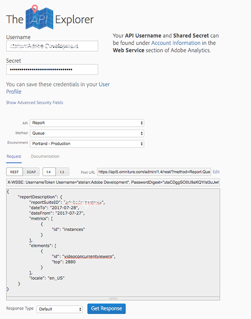
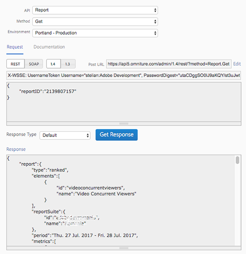

# Get concurrent viewers JSON report data{#get-concurrent-viewers-json-report-data}

You can obtain concurrent viewers report data using the _*1.4 version*_ of the Analytics APIs:
* [Analytics APIs](https://github.com/AdobeDocs/analytics-1.4-apis)
* [Swagger](https://adobedocs.github.io/analytics-1.4-apis/swagger-docs.html#/Report/Report.Get)

1. Filter the data using any segment that built on the UI. To filter by a specific Content ID, create a new segment.  
1. Set the `elements` -> `id` in the request body to `videoconcurrentviewers`.
1. Request a sufficient amount of data. Adobe recommends 3200 data points, to ensure there are no gaps in the data. 

    * The data range you specify in the report gathers all concurrent viewer data _at the time the video session ended._ 
       So, you must account for sessions that start on one day and end after midnight (i.e., the next day).

    * Request more than one day of data, but in your analysis _*use only the first day of the data.*_

A sample request payload for this scenario would look like this:

```
{
  "reportDescription":{
    "reportSuiteID":"[YOUR_RSID]",
    "dateFrom":"2018-07-01",
    "dateTo":"2018-07-02",
    "metrics":[
      {
        "id":"instances"
      }
    ],
    "elements":[
      {
        "id":"videoconcurrentviewers",
        "top":"3200"
      }
    ],
    "segments":[
      {
        "id":"s1234_58ca4fc7e4b0abc238707bb9"                                         
      }
    ],
    "sortBy":"instances",
    "locale":"en_US"
  }
}
```

<!--
You can extract the concurrent viewers report data using the Experience Cloud API Explorer as follows. 

1. Navigate to: [https://www.adobe.io.](https://www.adobe.io)
1. Select and enter the following information in the API Explorer form:

    * **API -** Select "Report".
    * **Method -** Select "Queue".
    * **Environment -** Select your data center.
    * Request JSON - Specify the following:

        * `reportSuiteID` - For info on reports suites: [Report Suites](https://experienceleague.adobe.com/docs/analytics/admin/manage-report-suites/report-suites-admin.html)
        
        * `dateTo` - End date of the report.         
        
          >[!NOTE]
          >
          >The maximum time period supported is two days.

        * `dateFrom` - Start date of the report.
        * `elements : id` - Set to `"videoconcurrentviewers"`
        
        * `elements : top` - Specify the number of entries to be returned.

      Sample request body:

      ```    
      {
          "reportDescription": {
              "reportSuiteID": "[Your Report Suite ID]",
              "dateTo": "2017-09-07",
              "dateFrom": "2017-09-07"
              "metrics": [
                  {
                      "id": "instances"
                  }
              ],
              "elements": [
                  {
                      "id": "videoconcurrentviewers",
                      "top": 2880
                  }
              ]
              "locale": "en_US"
          }
      }
      
      ```

      >[!TIP]
      >
      >Some sessions are ended on the next day, and at that point the data will be available for reporting. In that case the best approach is to select 2 days (2880 minutes) of data, and use only the data for the first day (1440 minutes).

1. Click **Get Response**.

   In the Response field, you should get a `reportID`.
1. In the form, change **Method** to "Get".
1. Enter the value of the `reportID` you received in Step 3, and click **Get Response**.

   The concurrent viewers report data, in JSON format, is presented in the Response field.
   
   For example:
   
    

   

-->
