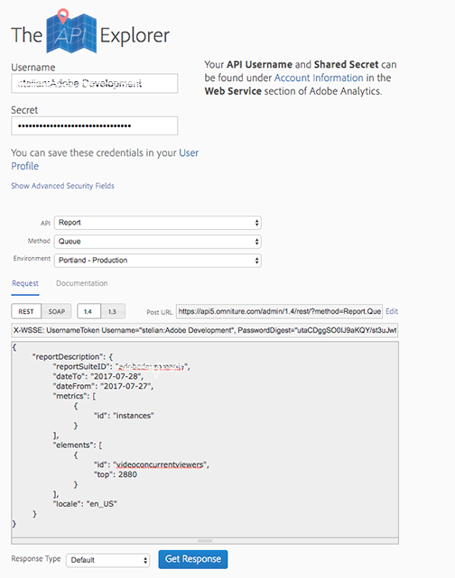

# Get Media Playback Time Spent JSON report data with Analytics 2.0 APIs{#get-media-playback-time-spent-json-report-data}

You can obtain media playback time spent report data using the [_*Analytics 2.0 APIs*_](https://www.adobe.io/apis/experiencecloud/analytics/docs.html).

1. Filter the data using any segment that is built on the UI. To filter by a specific Content ID, create a new segment.  
1. Set the `elements` -> `id` in the request body to `metrics/playback_time_spent_seconds` or `metrics/playback_time_spent_minutes` depending on whether you want the output in seconds or minutes.
1. Request a sufficient amount of data.  

    * The data range you specify in the report gathers all concurrent viewer data _at the time the video session ended._
       You must account for sessions that start on one day and end after midnight which is the next day.

    * Request one more day of data to your intended period in your request, but in your analysis _*use only the intended data.*_

A sample request payload for one day of data would look like the following sample. The request is done for 2 consecutive days but in reporting you use only the first day.

## Sample Request

```json
{
    "rsid": "[YOUR_RSID]",
    "locale": "en_US",
    "dimension": "variables/daterangeminute",
    "globalFilters": [
        {
            "dateRange": "2021-09-02T00:00/2021-09-03T00:00",
            "type": "dateRange"
        }
    ],
    "metricContainer": {
        "metrics": [
            {
                "columnId": "column1",
                "id": "metrics/playback_time_spent_minutes"
            }
        ]
    },
    "settings": {
        "dimensionSort": "asc",
        "limit": "2000",
        "page": 0
  }
}

```

## Sample Response

```JSON
{
   "totalPages":1,
   "firstPage":true,
   "lastPage":true,
   "numberOfElements":1440,
   "number":0,
   "totalElements":1440,
   "columns":{
      "dimension":{
         "id":"variables/daterangeminute",
         "type":"time"
      },
      "columnIds":[
         "column1"
      ]
   },
   "rows":[
      {
         "itemId":"12008020000",
         "value":"00:00 2021-09-02",
         "data":[
            123.0
         ]
      },
      {
         "itemId":"12008020001",
         "value":"00:01 2021-09-02",
         "data":[
            143.0
         ]
      },
      {
         "itemId":"12008020002",
         "value":"00:02 2021-09-02",
         "data":[
            167.0
         ]
      },

      ...
      {
         "itemId":"12008022359",
         "value":"23:59 2021-09-02",
         "data":[
            768.0
         ]
      }
   ],
   "summaryData":{
      "filteredTotals":[
         17124.0
      ],
      "totals":[
         18453.0
      ]
   }
}

```


<!--
You can extract the Media Playback Time Spent report data using the Experience Cloud API Explorer as follows.

1. Navigate to: [https://www.adobe.io.](https://www.adobe.io)
1. Select and enter the following information in the API Explorer form:

    * **API -** Select "Report".
    * **Method -** Select "Queue".
    * **Environment -** Select your data center.
    * Request JSON - Specify the following:

        * `reportSuiteID` - For info on reports suites: [Report Suites](https://experienceleague.adobe.com/docs/analytics/admin/manage-report-suites/report-suites-admin.html)

        * `dateTo` - End date of the report.         

          >[!NOTE]
          >
          >The maximum time period supported is two days.

        * `dateFrom` - Start date of the report.
        * `elements : id` - Set to `"videoconcurrentviewers"`

        * `elements : top` - Specify the number of entries to be returned.

      Sample request body:

      ```    
      {
          "reportDescription": {
              "reportSuiteID": "[Your Report Suite ID]",
              "dateTo": "2017-09-07",
              "dateFrom": "2017-09-07"
              "metrics": [
                  {
                      "id": "instances"
                  }
              ],
              "elements": [
                  {
                      "id": "videoconcurrentviewers",
                      "top": 2880
                  }
              ]
              "locale": "en_US"
          }
      }

      ```

      >[!TIP]
      >
      >Some sessions are ended on the next day, and at that point the data will be available for reporting. In that case the best approach is to select 2 days (2880 minutes) of data, and use only the data for the first day (1440 minutes).

1. Click **Get Response**.

   In the Response field, you should get a `reportID`.
1. In the form, change **Method** to "Get".
1. Enter the value of the `reportID` you received in Step 3, and click **Get Response**.

   The Media Playback Time Spent report data, in JSON format, is presented in the Response field.

   For example:

   

   

-->
