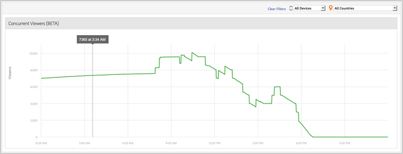

# Media concurrent viewers{#media-concurrent-viewers}

The Media Concurrent Viewers dashboard displays concurrent viewers during one day. The data can be filtered by content, device type, or country.

>[!TIP]
>
>No data will be displayed if the selected interval is not an entire day.

## Report features {#report-features}

Here are some features of this report:

* This is not in real time. It has normal Adobe Analytics latency. 
* The report covers a 24 hour time frame. The x-axis is time-of-day based on the report suite time zone. 
* This shows concurrent viewers at minute granularity. 
* There is a *Media Concurrent Viewers Report* that shows how many viewers are watching or listening across all content. 
* There is a Concurrent Viewers report within the *Media Detail* report that shows how many viewers are watching or listening to one specific media item. 
* The report only works across one day. 
* The customer can look at historical concurrent viewer reports (limited to a single day).

## Limitations {#limitations}

Here are some limitations for this report:

* You cannot export the data, such as ReportBuilder. 
* You cannot present the data in a table format. 
* You cannot send a report via email. 
* Even if you do not track ads, you have to re-enable media tracking and select the Media Ad module. 
* This functionality will provide accurate data when using a heartbeats Library that has Pause tracking capabilities.

