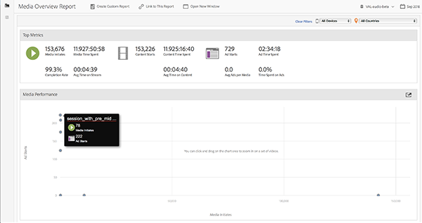
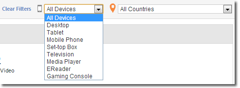

# Media overview{#media-overview}

The Media Overview dashboard is designed to let you monitor media across your site. The Media Overview display shows several aggregate measurements so you can quickly monitor that media is performing as expected. A graph displays content starts next to ad starts to let you quickly view these metrics for each media item. 

{width="672px"} 

## Quick Filters {#section_8DF3E4A6734145B082657C6BECFA0BBE}

Quickly display media metrics by device or geo country: 

{width="400px"}

## Media Performance {#section_288FB476EDA44761BB8A86551F0A110C}

Click-and-drag to zoom in, then hover to view granular metrics for specific media. Click  

to reset the view after you zoom. 

{width="400px"}

