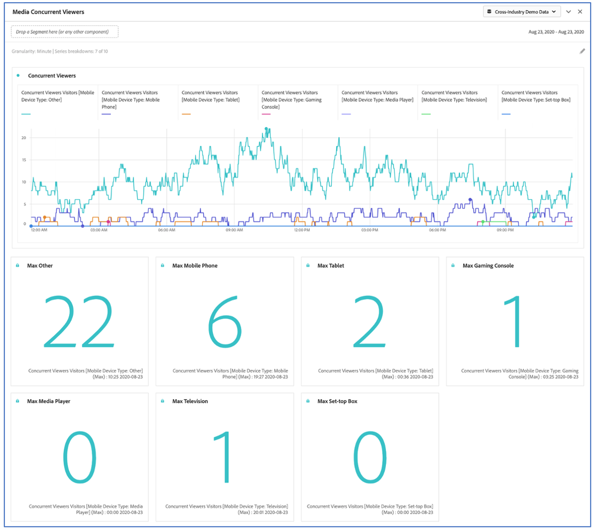

# Media Concurent Viewers{#media-concurrent-viewers}

For Media Analytics customers, the Media Concurrent Viewers panel enables you to understand where peak concurrency occurred or where drop-offs happened to provide valuable insight into the quality of content and viewer engagement, and to help with troubleshooting or planning for volume and scale.  [Learn More](https://docs.adobe.com/content/help/en/analytics/analyze/analysis-workspace/panels/media-concurrent-viewers.html)

## Panel Output

