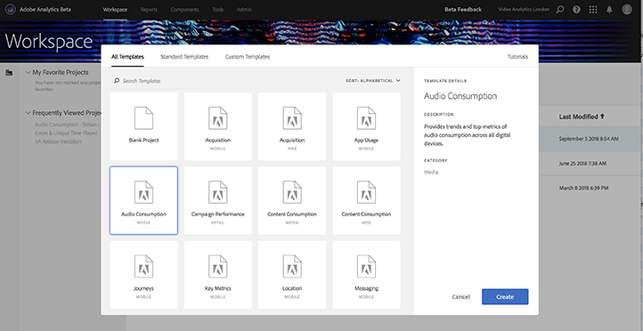
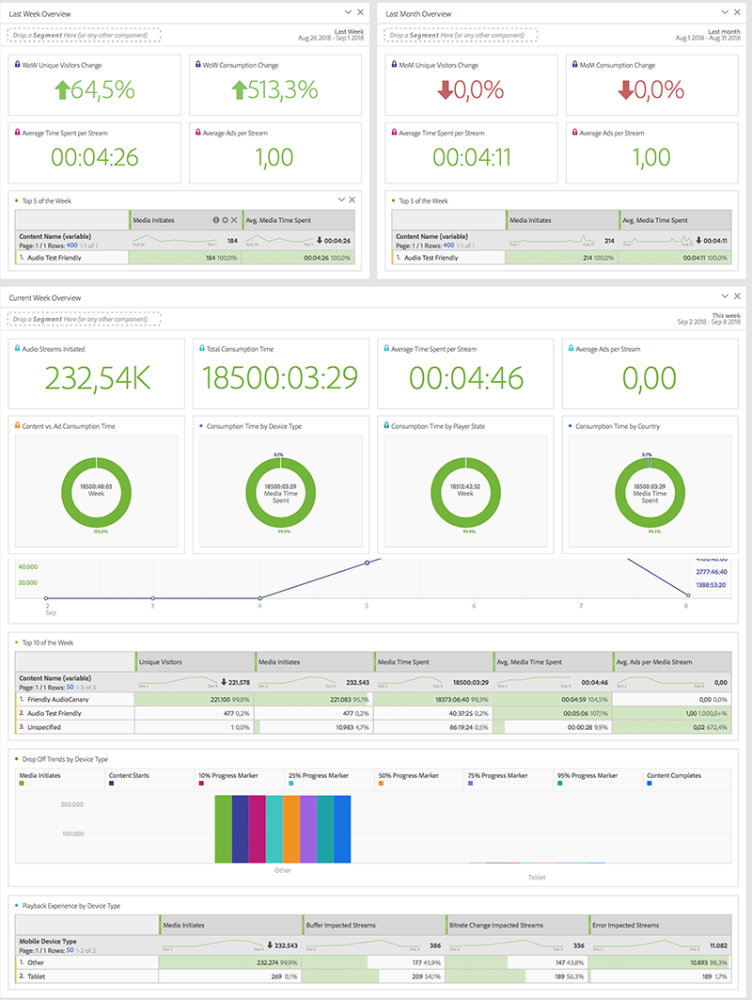

# Media workspace templates{#media-workspace-templates}

Adobe Analytics Workspace gives you the ability to quickly set up dashboards for analyzing your tracking data. When you create a new project, or when you go in to Workspace to manage an existing project, you can choose from standard templates that cover common general tracking scenarios, such as Acquisition, Streaming Media consumption, and more. You can also create, modify, and save your own custom templates.

You work with templates from the Workspace tab in Adobe Analytics, when you create or manage a project. When you initially go into Workspace, you are presented with the options of creating a new project or opening an existing project:

* **Create a new project -** When you click the **[!UICONTROL Create New Project]** button in Workspace, you are presented with a dialog from which you can select from your collection of templates (including Standard and Custom):

  

  For example, if you choose the **[!UICONTROL Audio Consumption]** template, a project with the following audio-oriented dashboard is presented:

  

* **Manage projects -** In an existing project, you can modify the data presentation and Save As to create your own collection of custom templates.
