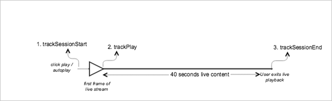

# Live content playback


><a id="fig_65D741D8180845E3BD58C248DD5083C6"></a>  
>Here is the expected API call order: >
>```
>js>// Set up mediaObject 
>var mediaInfo =  
>  MediaHeartbeat.createMediaObject(Configuration.VIDEO_NAME,  
>                                   Configuration.VIDEO_ID,  
>                                   Configuration.VIDEO_LENGTH,  
>                                   MediaHeartbeat.StreamType.VOD); 
> 
>var videoMetadata = { 
>    CUSTOM_KEY_1 : CUSTOM_VAL_1,  
>    CUSTOM_KEY_2 : CUSTOM_VAL_2,  
>    CUSTOM_KEY_3 : CUSTOM_VAL_3 
>}; 
> 
>// 1. Call trackSessionStart() when Play is clicked or if autoplay  
>//    is used, i.e., there's an intent to start playback. 
>this._mediaHeartbeat.trackSessionStart(mediaInfo, videoMetadata); 
> 
>...... 
>...... 
> 
>// 2. Call trackPlay() when the playback actually starts, i.e., when the  
>//    first frame of video is rendered on the screen. 
>this._mediaHeartbeat.trackPlay(); 
> 
>....... 
>....... 
> 
>// 3. Call trackSessionEnd() when user ends the playback session.  
>//    Since user does not watch live video to completion, there is  
>//    no need to call trackComplete(). 
>this._mediaHeartbeat.trackSessionEnd(); 
> 
>........ 
>........ 
>
>```

