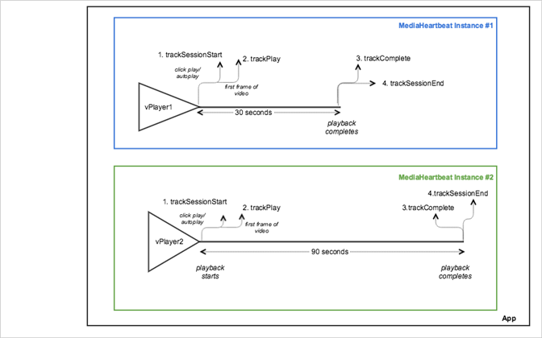

# Multiple trackers in parallel


><a id="fig_E333C95A544A4DCFB192F9DA9093BB04"></a>  
>
>```
>java>public class VideoAnalyticsProvider implements MediaHeartbeatDelegate { 
>    private VideoPlayer _player; 
>    private MediaHeartbeat _heartbeat; 
> 
>    public VideoAnalyticsProvider(VideoPlayer player) { 
>        if (player == null) { 
>            throw new IllegalArgumentException("Player reference cannot be null."); 
> 
>        } 
>        _player = player;  
>        _player.addObserver(this); 
> 
>        // Media Heartbeat initialization 
>        MediaHeartbeatConfig config = new MediaHeartbeatConfig(); 
>        config.trackingServer = HEARTBEAT_TRACKING_SERVER; 
>        config.channel = HEARTBEAT_CHANNEL; 
>        config.appVersion = HEARTBEAT_SDK; 
>        config.ovp = HEARTBEAT_OVP; 
>        config.playerName = PLAYER_NAME; 
>        config.ssl = false; 
>        config.debugLogging = true;  
> 
>        _heartbeat = new MediaHeartbeat(this, config); 
>    } 
> 
>    @Override 
>    public MediaObject getQoSObject() { 
>        return MediaHeartbeat.createQoSObject(BITRATE,  
>                                              STARTUP_TIME,  
>                                              FPS,  
>                                              DROPPED_FRAMES); 
>    } 
> 
>    @Override 
>    public Double getCurrentPlaybackTime() { 
>        return _player.getCurrentPlaybackTime(); 
>    } 
>} 
>
>```
>
>```
>java>@Override 
>protected void onCreate(Bundle savedInstanceState) { 
>    super.onCreate(savedInstanceState); 
>    setContentView(R.layout.activity_main); 
> 
>    // Bootstrap the AdobeMobile library.  
>    Config.setContext(this.getApplicationContext()); 
> 
>    // Create first VideoPlayer instance.  
>    _player1 = new VideoPlayer(); 
> 
>    // Create first VideoAnalyticsProvider instance and 
>    // attach it to the VideoPlayer instance.  
>    _analyticsProvider1 = new VideoAnalyticsProvider(_player1); 
> 
>    // Load the main video content.  
>    Uri uri =  
>      Uri.parse("android.resource://" + getPackageName() + "/" + R.raw.video1);  
>    _player1.loadContent(uri); 
> 
>    // Create second VideoPlayer instance.  
>    _player2 = new VideoPlayer(); 
> 
>    // Create second VideoAnalyticsProvider instance and 
>    // attach it to the VideoPlayer instance.  
>    _analyticsProvider2 = new VideoAnalyticsProvider(_player2); 
> 
>    // Load the main video content.  
>    Uri uri =  
>      Uri.parse("android.resource://" + getPackageName() + "/" + R.raw.video2);  
>    _player2.loadContent(uri); 
>} 
>
>```

>Both instances of ` VideoAnalyticsProvider` and ` MediaHeartbeat` track two separate sessions, each with its own unique session IDs. The two sessions in the Charles debugging tool or debug logs can be identified by using the session ID value. To display this scenario in Android, set up the following code: 
>
>```
>java>// Set up mediaObject 
>MediaObject mediaInfo = MediaHeartbeat.createMediaObject( 
>    Configuration.VIDEO_NAME,  
>    Configuration.VIDEO_ID, 
>    Configuration.VIDEO_LENGTH,  
>    MediaHeartbeat.StreamType.VOD 
>); 
> 
>HashMap<String, String> videoMetadata = new HashMap<String, String>(); 
>videoMetadata.put(CUSTOM_VAL_1, CUSTOM_KEY_1); 
>videoMetadata.put(CUSTOM_VAL_2, CUSTOM_KEY_2); 
> 
>// 1. Call trackSessionStart() when the user clicks Play or if autoplay is used,  
>//    i.e., there is an intent to start playback. 
>_mediaHeartbeat.trackSessionStart(mediaInfo, videoMetadata); 
> 
>...... 
>...... 
> 
>// 2. Call trackPlay() when the playback actually starts, i.e., when the first  
>//    frame of main content is rendered on the screen.  
>_mediaHeartbeat.trackPlay(); 
> 
>....... 
>....... 
> 
>// 3. Call trackComplete() when the playback reaches the end, i.e., when the 
>//    video completes and finishes playing.  
>_mediaHeartbeat.trackComplete(); 
> 
>........ 
>........ 
> 
>// 4. Call trackSessionEnd() when the playback session is over. This method must  
>//    be called even if the user does not watch the video to completion. 
>_mediaHeartbeat.trackSessionEnd(); 
> 
>........ 
>........ 
>
>```

