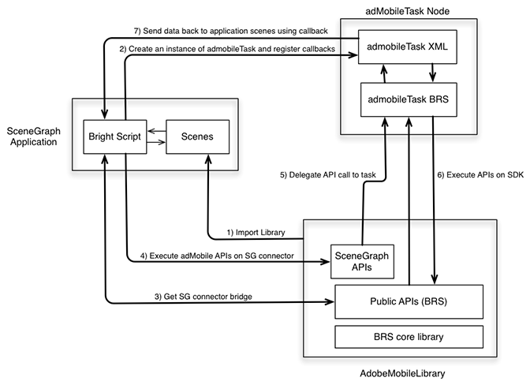

# Tracking in SceneGraph (Roku){#tracking-in-scenegraph-roku}

## Introduction {#section_vfr_zcz_y2b}

Roku has introduced a new programming framework for developing applications: the SceneGraph XML programming framework. This new framework features two new key concepts:

* SceneGraph rendering of the application screens
* XML configuration of the SceneGraph screens

The Adobe Mobile SDK for Roku is written in BrightScript. The SDK uses many components that are not available for an app running on SceneGraph (for example, threads). Therefore, a Roku app developer intending to use the SceneGraph framework cannot call Adobe Mobile SDK APIs (the latter are similar to those available in legacy BrightScript apps).

## Architecture {#section_dj5_1dz_y2b}

To add SceneGraph support to the AdobeMobile SDK, Adobe has added a new API that creates a connector bridge between the AdobeMobile SDK and `adbmobileTask`. The latter is a SceneGraph node used for the SDK's API execution. (Usage of `adbmobileTask` is explained in detail throughout the rest of this document.)

The connector bridge is designed to perform as follows:

* The bridge returns a SceneGraph-compatible instance of the AdobeMobile SDK. The SceneGraph-compatible SDK has all of the APIs that the legacy SDK exposes. 
* You use the AdobeMobile SDK APIs in SceneGraph in a very similar way to how you used the legacy APIs. 
* The bridge also exposes a mechanism to listen for callbacks for APIs that return some data.



## Components {#section_jwl_wqx_1bb}

**SceneGraph Application:**

* Consumes `AdobeMobileLibrary` APIs via the SceneGraph connector bridge APIs.
* Registers for response callbacks on `adbmobileTask` for expected output data variables.

**AdobeMobileLibrary:**

* Exposes a set of public APIs (Legacy), including the connector bridge API.
* Returns a SceneGraph connector instance that wraps all legacy public APIs.
* Communicates with an `adbmobileTask` SceneGraph node for execution of APIs.

**adbmobileTask Node:**

* A SceneGraph task node that executes `AdobeMobileLibrary` APIs on a background thread.
* Serves as a delegate to return data back to application scenes.

## Public SceneGraph APIs {#section_jyd_hdz_y2b}

### ADBMobileConnector

|  Category  | Method Name  | Description  |
|---|---|---|
|  ***Constants*** | ||
|  | `sceneGraphConstants`  | Returns an object containing `SceneGraphConstants`. Refer to the table above for details.  |
|  | | |
|  ***Debug Logging*** | ***For more information refer to the Debug Logging section of the legacy SDK.*** ||
|  | `setDebugLogging`  | SceneGraph API to set debug logging on the ADBMobile SDK.  |
|  | `getDebugLogging`  | SceneGraph API to get debug logging from the ADBMobile SDK.  |
|  | | |
|  ***Privacy Status / Opt-Out*** | ***For more information, refer to the Opt-Out/Privacy Status section of the legacy SDK.*** ||
|  | `setPrivacyStatus`  | SceneGraph API to set privacy status on the ADBMobile SDK.  |
|  | `getPrivacyStatus`  | SceneGraph API to get privacy status from the ADBMobile SDK.  |
|  | | |
|  ***Analytics*** | ***For more information refer to the Analytics section of the legacy SDK.*** ||
|  | `trackState`  | SceneGraph API to track state on the ADBMobile SDK.  |
|  | `trackAction`  | SceneGraph API to track action on the ADBMobile SDK.  |
|  | `trackingIdentifier`  | SceneGraph API to get a tracking identifier from the ADBMobile SDK.  |
|  | `userIdentifier`  | SceneGraph API to get a user identifier from the ADBMobile SDK.  |
|  | `setUserIdentifier`  | SceneGraph API to set the user identifier on the ADBMobile SDK.  |
|  | `getAllIdentifiers`  | SceneGraph API retrieves all user identities known and persisted by the Roku SDK.  |
|  | | |
|  ***Experience Cloud*** | ***For more information refer to the Experience Cloud section of the legacy SDK.*** ||
|  | `visitorSyncIdentifiers`  | SceneGraph API to sync Experience Cloud identifiers on the ADBMobile SDK.  |
|  | `visitorMarketingCloudID`  | SceneGraph API to get Visitor Experience Cloud ID from the ADBMobile SDK.  |
|  | | |
|  ***Audience Manager*** | ***For more information refer to the Audience Manager section of the legacy SDK.*** ||
|  | `audienceSubmitSignal`  | SceneGraph API to send an audience management signal with trait.  |
|  | `audienceVisitorProfile`  | SceneGraph API to get an audience manager visitor profile from the ADBMobile SDK.  |
|  | `audienceDpid`  | SceneGraph API to get an audience Dpid from the ADBMobile SDK.  |
|  | `audienceDpuuid`  | SceneGraph API to get an audience Dpuuid from the ADBMobile SDK.  |
|  | `audienceSetDpidAndDpuuid`  | SceneGraph API to set audience Dpid and Dpuuid on the ADBMobile SDK.  |
|  | | |
|  ***MediaHeartbeat*** | ***For more information refer to the MediaHeartbeat section of the legacy SDK.*** ||
|  | `mediaTrackLoad`  | SceneGraph API to load video content for MediaHeartbeat tracking.  |
|  | mediaTrackStart  | SceneGraph API to start video tracking session using MediaHeartbeat.  |
|  | `mediaTrackUnload`  | SceneGraph API to unload video content from MediaHeartbeat tracking.  |
|  | `mediaTrackPlay`  | SceneGraph API to track playback of video content.  |
|  | mediaTrackPause  | SceneGraph API to track paused video content.  |
|  | `mediaTrackComplete`  | SceneGraph API to track playback complete for video content.  |
|  | `mediaTrackError`  | SceneGraph API to track playback errors.  |
|  | mediaTrackEvent  | SceneGraph API to track playback events during tracking. For example: Ads, Chapters.  |
|  | `mediaUpdatePlayhead`  | SceneGraph API to send playhead updates to MediaHeartbeat during video tracking.  |
|  | `mediaUpdateQoS`  | SceneGraph API to send QoS updates to MediaHeartbeat during video tracking.  |

### SceneGraphConstants

|  Constant Name  | Description  |
|---|---|
|  `API_RESPONSE`  | Used to retrieve the response object from `adbmobileTask` node's `adbmobileApiResponse` field  |
|  `DEBUG_LOGGING`  | Used as `apiName` for `getDebugLogging`  |
|  `PRIVACY_STATUS`  | Used as `apiName` for `getPrivacyStatus`  |
|  `TRACKING_IDENTIFIER`  | Used as `apiName` for `trackingIdentifier`  |
|  `USER_IDENTIFIER`  | Used as `apiName` for `userIdentifier`  |
|  `VISITOR_MARKETING_CLOUD_ID`  | Used as `apiName` for `visitorMarketingCloudID`  |
|  `AUDIENCE_VISITOR_PROFILE`  | Used as `apiName` for `audienceVisitorProfile`  |
|  `AUDIENCE_DPID`  | Used as `apiName` for `audienceDpid`  |
|  `AUDIENCE_DPUUID`  | Used as `apiName` for `audienceDpuuid`  |

### adbmobileTask Node

| Field | Type | Default | Usage |
| --- | --- | --- | --- |
| `adbmobileApiCall` | `assocarray` | _Invalid_ | **_Do NOT_** modify this field or let is be used by the Application. This field is used by the ADBMobile SceneGraphConnector to route API calls via SceneGraph nodes and to fetch responses. Therefore, this key/field is reserved for AdobeMobileSDK for SceneGraph compatibility.  Important:  Any modifications to this field may result in AdobeMobileSDK functioning incorrectly.  |
| `adbmobileApiResponse` | `assocarray` | _Invalid_ | **Read-Only** All of the APIs executed on AdobeMobileSDK will return responses on this field. Register for a callback to listen for updates to this field in order to receive response objects. Following is the format for the response object: <br/><br/> `response = {` <br/><br/>&nbsp;&nbsp; `"apiName" : <SceneGraphConstants.API_NAME>` <br/>&nbsp;&nbsp; `"returnValue : <API_RESPONSE>` <br/> `}` An instance of this response object will be sent for any API call on AdobeMobileSDK that is expected to return a value as per the API reference guide. For example, an API call for **visitorMarketingCloudID()** will return following response object: <br/><br/>`response = {` <br/>&nbsp;&nbsp; `"apiName" : m.adbmobileConstants.VISITOR_MARKETING_CLOUD_ID` <br/>&nbsp;&nbsp; `"returnValue : "07050xxxx25671xxxx33760xxxx72644xxxx14"` <br/> `}` OR, response data can be invalid as well: <br/><br/>`response = {` <br/>&nbsp;&nbsp; `"apiName" : m.adbmobileConstants.VISITOR_MARKETING_CLOUD_ID` <br/>&bsp;&nbsp; `"returnValue : invalid }` |

### adbmobile.brs

|  Name  | API Signature  | Input  | Return Type&nbsp;&nbsp;  |
|---|---|---|---|
|  `getADBMobileConnectorInstance`  | `ADBMobile().getADBMobileConnectorInstance()`  | `adbmobileTask`  | `ADBMobileConnector`  |
|  *Comments:* Refer to the `ADBMobileConnector` API reference for details.  ||||
|  ||||
|  `sgConstants`  | `ADBMobile().sgConstants()`  | None  | `SceneGraphConstants`  |
|  *Comments:* Refer to the `SceneGraphConstants` API reference for details.  ||||

In addition to methods above, `ADBMobileConnector` also exposes all the `ADBMobile` constants for the following:

### ADBMobile Constants

|  Feature  | Constant Name  | Description&nbsp;&nbsp;  |
|---|---|---|
|  Versioning  | `version`  | Constant for retreiving AdobeMobileLibrary verison info  |
|  Privacy/opt-out  | `PRIVACY_STATUS_OPT_IN`  | Constant for privacy status opted in  |
|   | `PRIVACY_STATUS_OPT_OUT`  | Constant for privacy status opted out  |
|  MediaHeartbeat Constants  | Refer to the constants on this page: [Media Heartbeat Methods](https://marketing.adobe.com/resources/help/en_US/sc/appmeasurement/hbvideo/roku/r_vhl_med-hrbts-meth.html).  | Use these constants for using MediaHeartbeat APIs  |
|  Standard Metadata  | Refer to the constants on this page: [Standard Metadata Parameters](https://marketing.adobe.com/resources/help/en_US/sc/appmeasurement/hbvideo/roku/c_vhl_stand-meta_roku.html).  | Use these constants to attach Standard Video/Ad metadata in MediaHeartbeat APIs  |

Globally defined utility `MediaHeartbeat` APIs on the legacy AdobeMobileLibrary are accessible *as is* in the SceneGraph enviromnet because they do not use any components for Brightscript that are unavailable in SceneGraph nodes. For more information on these methods, refer to the table below:

### Global Methods for MediaHeartbeat

| Method | Description |
| --- | --- |
| `adb_media_init_mediainfo` | This method returns an initialized Media Information object `Function adb_media_init_mediainfo(name As String, id As String, length As Double, streamType As String) As Object` |
| `adb_media_init_adinfo` | This method returns initialized Ad Information object `Function adb_media_init_adinfo(name As String, id As String, position As Double, length As Double) As Object` |
| `adb_media_init_chapterinfo` | This method returns initialized Chapter Information object.  `Function adb_media_init_adbreakinfo(name As String, startTime as Double, position as Double) As Object` |
| `adb_media_init_adbreakinfo` | This method returns initialized AdBreak Information object.  `Function adb_media_init_chapterinfo(name As String, position As Double, length As Double, startTime As Double) As Object` |
| `adb_media_init_qosinfo` | This method returns an initialized QoS Information object.  `Function adb_media_init_qosinfo(bitrate As Double, startupTime as Double, fps as Double, droppedFrames as Double) As Object` | 

## Implementation {#section_dbz_ydz_y2b}

1. **Download the Roku Library**Download the latest Roku library from [https://github.com/Adobe-Marketing-Cloud/video-heartbeat-v2/releases](https://github.com/Adobe-Marketing-Cloud/media-sdks/releases).

1. **Set Up Your Development Environment**

    1. Copy [!DNL adbmobile.brs] (AdobeMobileLibrary) into your [!DNL pkg:/source/] directory.
    
    1. For Scene Graph support, copy [!DNL adbmobileTask.brs] and [!DNL adbMobileTask.xml] into your [!DNL pkg:/components/] directory.

1. **Initialize**

    1. Import [!DNL adbmobile.brs] into your Scene.

       ```    
       <script type="text/brightscript" uri="pkg:/source/adbmobile.brs" />
       ```

    1. Create an instance of `adbmobileTask` node into your Scene.

       ```    
       m.adbmobileTask = createObject("roSGNode", "adbmobileTask")
       ```

    1. Get an instance of `adbmobile` connector for SceneGraph using the `adbmobileTask` instance.

       ```    
       m.adbmobile = ADBMobile().getADBMobileConnectorInstance(m.adbmobileTask)
       ```

    1. Get `adbmobile` SG constants.

       ```    
       m.adbmobileConstants = m.adbmobile.sceneGraphConstants()
       ```

    1. Register a callback for receiving response object for all `AdbMobile` API calls.

       ```    
       m.adbmobileTask.ObserveField(m.adbmobileConstants.API_RESPONSE,  
                                    "onAdbmobileApiResponse") 
          
       ' Sample implementation of the callback 
       ' Listen for all the constants for which API calls are made on the SDK 
       function onAdbmobileApiResponse() as void 
           responseObject = m.adbmobileTask[m.adbmobileConstants.API_RESPONSE] 
         
           if responseObject <> invalid 
               methodName = responseObject.apiName 
               retVal = responseObject.returnValue 
        
               if methodName = m.adbmobileConstants.DEBUG_LOGGING 
                   if retVal 
                       print "API Response: DEBUG LOGGING: " + "True" 
                   else 
                       print "API Response: DEBUG LOGGING: " + "False" 
                   endif 
               else if methodName = m.adbmobileConstants.PRIVACY_STATUS 
                   print "API Response: PRIVACY STATUS: " + retVal 
               else if methodName = m.adbmobileConstants.TRACKING_IDENTIFIER 
                   if retVal <> invalid 
                       print "API Response: TRACKING IDENTIFIER: " + retVal 
                   else 
                       print "API Response: TRACKING IDENTIFIER: " + "invalid" 
                   endif 
               else if methodName = m.adbmobileConstants.USER_IDENTIFIER 
                   if retVal <> invalid 
                       print "API Response: USER IDENTIFIER: " + retVal 
                   else 
                       print "API Response: USER IDENTIFIER: " + "invalid" 
                   endif 
               else if methodName = m.adbmobileConstants.VISITOR_MARKETING_CLOUD_ID 
                   if retVal <> invalid 
                       print "API Response: MCID: " + retVal 
                   else 
                       print "API Response: MCID: " + "invalid" 
                   endif 
               else if methodName = m.adbmobileConstants.AUDIENCE_DPID 
                   if retVal <> invalid 
                       print "API Response: AUDIENCE DPID: " + retVal 
                   else 
                       print "API Response: AUDIENCE DPID: " + "invalid" 
                   endif 
               else if methodName = m.adbmobileConstants.AUDIENCE_DPUUID 
                   if retVal <> invalid 
                       print "API Response: AUDIENCE DPUUID: " + retVal 
                   else 
                       print "API Response: AUDIENCE DPUUID: " + "invalid" 
                   endif 
               else if methodName = m.adbmobileConstants.AUDIENCE_VISITOR_PROFILE 
                   if retVal <> invalid 
                       print "API Response: AUDIENCE VISITOR PROFILE: Valid Object" 
                   else 
                       print "API Response: AUDIENCE VISITOR PROFILE: " + "invalid" 
                   endif 
               endif 
           endif 
       end function 
       
       ```

## Sample Implementation {#section_mld_lfz_y2b}

**Sample API calls on Legacy SDK**

```
'get an instance of SDK 
m.adbmobile = ADBMobile() 
   
'execute setter APIs 
m.adbmobile.setDebugLogging(true) 
   
'execute getter APIs 
debugLogging = m.adbmobile.getDebugLogging()
```

**Sample API calls on SG SDK**

```
'create adbmobileTask instance 
m.adbmobileTask = createObject("roSGNode", "adbmobileTask") 
   
'get an instance of SDK using task instance 
m.adbmobile =  
  ADBMobile().getADBMobileConnectorInstace(m.adbmobileTask) 
m.adbmobileConstants = m.adbmobile.sceneGraphConstants() 
'execute setter APIs 
m.adbmobile.setDebugLogging(true) 
  
'execute getter APIs 
m.adbmobileTask.ObserverField(m.adbConstants.API_RESPONSE,  
                              "onAdbmobileApiResponse") 
m.adbmobile.getDebugLogging() 
   
'listen for return data in registered callbacks 
function onAdbmobileApiResponse() as void 
    responseObject = m.adbmobileTask[m.adbmobileConstants.API_RESPONSE] 
  
        if responseObject <> invalid 
            methodName = responseObject.apiName 
            retVal = responseObject.returnValue 
  
        if methodName = m.adbmobileConstants.DEBUG_LOGGING 
            if retVal 
                print "API Response: DEBUG LOGGING: " + "True" 
            else 
                print "API Response: DEBUG LOGGING: " + "False" 
         endif 
    endif 
end function
```

