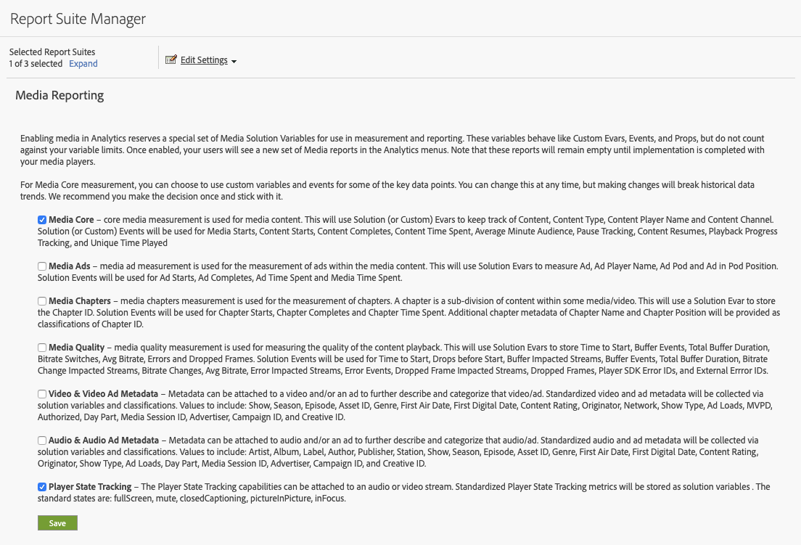
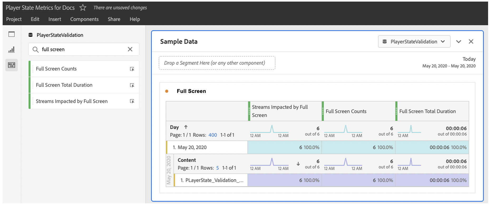

# Implementation and reporting

During a playback session, each state occurrence (start-to-end) must be tracked individually. The Media SDK and the Media Collection API provide new tracking methods for this capability.

The Media SDK includes two new methods for custom state tracking:

`trackStateStart("state_name")`

`trackStateClose("state_name")`


The Media Collection API includes two new events that have `media.stateName` as the required parameter:

`stateStart` and `stateEnd`

## Media SDK implementation

Player State Starts

```
// StateStart (ex: Mute is switched on)
var stateObject = ADB.Media.createStateObject(ADB.Media.PlayerState.Mute);
tracker.trackEvent(ADB.Media.Event.StateStart, stateObject);
```

Player State Ends

```
// StateEnd (ex: Mute is switched off)
tracker.trackEvent(ADB.Media.Event.StateEnd, stateObject);
```


## Media Collection API implementation

Player State Starts

```
// StateStart (ex: Mute is switched on)
http(s)://<Analytics_Visitor_Namespace>.hb-api.omtrdc.net/api/v1/sessions/<SID>/events
{
  "eventType": "stateStart",
  "params": {
    "media.state.name": "mute"
  },
  "playerTime": {
    "playhead": 0,
    "ts": 1569999130627
  }
}
```

Player State Ends

```
// StateEnd (ex: Mute is switched off)
http(s)://<Analytics_Visitor_Namespace>.hb-api.omtrdc.net/api/v1/sessions/<SID>/events

{
  "eventType": "stateEnd",
  "params": {
    "media.state.name": "mute"
  },
  "playerTime": {
    "playhead": 600,
    "ts": 1569999730638
  }
}
```

## State Metrics

The metrics provided for each individual state are computed and pushed to Adobe Analytics as Context Data parameters and stored for reporting purposes. Three metrics are available for each state:

* `a.media.states.[state.name].set = true` — Set to true if the state was set at least once per each specific playback of a stream.
* `a.media.states.[state.name].count = 4` — Identifies the number of occurrences of a state during per each individual playback of a stream
* `a.media.states.[state.name].time = 240` — Identifies the total state duration in seconds per each individual playback of a stream

## Reporting

All player state metrics can be used for any reporting visualization available in Analysis Workspace or a component (segment, calculated metrics) once a report suite is enabled for player state tracking. The new metrics could be enabled from the Admin Console for each individual report using Media Reporting Setup (Edit Settings > Media Management > Media Reporting).



In Analytics Workspace, all new properties are located in the metrics panel. For example, you can search by `full screen` to view the full screen data in the metrics panel.



## Importing player stated metrics to Adobe Experience Platform

Data stored in Analytics could be used for any purpose and the player state metrics can be imported into Adobe Experience Platform using XDM and used with Customer Journey Analytics. The standard state properties have specific properties while the custom states are properties are available using the custom events. For additional information about the standard state properties, see the *Properties List for XDM Identities* section on the [Player State Parameters](/help/metrics-and-metadata/player-state-parameters.md) page.
