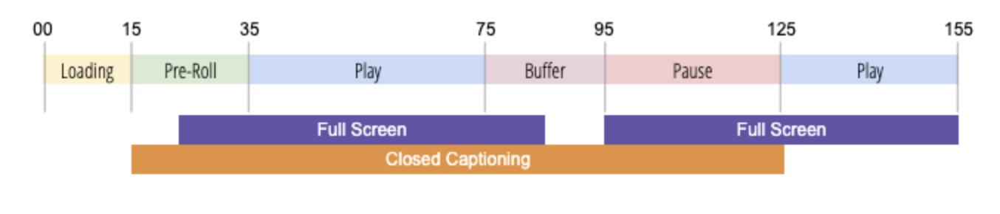

# About Player State Tracking

To optimize your product experience and drive value for your business, it's important to understand customer behavior when viewing videos. This includes  the time spent within different player states.  It's also important to have the flexibility to create and measure new player states and events as needed.

Player State Tracking provides the capability to capture viewer interaction during playback using a standard set of solution variables for full screen, closed captioning, mute, picture in picture, and in focus.  Player State Tracking also provides the flexibility to create custom player states. You can use Player State Tracking variables for reporting in Analysis Workspace.  

To capture changes to the player state, Player State Tracking updates the video measurement metadata. For example, to determine the "true" video engagement, Player State Tracking measures time spent with the sound on versus the passive or non-engaged video views when the sound is off or the time spent in Normal versus Full Screen mode.

Player State Tracking delivers the following benefits:

* Provides standard variables that measure common states such as full screen or closed captioning
* Provides customizable variables to measure custom states during a playback session
* Measures time spent within a custom player state
* Measures multiple states that may be concurrent

## Requirements

Player State Tracking requires one of the following for data collection:
* Media JS SDK 3.0+
* Chromecast 3.0 SDK for Adobe Marketing Cloud Solutions
* Media Analytics Extension (for use with the Adobe Experience Platform (AEP) SDK)
   * Web: Adobe Media Analytics (3.x SDK) for Audio and Video v1.0+
   * Mobile: Adobe Media Analytics for Audio and Video v2.0+
* Media Collection API

## Guidelines

Before implementing Player state tracking consider the following guidelines.

* The player state is computed across all playback states (no splitting).
* You can measure multiple player states at the same time.
* The maximum number of player states that can be tracked during a playback is 10.
* Player state metrics are sent to Analytics for reporting on the Media Close call only.
* Knowledge of the application status isn’t maintained after a state stops. After a state ends, the state must be started again to continue tracking. For every new playback state, the state of the player must be started again. 
* Player states are captured for each individual playback session—the player state is not computed across playbacks.
