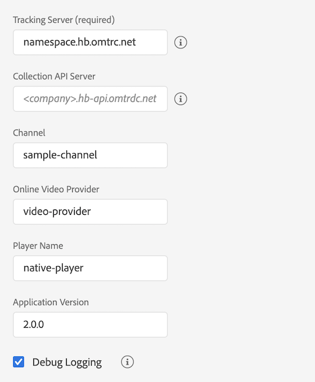

# Migrating from the standalone Media SDK to Adobe Launch - Android

>[!NOTE]
>Adobe Experience Platform Launch has been rebranded as a suite of data collection technologies in Experience Platform. Several terminology changes have rolled out across the product documentation as a result. Please refer to the following [document](https://experienceleague.adobe.com/docs/experience-platform/tags/term-updates.html?lang=en) for a consolidated reference of the terminology changes.


## Configuration

### Standalone Media SDK

In the standalone Media SDK, you configure tracking in the app, and pass it to
the SDK when you create the tracker.

```java
MediaHeartbeatConfig config = new MediaHeartbeatConfig();
config.trackingServer = "namespace.hb.omtrdc.net";
config.channel = "sample-channel";
config.appVersion = "v2.0.0";
config.ovp = "video-provider";
config.playerName = "native-player";
config.ssl = true;
config.debugLogging = true;

MediaHeartbeat tracker = new MediaHeartbeat(... , config);
```

### Launch Extension

1. In Experience Platform Launch, click the [!UICONTROL Extensions] tab for your
    mobile property.
1. On the [!UICONTROL Catalog] tab, locate the Adobe Media Analytics for Audio
    and Video extension, and click [!UICONTROL Install].
1. In the extension settings page, configure the tracking parameters.
    The Media extension will use the configured parameters for tracking.

  

[Using Mobile Extensions](https://aep-sdks.gitbook.io/docs/using-mobile-extensions/adobe-media-analytics)

## Tracker Creation

### Standalone Media SDK

In the standalone Media SDK you manually create the `MediaHeartbeatConfig` object
and configure the tracking parameters. Implement the delegate interface exposing
`getQoSObject()` and `getCurrentPlaybackTime()functions.`
Create a `MediaHeartbeat` instance for tracking.

```java
MediaHeartbeatConfig config = new MediaHeartbeatConfig();
config.trackingServer = "namespace.hb.omtrdc.net";
config.channel = "sample-channel";
config.appVersion = "v2.0";
config.ovp = "video-provider";
config.playerName = "native-player";
config.ssl = true;
config.debugLogging = true;

MediaHeartbeatDelegate delegate = new MediaHeartbeatDelegate() {
    @Override
    public MediaObject getQoSObject() {
        // When called should return the latest qos values.
        return MediaHeartbeat.createQoSObject(<bitrate>,  
                                              <startupTime>,  
                                              <fps>,  
                                              <droppedFrames>);
    }

    @Override
    public Double getCurrentPlaybackTime() {
        // When called should return the current player time in seconds.
        return <currentPlaybackTime>;
    }

    MediaHeartbeat tracker = new MediaHeartbeat(delegate, config);
}
```

### Launch Extension

[Media API reference - Create a Media Tracker](https://aep-sdks.gitbook.io/docs/using-mobile-extensions/adobe-media-analytics/media-api-reference#create-a-media-tracker)

Before you create the tracker, you should register the media extension and
dependent extensions with the mobile core.

```java
// Register the extension once during app launch
try {
    // Media needs Identity and Analytics extension
    // to function properly
    Identity.registerExtension();
    Analytics.registerExtension();

    // Initialize media extension.
    Media.registerExtension();                
    MobileCore.start(new AdobeCallback () {
        @Override
        public void call(Object o) {
            // Launch mobile property to pick extension settings.
            MobileCore.configureWithAppID("LAUNCH_MOBILE_PROPERTY");
        }
    });
} catch (InvalidInitException ex) {
    ...
}
```

Once you register the media extension, create the tracker using the following API.
The tracker automatically picks the configuration from the configured launch property.

```java
Media.createTracker(new AdobeCallback<MediaTracker>() {
    @Override
    public void call(MediaTracker tracker) {
        // Use the instance for tracking media.
    }
});
```

## Updating Playhead and Quality of Experience values.

### Standalone Media SDK

In the standalone Media SDK, you pass a delegate object that implements the
`MediaHeartbeartDelegate` interface during tracker creation.  The implementation
should return the latest QoE and playhead whenever the tracker calls the
`getQoSObject()` and `getCurrentPlaybackTime()` interface methods.

### Launch Extension

The implementation should update the current player playhead by calling the
`updateCurrentPlayhead` method exposed by the tracker. For accurate tracking
you should call this method at least once per second.

[Media API reference - Update Current Player](https://aep-sdks.gitbook.io/docs/using-mobile-extensions/adobe-media-analytics/media-api-reference#updatecurrentplayhead)

The implementation should update the QoE information by calling the `updateQoEObject`
method exposed by the tracker. We expect this method to be called whenever there
is a change in the quality metrics.

[Media API reference - Update QoE Object](https://aep-sdks.gitbook.io/docs/using-mobile-extensions/adobe-media-analytics/media-api-reference#updateqoeobject)

## Passing standard media / ad metadata

### Standalone Media SDK

* Standard Media Metadata:

   ```java
   MediaObject mediaInfo =
     MediaHeartbeat.createMediaObject("media-name",
                                      "media-id",
                                      60D,
                                      MediaHeartbeat.StreamType.VOD,
                                      MediaHeartbeat.MediaType.Video);

   // Standard metadata keys provided by adobe.
   Map <String, String> standardVideoMetadata =
     new HashMap<String, String>();
   standardVideoMetadata.put(MediaHeartbeat.VideoMetadataKeys.EPISODE,
                             "Sample Episode");
   standardVideoMetadata.put(MediaHeartbeat.VideoMetadataKeys.SHOW,
                             "Sample Show");
   standardVideoMetadata.put(MediaHeartbeat.VideoMetadataKeys.SEASON,
                             "Sample Season");
   mediaInfo.setValue(MediaHeartbeat.MediaObjectKey.StandardMediaMetadata,
                      standardVideoMetadata);

   // Custom metadata keys
   HashMap<String, String> mediaMetadata = new HashMap<String, String>();
   mediaMetadata.put("isUserLoggedIn", "false");
   mediaMetadata.put("tvStation", "Sample TV Station");
   tracker.trackSessionStart(mediaInfo, mediaMetadata);
   ```

* Standard Ad Metadata:

   ```java
   MediaObject adInfo =
     MediaHeartbeat.createAdObject("ad-name",
                                   "ad-id",
                                   1L,
                                   15D);

   // Standard metadata keys provided by adobe.
   Map <String, String> standardAdMetadata =
     new HashMap<String, String>();
   standardAdMetadata.put(MediaHeartbeat.AdMetadataKeys.ADVERTISER,
                          "Sample Advertiser");
   standardAdMetadata.put(MediaHeartbeat.AdMetadataKeys.CAMPAIGN_ID,
                          "Sample Campaign");
   adInfo.setValue(MediaHeartbeat.MediaObjectKey.StandardAdMetadata,
                   standardAdMetadata);

   HashMap<String, String> adMetadata =
     new HashMap<String, String>();
   adMetadata.put("affiliate",
                  "Sample affiliate");

   tracker.trackEvent(MediaHeartbeat.Event.AdStart,
                      adObject,
                      adMetadata);
   ```

### Launch Extension

* Standard Media Metadata:

   ```java
   HashMap<String, Object> mediaObject =
     Media.createMediaObject("media-name",
                             "media-id",
                             60D,
                             MediaConstants.StreamType.VOD,
                             Media.MediaType.Video);

   HashMap<String, String> mediaMetadata =
     new HashMap<String, String>();

   // Standard metadata keys provided by adobe.
   mediaMetadata.put(MediaConstants.VideoMetadataKeys.EPISODE,
                     "Sample Episode");
   mediaMetadata.put(MediaConstants.VideoMetadataKeys.SHOW,
                     "Sample Show");

   // Custom metadata keys
   mediaMetadata.put("isUserLoggedIn", "false");
   mediaMetadata.put("tvStation", "Sample TV Station");

   tracker.trackSessionStart(mediaInfo, mediaMetadata);
   ```

* Standard Ad Metadata:

   ```java
   HashMap<String, Object> adObject =
     Media.createAdObject("ad-name",
                          "ad-id",
                          1L,
                          15D);
   HashMap<String, String> adMetadata =
     new HashMap<String, String>();

   // Standard metadata keys provided by adobe.
   adMetadata.put(MediaConstants.AdMetadataKeys.ADVERTISER,
                  "Sample Advertiser");
   adMetadata.put(MediaConstants.AdMetadataKeys.CAMPAIGN_ID,
                  "Sample Campaign");

   // Custom metadata keys
   adMetadata.put("affiliate",
                  "Sample affiliate");
   _tracker.trackEvent(Media.Event.AdStart,
                       adObject,
                       adMetadata);
   ```
