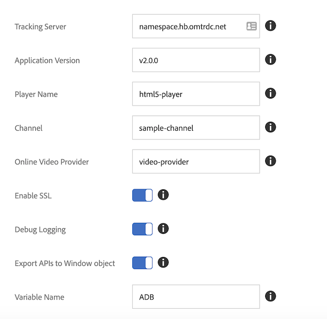

# Migrating from the standalone Media SDK to Adobe Launch - Web (JS)

>[!NOTE]
>Adobe Experience Platform Launch has been rebranded as a suite of data collection technologies in Experience Platform. Several terminology changes have rolled out across the product documentation as a result. Please refer to the following [document](https://experienceleague.adobe.com/docs/experience-platform/tags/term-updates.html?lang=en) for a consolidated reference of the terminology changes.

## Feature differences

* *Launch* - Launch provides you with a UI that walks you through setting up, configuring, and deploying your web-based media tracking solutions. Launch improves upon Dynamic Tag Management (DTM).
* *Media SDK* - The Media SDK provides you with media tracking libraries designed for specific platforms (e.g.: Android, iOS, etc.). Adobe recommends Media SDK for tracking media usage in your Mobile Apps.

## Configuration

### Standalone Media SDK

In the standalone Media SDK, you configure the tracking configuration in the app
and pass it to the SDK when you create the tracker.

```javascript
//Media Heartbeat initialization
var mediaConfig = new MediaHeartbeatConfig();
mediaConfig.trackingServer = "namespace.hb.omtrdc.net";
mediaConfig.playerName = "html5-player";
mediaConfig.channel = "sample-channel";
mediaConfig.ovp = "video-provider";
mediaConfig.appVersion = "v2.0.0"
mediaConfig.ssl = true;
mediaConfig.debugLogging = true;
```

In addition to the `MediaHeartbeat` configuration, the page must configure and pass
the `AppMeasurement` instance and `VisitorAPI` instance for media tracking in order
to work properly.

### Launch Extension

1. In Experience Platform Launch, click the [!UICONTROL Extensions] tab for your
    web property.
1. On the [!UICONTROL Catalog] tab, locate the Adobe Media Analytics for Audio and
    Video extension, and click [!UICONTROL Install].
1. In the extension settings page, configure the tracking parameters.
    The Media extension will use the configured parameters for tracking.

    

[Launch User Guide - Install & configure the media extension](https://experienceleague.adobe.com/docs/experience-platform/tags/extensions/adobe/media-analytics/overview.html#install-and-configure-the-ma-extension)

## Tracker creation differences

### Media SDK

1. Add the Media Analytics library to your development project.
1. Create a config object (`MediaHeartbeatConfig`).
1. Implement the delegate protocol, exposing the `getQoSObject()` and `getCurrentPlaybackTime()` functions.
1. Create a Media Heartbeat instance (`MediaHeartbeat`).

```
// Media Heartbeat initialization
var mediaConfig = new MediaHeartbeatConfig();
...
// Configuration settings
mediaConfig.trackingServer = Configuration.HEARTBEAT.TRACKING_SERVER;
...
// Implement Media Delegate (Quality of Service and Playhead)
var mediaDelegate = new MediaHeartbeatDelegate();
...
mediaDelegate.getQoSObject = function() {
    return MediaHeartbeat.createQoSObject(<bitrate>, <startuptime>, <fps>, <droppedFrames>);
    ...
}
...
// Create your tracker
this.mediaHeartbeat = new MediaHeartbeat(mediaDelegate, mediaConfig, appMeasurement);
```

<!--  Dead Link - from 2019 - can't locate where this should go
[Media SDK - Tracker Creation](https://experienceleague.adobe.com/docs/media-analytics/using/sdk-implement/cookbook/sdk-vs-launch-qoe.html) -->

### Launch

Launch offers two approaches to creating the tracking infrastructure. Both approaches use the Media Analytics Launch Extension:

1. Use the media tracking APIs from a web page.

    In this scenario, the Media Analytics Extension exports the media tracking APIs to a configured variable in the global window object:

    ```
    window["CONFIGURED_VARIABLE_NAME"].MediaHeartbeat.getInstance
    ```

1. Use the media tracking APIs from another Launch extension.

    In this scenario, you use the media tracking APIs exposed by the `get-instance` and `media-heartbeat` Shared Modules.

    >[!NOTE]
    >
    >Shared Modules are not available for use in web pages. You can only use Shared Modules from another extension.

    Create a `MediaHeartbeat` instance using the `get-instance` Shared Module.
    Pass a delegate object to `get-instance` that exposes `getQoSObject()` and `getCurrentPlaybackTime()` functions.

    ```
    var getMediaHeartbeatInstance =
    turbine.getSharedModule('adobe-video-analytics', 'get-instance');
    ```

    Access `MediaHeartbeat` constants via the `media-heartbeat` Shared Module.

## Related Documentation

### Media SDK

* [Set up JavaScript 2.x](/help/sdk-implement/setup/setup-javascript/set-up-js-2.md)
* [Set up JavaScript 3.x](/help/sdk-implement/setup/setup-javascript/set-up-js-3.md)
* [Media SDK JS API](https://adobe-marketing-cloud.github.io/media-sdks/reference/javascript/MediaHeartbeat.html)

### Launch

* [Launch overview](https://experienceleague.adobe.com/docs/experience-platform/tags/home.html)
* [Media Analytics Extension](https://experienceleague.adobe.com/docs/experience-platform/tags/extensions/adobe/media-analytics/overview.html)
