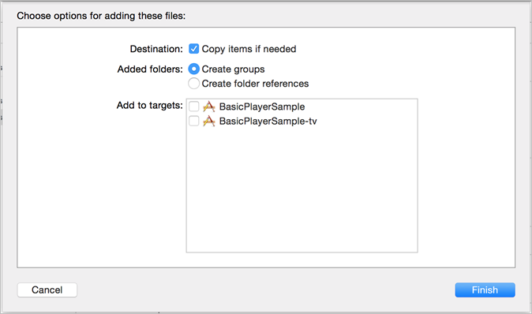

# Set up iOS{#set-up-ios}

>[!IMPORTANT]
>
>With the end of support for Version 4 Mobile SDKs on August 31, 2021, Adobe will also end support for the Media Analytics SDK for iOS and Android.  For additional information, see [Media Analytics SDK End-of-Support FAQs](/help/sdk-implement/end-of-support-faqs.md).

## Prerequisites

* **Obtain valid configuration parameters for the Media SDK**
   These parameters can be obtained from an Adobe representative after you set up your analytics account.
* **Implement ADBMobile for iOS in your application**
   For more information about the Adobe Mobile SDK documentation, see [iOS SDK 4.x for Experience Cloud Solutions.](https://docs.adobe.com/content/help/en/mobile-services/ios/overview.html)

   >[!IMPORTANT]
   >
   >Beginning with iOS 9, Apple introduced a feature called App Transport Security (ATS). This feature aims to improve network security by ensuring that your apps use only industry-standard protocols and ciphers. This feature is enabled by default, but you have configuration options that provide you with choices for working with ATS. For details on ATS, see [App Transport Security.](https://docs.adobe.com/content/help/en/mobile-services/ios/config-ios/app-transport-security.html)

* **Provide the following capabilities in your media player:**

   * _An API to subscribe to player events_ - The Media SDK requires that you call a set of simple APIs when events occur in your player.
   * _An API that provides player information_ - This information includes details such as the media name and the play head position.

## SDK Implementation

1. Add your [downloaded](/help/sdk-implement/download-sdks.md#download-2x-sdks) Media SDK to your project.

    1. Verify that the following software components exist in the `libs` directory:

        * `ADBMediaHeartbeat.h`: The Objective-C header file that is used for iOS heartbeat tracking APIs.
        * `ADBMediaHeartbeatConfig.h`: The Objective-C header file for the SDK configuration.
        * `MediaSDK.a`: A bitcode-enabled fat binary that contains the library builds for iOS devices (armv7, armv7s, arm64) and simulators (i386 and x86_64).

          This binary should be linked when the target is intended for an iOS app.

        * `MediaSDK_TV.a`: A bitcode-enabled fat binary containing the library builds for new Apple TV devices (arm64) and simulator (x86_64).

          This binary should be linked when the target is intended for an Apple TV (tvOS) app.

    1. Add the library to your project:

        1. Launch the Xcode IDE and open your app.
        1. In **[!UICONTROL Project Navigator]**, drag the `libs` directory and drop it under your project.

        1. Ensure that the **[!UICONTROL Copy Items if Needed]** checkbox is selected, the **[!UICONTROL Create Groups]** is selected, and none of the checkboxes in **[!UICONTROL Add to Target]** are selected.

           

        1. Click **[!UICONTROL Finish]**.
        1. In **[!UICONTROL Project Navigator]**, select your app and select your targets.
        1. Link the required frameworks and libraries in the **[!UICONTROL Linked Frameworks]** and **[!UICONTROL Libraries]** section on the **[!UICONTROL General]** tab.

           **iOS App Targets:**

            * **AdobeMobileLibrary.a**
            * **MediaSDK.a**
            * **libsqlite3.0.tbd**

           **Apple TV (tvOS) Targets:**

            * **AdobeMobileLibrary_TV.a**
            * **MediaSDK_TV.a**
            * **libsqlite3.0.tbd**
            * **SystemConfiguration.framework**

        1. Verify that your app builds without errors.

1. Import the library.

   ```
   #import "ADBMediaHeartbeat.h"
   #import "ADBMediaHeartbeatConfig.h"
   ```

1. Create a `ADBMediaHeartbeatConfig` instance.

   This section helps you to understand the `MediaHeartbeat` config parameters, and to set correct config values on your `MediaHeartbeat` instance for accurate tracking.

   Here is a sample `ADBMediaHeartbeatConfig` initialization:

   ```
   // Media Heartbeat Initialization
   ADBMediaHeartbeatConfig *config = [[ADBMediaHeartbeatConfig alloc] init];
   config.trackingServer = <SAMPLE_HEARTBEAT_TRACKING_SERVER>;
   config.channel        = <SAMPLE_HEARTBEAT_CHANNEL>;
   config.appVersion     = <SAMPLE_HEARTBEAT_SDK_VERSION>;
   config.ovp            = <SAMPLE_HEARTBEAT_OVP_NAME>;
   config.playerName     = <SAMPLE_PLAYER_NAME>;
   config.ssl            = <YES/NO>;
   config.debugLogging   = <YES/NO>;
   ```

1. Implement the `ADBMediaHeartbeatDelegate` protocol.

   ```
   @interface VideoAnalyticsProvider : NSObject <ADBMediaHeartbeatDelegate>

   @end

   @implementation VideoAnalyticsProvider

   // Replace <bitrate>, <startuptime>, <fps> and <droppeFrames>  
   // with the current playback QoS values.
   - (ADBMediaObject *)getQoSObject {
       return [ADBMediaHeartbeat createQoSObjectWithBitrate:<bitrate>  
                                 startupTime:<startuptime>   
                                 fps:<fps>  
                                 droppedFrames:<droppedFrames>];
   }

   // Return the current video player playhead position.
   // Replace <currentPlaybackTime> with the video player current playback time
   - (NSTimeInterval)getCurrentPlaybackTime {
       return <currentPlaybackTime>;
   }

   @end
   ```

1. Use the `ADBMediaHeartBeatConfig` and `ADBMediaHeartBeatDelegate` to create the `ADBMediaHeartbeat` instance.

   ```
   //Replace <ADBMediaHeartBeatDelegate> with your delegate instance
   _mediaHeartbeat = [[ADBMediaHeartbeat alloc] initWithDelegate:
     <ADBMediaHeartBeatDelegate> config:config];
   ```

   >[!IMPORTANT]
   >
   >Make sure that your `ADBMediaHeartbeat` instance is accessible and *does not get deallocated until the end of the session*. This instance will be used for all the following tracking events.

## Migrating from version 1.x to 2.x in iOS {#migrate-to-two-x}

In version 2.x, all of the public methods are consolidated into the `ADBMediaHeartbeat` class to make it easier on developers. All configurations have been consolidated into the `ADBMediaHeartbeatConfig` class.

For more information about migrating from 1.x to 2.x, see [VHL 1.x to 2.x Migration.](/help/sdk-implement/va-1x-to-2x/mig-1x-2x-overview.md)

## Configure a Native App for tvOS

With the release of the new Apple TV, you can now create applications to run in the native tvOS environment. You can either create a purely native app, using any of several frameworks available in iOS, or you can create your app using XML templates and JavaScript. Starting with MediaSDK version 2.0, support for tvOS is available. For more information about tvOS, see [tvOS Developer site.](https://developer.apple.com/tvos/)

Perform the following steps in your Xcode project. This guide is written assuming your project has a target that is an Apple TV app targeting tvOS:

1. Drag the `VideoHeartbeat_TV.a` library file into your project’s `lib` folder.

1. In the **[!UICONTROL Build Phases]** tab of your tvOS app’s target, expand the **[!UICONTROL Link Binary with Libraries]** section and add the following libraries:

   * `MediaSDK_TV.a`
   * `AdobeMobileLibrary_TV.a`
   * `libsqlite3.0.tbd`
   * `SystemConfiguration.framework`
