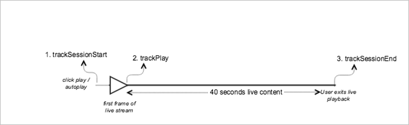

# Live main content{#live-main-content}

## Scenario {#scenario}

In this scenario, there is one live asset with no ads played for 40 secs after joining the live stream. 

|  Trigger  | Heartbeat method  | Network calls  | Notes&nbsp;&nbsp;  |
|---|---|---|---|
|  User clicks **[!UICONTROL Play]** | `trackSessionStart`  | Analytics Content Start, Heartbeat Content Start  | This can be a user clicking **[!UICONTROL Play]** or an auto-play event.  |
|  The first frame of the media plays.  | `trackPlay`  | Heartbeat Content Play  | This method triggers the timer. Heartbeats are sent every 10 seconds as long as playback continues.  |
|  The content plays.  |  | Content Heartbeats  |  |
|  The session is over.  | `trackSessionEnd`  |  | `SessionEnd` means the end of a viewing session. This API must be called even if the user does not consume the media to completion.  |

## Parameters {#parameters}

Many of the same values that you see on Adobe Analytics Content Start Calls you will also see on Heartbeat Content Start Calls. You will also see lots of other parameters that Adobe uses to populate the various Media reports in Adobe Analytics. We won't be covering all of them here, just the really important ones.

### Heartbeat Content Start

|  Parameter  | Value  | Notes  |
|---|---|---|
|  `s:sc:rsid`  | &lt;Your Adobe Report Suite ID&gt;  |  |
|  `s:sc:tracking_serve`  | &lt;Your Analytics Tracking Server URL&gt;  |  |
|  `s:user:mid`  | `s:user:mid`  | Should match the mid value on the Adobe Analytics Content Start Call  |
|  `s:event:type`  | "start"  |  |
|  `s:asset:type`  | "main"  |  |
|  `s:asset:mediao_id`  | &lt;Your Media Name&gt;  |  |
|  `s:stream:type`  | live  |  |
|  `s:meta:*`  | optional  | Custom metadata set on the media  |

## Content Heartbeats {#content-heartbeats}

During media playback, there is a timer that will send one or more heartbeats (or pings) every 10 seconds for main content, and every second for ads. These heartbeats will contain information about playback, ads, buffering, and a number of other things. The exact content of each heartbeat is beyond the scope of this document, the critical thing to validate is that heartbeats are being triggered consistently while playback continues.

In the content heartbeats, look for a few specific things:  

|  Parameter  | Value  | Notes  |
|---|---|---|
|  `s:event:type`  | "play"  |  |
|  `l:event:playhead`  | &lt;playhead position&gt; e.g., 50, 60, 70  | This should reflect the current position of the playhead.  |

## Heartbeat Content Complete {#heartbeat-content-complete}

There will not be a complete call in this scenario, because the live stream was never completed.

## Playhead Value Settings

For LIVE streams, you need to set the playhead value as the number of seconds since midnight UTC on that day, so that in reporting, analysts can determine at what point users are joining and leaving the LIVE stream within a 24-hour view.

### At Start

For LIVE media, when a user starts playing the stream, you need to set `l:event:playhead` to the number of seconds since midnight UTC on that day. This is as opposed to VOD, where you would set the playhead to "0". Note: When using progress markers, the content duration is required and the playhead needs to be updated as number of seconds from the beginning of the media item, starting with 0.

For example, say a LIVE streaming event starts at midnight and runs for 24 hours (`a.media.length=86400`; `l:asset:length=86400`). Then, say a user starts playing that LIVE stream at 12:00pm. In this scenario, you should set `l:event:playhead` to 43200 (12 hours since midnight UTC on that day in seconds).

### On Pause

The same "live playhead" logic applied at the start of playback must be applied when a user pauses the playback. When the user returns to playing the LIVE stream, you must set the `l:event:playhead` value according to the new number of seconds since midnight UTC, _not_ to the point where the user paused the LIVE stream.

## Sample Code {#sample-code}



### Android 

Here is the expected API call order: 

```java
// Set up mediaObject 
MediaObject mediaInfo = MediaHeartbeat.createMediaObject( 
  Configuration.MEDIA_NAME,  
  Configuration.MEDIA_ID,  
  Configuration.MEDIA_LENGTH,  
  MediaHeartbeat.StreamType.LIVE 
); 

HashMap<String, String> mediaMetadata = new HashMap<String, String>(); 
mediaMetadata.put(CUSTOM_VAL_1, CUSTOM_KEY_1); 
mediaMetadata.put(CUSTOM_VAL_2, CUSTOM_KEY_2); 

// 1. Call trackSessionStart() when the user clicks Play or if autoplay is used,  
//    i.e., there is an intent to start playback.  
_mediaHeartbeat.trackSessionStart(mediaInfo, mediaMetadata); 

...... 
...... 

// 2. Call trackPlay() when the playback actually starts, i.e., when the first  
//    frame of main content is rendered on the screen. 
_mediaHeartbeat.trackPlay(); 

....... 
....... 

// 3. Call trackSessionEnd() when user ends the playback session.  
//    Since the user does not watch live media to completion, there  
//    is no need to call trackComplete().  
_mediaHeartbeat.trackSessionEnd(); 
....... 
....... 
```

### iOS 

Here is the expected API call order: 

```
// Set up mediaObject 
ADBMediaObject *mediaObject =  
[ADBMediaHeartbeat createMediaObjectWithName:MEDIA_NAME  
                   length:MEDIA_LENGTH  
                   streamType:ADBMediaHeartbeatStreamTypeLIVE]; 
 
NSMutableDictionary *mediaContextData = [[NSMutableDictionary alloc] init]; 
[mediaContextData setObject:CUSTOM_VAL_1 forKey:CUSTOM_KEY_1]; 
[mediaContextData setObject:CUSTOM_VAL_2 forKey:CUSTOM_KEY_2]; 
 
// 1. Call trackSessionStart when the user clicks Play or if autoplay is used,  
//    i.e., there is an intent to start playback. 
[_mediaHeartbeat trackSessionStart:mediaObject data:mediaContextData]; 
...... 
...... 
 
// 2. Call trackPlay when the playback actually starts, i.e., when the first  
//    frame of the main content is rendered on the screen. 
[_mediaHeartbeat trackPlay]; 
....... 
....... 
 
// 3. Call trackSessionEnd when user ends the playback session. Since the user  
//    does not watch live media to completion, there is no need to call  
//    trackComplete. 
[_mediaHeartbeat trackSessionEnd]; 
........ 
........ 
```

### JavaScript 

Here is the expected API call order: 

```js
// Set up mediaObject 
var mediaInfo =  
MediaHeartbeat.createMediaObject(Configuration.MEDIA_NAME,  
                                 Configuration.MEDIA_ID,  
                                 Configuration.MEDIA_LENGTH,  
                                 MediaHeartbeat.StreamType.VOD); 

var mediaMetadata = { 
  CUSTOM_KEY_1 : CUSTOM_VAL_1,  
  CUSTOM_KEY_2 : CUSTOM_VAL_2,  
  CUSTOM_KEY_3 : CUSTOM_VAL_3 
}; 

// 1. Call trackSessionStart() when Play is clicked or if autoplay  
//    is used, i.e., there's an intent to start playback. 
this._mediaHeartbeat.trackSessionStart(mediaInfo, mediaMetadata); 

...... 
...... 

// 2. Call trackPlay() when the playback actually starts, i.e., when the  
//    first frame of media is rendered on the screen. 
this._mediaHeartbeat.trackPlay(); 

....... 
....... 

// 3. Call trackSessionEnd() when user ends the playback session.  
//    Since user does not watch live media to completion, there is  
//    no need to call trackComplete(). 
this._mediaHeartbeat.trackSessionEnd(); 

........ 
........ 
```
