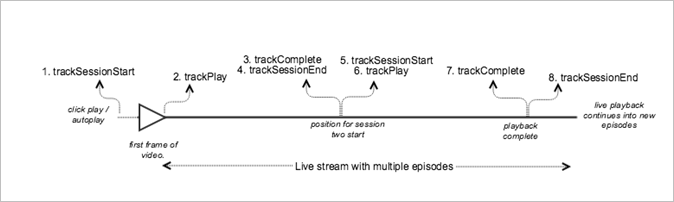

# Live main content with sequential tracking{#live-main-content-with-sequential-tracking}

## Scenario {#scenario}

In this scenario, there is one live asset with no ads played for 40 secs after joining the live stream.

This is the same scenario as the [VOD playback with no ads](/help/sdk-implement/tracking-scenarios/vod-no-intrs-details.md) scenario, but a part of the content is scrubbed through and a seek is completed from one point in main content to another point. 

| Trigger | Heartbeat method | &nbsp;Network&nbsp;calls&nbsp; | &nbsp;Notes&nbsp;&nbsp; |
| --- | --- | --- | --- |
| User clicks [!UICONTROL Play] | trackSessionStart | Analytics Content Start, Heartbeat Content Start | The measurement library is unaware that there is a pre-roll ad, so these network calls are identical to the [VOD playback with no ads](/help/sdk-implement/tracking-scenarios/vod-no-intrs-details.md) scenario.  |
| First frame of the content plays.  | trackPlay | Heartbeat Content Play | When chapter content plays before main content, the Heartbeats start when the chapter starts.  |
| Content plays | | Content Heartbeats | This network call is exactly the same as the [VOD playback with no ads](/help/sdk-implement/tracking-scenarios/vod-no-intrs-details.md) scenario.  |
| Session1 Over (Episode1 ended) | trackComplete / trackSessionEnd | Heartbeat Content Complete | Complete means session1 for 1st episode was reached and watched completely. Before starting session for next episode this session must be ended.  |
| Episode2 started (Session2 start) | trackSessionStart | Analytics Content Start Heartbeat Content Start | This is because user watched first episode and continued watching into another episode |
| 1st Frame of Media | trackPlay | Heartbeat Content Play | This method triggers the timer and from this point forward, heartbeats will be sent every 10 seconds as long as playback continues.  |
| Content Plays | | Content Heartbeats | |
| Session Over (Episode2 ended) | trackComplete / trackSessionEnd | Heartbeat Content Complete | Complete means session2 for 2nd episode was reached and watched completely. Before starting session for next episode this session must be ended.  |

## Parameters {#parameters}

### Heartbeat Content Start

|  Parameter  | Value  | Notes  |
|---|---|---|
|  `s:sc:rsid`  | &lt;Your Adobe Report Suite ID&gt;  |  |
|  `s:sc:tracking_serve`  | &lt;Your Analytics Tracking Server URL&gt;  |  |
|  `s:user:mid`  | `s:user:mid`  | Should match the mid value on the Adobe Analytics Content Start Call  |
|  `s:event:type`  | `"start"`  |  |
|  `s:asset:type`  | `"main"`  |  |
|  `s:asset:media_id`  | &lt;Your Media Name&gt;  |  |
|  `s:stream:type`  | `live`  |  |
|  `s:meta:*`  | *optional* | Custom metadata set on the media  |

## Heartbeat Content Play {#heartbeat-content-play}

This should look almost exactly like the Heartbeat Content Start call, but with the key difference in the "s:event:type" parameter. All parameters should still be in place here.  

|  Parameter  | Value  | Notes  |
|---|---|---|
|  `s:event:type`  | `"play"`  |  |
|  `s:asset:type`  | `"main"`  |  |

## Content Heartbeats {#content-heartbeats}

During media playback, there is a timer that will send one or more heartbeats every 10 seconds for main content, and every one second for ads. These heartbeats will contain information about playback, ads, buffering, and a number of other things. The exact content of each heartbeat is beyond the scope of this document, the critical thing to validate is that heartbeats are being triggered consistently while playback continues.

In the content heartbeats, look for a few specific things:  

|  Parameter  | Value  | Notes  |
|---|---|---|
|  `s:event:type`  | `"play"`  |  |
|  `l:event:playhead`  | &lt;playhead position&gt; e.g., 50, 60, 70  | This should reflect the current position of the playhead.  |

## Heartbeat Content Complete {#heartbeat-content-complete}

When playback for any given episode has completed (playhead crosses episode boundary), a Heartbeat Content Complete call is sent. This looks like other Heartbeat Calls, but will contains a couple specific things:  

|  Parameter  | Value  | Notes  |
|---|---|---|
|  `s:event:type`  | `"complete"`  |  |
|  `s:asset:type`  | `"main"`  |  |

## Sample Code {#section_mpx_q2j_x2b}



### Android 

Here is the expected API call order: 

```java
// Set up mediaObject 
MediaObject mediaInfo = MediaHeartbeat.createMediaObject( 
  Configuration.MEDIA_NAME,  
  Configuration.MEDIA_ID,  
  Configuration.MEDIA_LENGTH,  
  MediaHeartbeat.StreamType.LIVE 
); 

HashMap<String, String> mediaMetadata = new HashMap<String, String>(); 
mediaMetadata.put(CUSTOM_VAL_1, CUSTOM_KEY_1); 
mediaMetadata.put(CUSTOM_VAL_2, CUSTOM_KEY_2); 

// 1. Call trackSessionStart() when the user clicks Play or if autoplay is used,  
//    i.e., when there is an intent to start playback.  
_mediaHeartbeat.trackSessionStart(mediaInfo, mediaMetadata); 

...... 
...... 

// 2. Call trackPlay() when the playback actually starts, i.e., when the first  
//    frame of main content is rendered on the screen.  
_mediaHeartbeat.trackPlay(); 

....... 
....... 

// 3. Call trackComplete() when the playback reaches the end of session,  
//    i.e., when the media completes and finishes playing 1st episode/session.  
_mediaHeartbeat.trackComplete(); 

........ 
........ 

// 4. Call trackSessionEnd() to end session 1 
_mediaHeartbeat.trackSessionEnd(); 

........ 
........ 

// Start tracking session 2 /episode 2 of the same live stream.  
// There is no need to reinstantiate a mediaHeartbeat instance for tracking sesison 2. 
// Set up mediaObject 
MediaObject mediaInfo = MediaHeartbeat.createMediaObject( 
  Configuration.MEDIA_NAME,  
  Configuration.MEDIA_ID,  
  Configuration.MEDIA_LENGTH,  
  MediaHeartbeat.StreamType.LIVE 
); 

HashMap<String, String> mediaMetadata = new HashMap<String, String>(); 
mediaMetadata.put(CUSTOM_VAL_1, CUSTOM_KEY_1); 
mediaMetadata.put(CUSTOM_VAL_2, CUSTOM_KEY_2); 

// 5. Call trackSessionStart() when the playhead reaches a point that denotes the 
//    start of session 2 
_mediaHeartbeat.trackSessionStart(mediaInfo, mediaMetadata); 

...... 
...... 

// 6. Call trackPlay() to start tracking session 2 playback  
_mediaHeartbeat.trackPlay(); 

....... 
....... 

// 7. Call trackComplete() when the playback reaches the end of session 2,  
//    i.e., the media completes and finishes playing.  
_mediaHeartbeat.trackComplete(); 

........ 
........ 

// 8. Call trackSessionEnd() to end session 2 
_mediaHeartbeat.trackSessionEnd(); 

........ 
........ 

// Continue similarly tracking further sessions in the live stream if required 
```

### iOS 

Here is the expected API call order: 

```
// Set up mediaObject 
ADBMediaObject *mediaObject =  
[ADBMediaHeartbeat createMediaObjectWithName:MEDIA_NAME  
                   length:MEDIA_LENGTH  
                   streamType:ADBMediaHeartbeatStreamTypeLIVE]; 
  
NSMutableDictionary *mediaContextData = [[NSMutableDictionary alloc] init]; 
[mediaContextData setObject:CUSTOM_VAL_1 forKey:CUSTOM_KEY_1]; 
[mediaContextData setObject:CUSTOM_VAL_2 forKey:CUSTOM_KEY_2]; 
  
// 1. Call trackSessionStart when the user clicks Play or if autoplay is used,  
//    i.e., there is an intent to start playback. 
[_mediaHeartbeat trackSessionStart:mediaObject data:mediaContextData]; 
...... 
...... 
  
// 2. Call trackPlay when the playback actually starts, i.e., when the first  
//    frame of main content is rendered on the screen. 
[_mediaHeartbeat trackPlay]; 
....... 
....... 

// 3. Call trackComplete when the playback reaches the end of session,  
//    i.e., when the media completes and finishes playing the first 
//    episode/session. 
[_mediaHeartbeat trackComplete]; 
....... 
....... 

// 4. Call trackSessionEnd to end session 1 
[_mediaHeartbeat trackSessionEnd]; 
........ 
........ 

// Start tracking session 2 / episode 2 of the same live stream, No need to  
// reinstantiate mediaHeartbeat instance for tracking sesison 2. 

// Set up mediaObject 
ADBMediaObject *mediaObject =  
[ADBMediaHeartbeat createMediaObjectWithName:MEDIA_NAME  
                   length:MEDIA_LENGTH  
                   streamType:ADBMediaHeartbeatStreamTypeLIVE]; 
 
NSMutableDictionary *mediaContextData = [[NSMutableDictionary alloc] init]; 
[mediaContextData setObject:CUSTOM_VAL_1 forKey:CUSTOM_KEY_1]; 
[mediaContextData setObject:CUSTOM_VAL_2 forKey:CUSTOM_KEY_2]; 
 
// 5. Call trackSessionStart when the playhead reaches a point that denotes  
//    start of session 2 
[_mediaHeartbeat trackSessionStart:mediaObject data:mediaContextData]; 
...... 
...... 
 
// 6. Call trackPlay to start tracking session 2 playback 
[_mediaHeartbeat trackPlay]; 
....... 
....... 
 
// 7. Call trackComplete when the playback reaches the end of session 2,  
//    i.e., when the media completes and finishes playing. 
[_mediaHeartbeat trackComplete]; 
........ 
........ 
 
// 8. Call trackSessionEnd to end the session 2 
[_mediaHeartbeat trackSessionEnd]; 
........ 
........ 

// Continue tracking further sessions in live stream similarly if required 
```

### JavaScript 

Here is the expected API call order: 

```js
// Set up mediaObject 

var mediaInfo = MediaHeartbeat.createMediaObject( 
  Configuration.MEDIA_NAME,  
  Configuration.MEDIA_ID,  
  Configuration.MEDIA_LENGTH,  
  MediaHeartbeat.StreamType.VOD 
); 

var mediaMetadata = { 
  CUSTOM_KEY_1 : CUSTOM_VAL_1,  
  CUSTOM_KEY_2 : CUSTOM_VAL_2,  
  CUSTOM_KEY_3 : CUSTOM_VAL_3 
}; 

// 1. Call trackSessionStart() when Play is clicked or if autoplay is used,  
//    i.e., there's an intent to start playback. 
this._mediaHeartbeat.trackSessionStart(mediaInfo, mediaMetadata); 

...... 
...... 

// 2. Call trackPlay() when the playback actually starts, i.e., when the  
//    first frame of media is rendered on the screen. 
this._mediaHeartbeat.trackPlay(); 

....... 
....... 

// 3. Call trackComplete() when the playback reaches the end of a session,  
//    i.e., whn playback completes and finishes playing the 1st episode/session. 
this._mediaHeartbeat.trackComplete(); 

........ 
........ 

// 4. Call trackSessionEnd() to end session 1 
this._mediaHeartbeat.trackSessionEnd(); 

........ 
........ 

// Start tracking session 2/episode 2 of the same live stream. There is no need  
// to reinstantiate a mediaHeartbeat instance for tracking sesison 2. 

// Set up mediaObject 
var mediaInfo2 = MediaHeartbeat.createMediaObject( 
  Configuration.MEDIA_NAME,  
  Configuration.MEDIA_ID,  
  Configuration.MEDIA_LENGTH,  
  MediaHeartbeat.StreamType.LIVE 
); 

var mediaMetadata2 = { 
  CUSTOM_KEY_1 : CUSTOM_VAL_1,  
  CUSTOM_KEY_2 : CUSTOM_VAL_2,  
  CUSTOM_KEY_3 : CUSTOM_VAL_3 
}; 

// 5. Call trackSessionStart() when the playhead reaches a point that denotes  
//    the start of session 2 
this._mediaHeartbeat.trackSessionStart(mediaInfo2, mediaMetadata2); 

...... 
...... 

// 6. Call trackPlay() to start tracking session 2 playback 
this._mediaHeartbeat.trackPlay(); 

....... 
....... 

// 7. Call trackComplete() when the playback reaches the end of session 2,  
//    i.e., playback completes and finishes playing. 
this._mediaHeartbeat.trackComplete(); 

........ 
........ 

// 8. Call trackSessionEnd() to end session 2 
this._mediaHeartbeat.trackSessionEnd(); 

........ 
........ 

// Continue tracking further sessions in live stream similarly if required 
```

