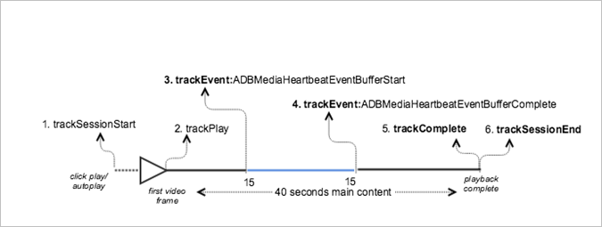

# VOD playback with buffering{#vod-playback-with-buffering}

## Scenario {#scenario}

In this scenario, some buffering occurs when VOD content is played back.

Unless specified, the network calls in this scenario are the same as the calls in the [VOD playback with no ads](/help/sdk-implement/tracking-scenarios/vod-no-intrs-details.md) scenario.

|  Trigger&nbsp;&nbsp;  | Heartbeat method&nbsp;&nbsp;  | Network calls&nbsp;&nbsp;  | Notes&nbsp;&nbsp;  |
|---|---|---|---|
|  User clicks **[!UICONTROL Play]** | `trackSessionStart`  | Analytics Content Start, Heartbeat Content Start  | This can be a user clicking **[!UICONTROL Play]** or an auto-play event.  |
|  The first frame of the video plays.  | `trackPlay`  | Heartbeat Content Play  | This method triggers the timer. Heartbeats are sent every 10 seconds as long as playback continues.  |
|  The content plays.  |  | Content Heartbeats  |  |
|  The buffering starts.  | `trackEvent:BufferStart`  | Heartbeat Buffer  |  |
|  The content is buffered.  |  | Content Heartbeats  |  |
|  The buffering completes.  | `trackEvent:BufferComplete`  | Heartbeat Buffer, Heartbeat Play  |  |
|  The content plays.  |  | Content Heartbeats  |  |
|  The content completes playing.  | `trackComplete`  | Heartbeat Content Complete  | The end of the playhead was reached.  |
|  The session is over.  | `trackSessionEnd`  |  | `SessionEnd` means the end of a viewing session. This API must be called even if the user does not watch the video to completion.  |

## Parameters {#parameters}

### Heartbeat Buffer

|  Parameter  | Value  | Notes  |
|---|---|---|
|  `s:event:type`  | `"buffer"`  |  |

## Sample Code {#section_hxn_fdj_x2b}

In this scenario, buffering occurs when the VOD content is played back.



### Android 

To view this scenario in Android, set up the following code:

```java
// Set up mediaObject 

MediaObject mediaInfo = MediaHeartbeat.createMediaObject( 
  Configuration.MEDIA_NAME,  
  Configuration.MEDIA_ID,  
  Configuration.MEDIA_LENGTH,  
  MediaHeartbeat.StreamType.VOD 

); 

HashMap<String, String> videoMetadata = new HashMap<String, String>(); 
videoMetadata.put(CUSTOM_KEY_1, CUSTOM_VAL_1); 
videoMetadata.put(CUSTOM_KEY_2, CUSTOM_VAL_2); 

// 1. Call trackSessionStart() when the user clicks Play or if autoplay is used,  
//    i.e., there is an intent to start playback. 
_mediaHeartbeat.trackSessionStart(mediaInfo, videoMetadata); 

...... 
...... 

// 2. Call trackPlay() when the playback actually starts, i.e., when the first  
//    frame of the main content is rendered on the screen. 
_mediaHeartbeat.trackPlay(); 

....... 
....... 

// 3. Track the MediaHeartbeat.Event.BufferStart event when the video player  
//    goes into the buffering state and begins to buffer content. 
_mediaHeartbeat.trackEvent(MediaHeartbeat.Event.BufferStart, null, null); 

....... 
....... 

// 4. Track the MediaHeartbeat.Event.BufferComplete event when the video player  
//    goes into the buffering state and begins to buffer content. 
_mediaHeartbeat.trackEvent(MediaHeartbeat.Event.BufferComplete, null, null); 

....... 
....... 

// 5. Call trackComplete() when the playback reaches the end, i.e., when the 
//    video completes and finishes playing. 
_mediaHeartbeat.trackComplete(); 

........ 
........ 

// 6. Call trackSessionEnd() when the playback session is over. This method must  
//    be called even if the user does not watch the video to completion. 
_mediaHeartbeat.trackSessionEnd(); 

........ 
```

### iOS 

To view this scenario in iOS, set up the following code: 

```
// Set up mediaObject 
ADBMediaObject *mediaObject =  
[ADBMediaHeartbeat createMediaObjectWithName:MEDIA_NAME  
                   length:MEDIA_LENGTH  
                   streamType:ADBMediaHeartbeatStreamTypeVOD]; 
 
NSMutableDictionary *videoContextData = [[NSMutableDictionary alloc] init]; 
[videoContextData setObject:CUSTOM_VAL_1 forKey:CUSTOM_KEY_1]; 
[videoContextData setObject:CUSTOM_VAL_2 forKey:CUSTOM_KEY_2]; 

// 1. Call trackSessionStart when the user clicks Play or if autoplay is used,  
//    i.e., there is an intent to start playback. 
[_mediaHeartbeat trackSessionStart:mediaObject data:videoContextData]; 
....... 
....... 

// 2. Call trackPlay when the playback actually starts, i.e., when the first  
//    frame of the main content is rendered on the screen. 
[_mediaHeartbeat trackPlay];  
....... 
....... 

// 3. Track the trackEvent:ADBMediaHeartbeatEventBufferStart event when the  
//    video player goes in buffering state and begins to buffer content. 
[_mediaHeartbeat trackEvent:ADBMediaHeartbeatEventBufferStart  
               mediaObject:nil  
               data:nil]; 
....... 
....... 

// 4. Track the trackEvent:ADBMediaHeartbeatEventBufferComplete event when  
//    the video player goes in buffering state and begins to buffer content. 
[_mediaHeartbeat trackEvent:ADBMediaHeartbeatEventBufferComplete  
               mediaObject:nil  
               data:nil]; 
....... 
....... 

// 5. Call trackComplete when the playback reaches the end, i.e., when the 
//    video completes and finishes playing. 
[_mediaHeartbeat trackComplete]; 
....... 
....... 

// 6. Call trackSessionEnd when the playback session is over. This method must  
//    be called even if the user does not watch the video to completion. 
[_mediaHeartbeat trackSessionEnd]; 
....... 
....... 
```

### JavaScript 

To view this scenario, enter the following text: 

```js
// Set up mediaObject 

var mediaInfo = MediaHeartbeat.createMediaObject( 
  Configuration.MEDIA_NAME,  
  Configuration.MEDIA_ID,  
  Configuration.MEDIA_LENGTH,  
  MediaHeartbeat.StreamType.VOD 

); 

var videoMetadata = { 
  CUSTOM_KEY_1 : CUSTOM_VAL_1,  
  CUSTOM_KEY_2 : CUSTOM_VAL_2,  
  CUSTOM_KEY_3 : CUSTOM_VAL_3 
}; 

// 1. Call trackSessionStart() when Play is clicked or if autoplay is used,  
//    i.e., there's an intent to start playback. 
this._mediaHeartbeat.trackSessionStart(mediaInfo, videoMetadata); 

...... 
...... 

// 2. Call trackPlay() when the playback actually starts, i.e., when the  
//    first frame of the ad video is rendered on the screen. 
this._mediaHeartbeat.trackPlay(); 

....... 
....... 

// 3. Track event MediaHeartbeat.Event.BufferStart when the video player  
//    goes into the buffering state and begins to buffer content. 
this._mediaHeartbeat.trackEvent(MediaHeartbeat.Event.BufferStart); 

....... 
....... 

// 4. Track the MediaHeartbeat.Event.BufferComplete event when the  
//    video player goes into the buffering state and begins to buffer content. 
this._mediaHeartbeat.trackEvent(MediaHeartbeat.Event.BufferComplete); 

....... 
....... 

// 5. Call trackComplete() when the playback reaches the end, i.e.,  
//    when playback completes and finishes playing. 
this._mediaHeartbeat.trackComplete(); 

........ 
........ 

// 6. Call trackSessionEnd() when the playback session is over. This method must  
//    be called even if the user does not watch the video to completion. 
this._mediaHeartbeat.trackSessionEnd(); 

........ 
........ 
```

