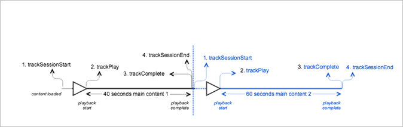

# VOD one tracker for multiple sessions{#vod-one-tracker-for-multiple-sessions}

## Scenario {#scenario}

In this scenario, the `MediaHeartbeat` instance is used to create two separate sessions in sequence.

This scenario is the same as the [VOD playback with no ads](/help/sdk-implement/tracking-scenarios/vod-no-intrs-details.md) scenario.

## Parameters {#parameters}

### Heartbeat Session

| Parameter | Value | Notes&nbsp;&nbsp; |
| --- | --- | --- |
| `s:event:sid` | Unique session ID | A unique session ID that exists in all the heartbeat network calls until `trackSessionEnd` |

## Sample Code {#sample-code}



### Android {#android}

To create two instances of `MediaHeartbeat` for two media players, set up the following code:

```java
public class MediaAnalyticsProvider implements MediaHeartbeatDelegate { 

  private MediaPlayer _player; 
  private MediaHeartbeat _heartbeat; 

  public MediaAnalyticsProvider(MediaPlayer player) { 
      if (player == null) { 
          throw new IllegalArgumentException("Player reference cannot be null."); 
      } 
  } 

  _player = player;  
  _player.addObserver(this); 

  // Media Heartbeat initialization 
  MediaHeartbeatConfig config = new MediaHeartbeatConfig(); 

  config.trackingServer = HEARTBEAT_TRACKING_SERVER; 
  config.channel = HEARTBEAT_CHANNEL; 
  config.appVersion = HEARTBEAT_SDK; 
  config.ovp = HEARTBEAT_OVP; 
  config.playerName = PLAYER_NAME; 
  config.ssl = false; 
  config.debugLogging = true;  
  _heartbeat = new MediaHeartbeat(this, config); 
} 
```

```java
@Override 
public MediaObject getQoSObject() { 
  return MediaHeartbeat.createQoSObject(BITRATE, STARTUP_TIME, FPS, DROPPED_FRAMES); 
} 

@Override 
public Double getCurrentPlaybackTime() { 
  return _player.getCurrentPlaybackTime(); 
} 
```

```java
@Override 
protected void onCreate(Bundle savedInstanceState) { 
  super.onCreate(savedInstanceState); 
  setContentView(R.layout.activity_main); 

  // Bootstrap the AppMeasurement library.  
  Config.setContext(this.getApplicationContext()); 

  // Create the MediaPlayer instance.  
  _player = new MediaPlayer(); 

  // Create the MediaAnalyticsProvider instance and 
  // attach it to the MediaPlayer instance.  
   _analyticsProvider = new MediaAnalyticsProvider(_player); 

  // Load the main media content.  
   Uri uri = Uri.parse("android.resource://" + getPackageName() + "/" + R.raw.media1);  
   _player.loadContent(uri); 
} 
```

To display the first session by using the `MediaAnalyticsProvider` (hence `MediaHeartbeat`) instance in Android, set up the following code: 

```java
// Set up mediaObject 
MediaObject mediaInfo = MediaHeartbeat.createMediaObject( 
  Configuration.MEDIA_NAME,  
  Configuration.MEDIA_ID,  
  Configuration.MEDIA_LENGTH,  
  MediaHeartbeat.StreamType.VOD 
); 

HashMap<String, String> mediaMetadata = new HashMap<String, String>(); 
mediaMetadata.put(CUSTOM_VAL_1, CUSTOM_KEY_1); 
mediaMetadata.put(CUSTOM_VAL_2, CUSTOM_KEY_2); 

// 1. Call trackSessionStart() when the user clicks Play or if autoplay is used,  
//    i.e., there is an intent to start playback.  
_mediaHeartbeat.trackSessionStart(mediaInfo, mediaMetadata); 

...... 
...... 

// 2. Call trackPlay() when the playback actually starts, i.e., when the first  
//    frame of main content is rendered on the screen.  
_mediaHeartbeat.trackPlay(); 

....... 
....... 

// 3. Call trackComplete() when the playback reaches the end, i.e., when the 
//    media completes and finishes playing. 
_mediaHeartbeat.trackComplete(); 

........ 
........ 

// 4. Call trackSessionEnd() when the playback session is over. This method must  
//    be called even if the user does not watch the media to completion.  
_mediaHeartbeat.trackSessionEnd(); 

........ 
........ 
```

To display the second session, you can use the same `MediaAnalyticsProvider` ( `MediaHeartbeat`) instance as the first session, but for a new session: 

```java
// Set up mediaObject 
MediaObject mediaInfo = MediaHeartbeat.createMediaObject( 
  Configuration.MEDIA_NAME,  
  Configuration.MEDIA_ID,  
  Configuration.MEDIA_LENGTH,  
  MediaHeartbeat.StreamType.VOD 
); 

HashMap<String, String> mediaMetadata = new HashMap<String, String>(); 
mediaMetadata.put(CUSTOM_VAL_1, CUSTOM_KEY_1); 
mediaMetadata.put(CUSTOM_VAL_2, CUSTOM_KEY_2); 

// 1. Call trackSessionStart() when the user clicks Play or if autoplay is used,  
//    i.e., there is an intent to start playback.  
_mediaHeartbeat.trackSessionStart(mediaInfo, mediaMetadata); 

...... 
...... 

// 2. Call trackPlay() when the playback actually starts, i.e., when the first  
//    frame of main content is rendered on the screen.  
_mediaHeartbeat.trackPlay(); 

....... 
....... 

// 3. Call trackComplete() when the playback reaches the end, i.e., when the  
//    media completes and finishes playing. 
_mediaHeartbeat.trackComplete(); 

........ 
........ 

// 4. Call trackSessionEnd() when the playback session is over. This method  
//    must be called even if the user does not watch the media to completion.  
_mediaHeartbeat.trackSessionEnd(); 

........ 
........ 
```

### iOS {#ios}

To create two instances of `MediaHeartbeat` for two media players, enter the following: 

```
@interface MediaAnalyticsProvider : NSObject <ADBMediaHeartbeatDelegate> 

@end    

@implementation { 
  MediaPlayer *_player; 
} 

- (instancetype)initWithPlayer:(AVPlayer *)player { 
  if (self = [super init]) { 
      _player = player; 

      ADBMediaHeartbeatConfig *config = [[ADBMediaHeartbeatConfig alloc] init]; 
      config.trackingServer = HEARTBEAT_TRACKING_SERVER; 
      config.channel = HEARTBEAT_CHANNEL; 
      config.appVersion = HEARTBEAT_SDK_VERSION; 
      config.playerName = PLAYER_NAME; 
      config.ssl = SSL_SETTING; 
      config.debugLogging = DEBUG_SETTING; 

      ADBMediaHeartbeatConfig *config = [[ADBMediaHeartbeatConfig alloc] init];       
      _mediaHeartbeat = [[ADBMediaHeartbeat alloc] initWithDelegate:self config:config]; 
        
      [self setupPlayerNotifications]; 
  } 

  return self; 
} 

- (ADBMediaObject *)getQoSInfo { 
  return [ADBMediaHeartbeat createQoSObjectWithBitrate:CURRENT_BITRATE_VALUE  
                            startupTime:CALCULATED_STARTED_TIME  
                            fps:CALCULATED_FPS  
                            droppedFrames:DROPPED_FRAMES_COUNT]; 
} 

- (NSTimeInterval)getCurrentPlaybackTime { 
  return CMTimeGetSeconds(_player.currentTime); 
} 

@end 
```

```
- (void)viewDidAppear:(BOOL)animated { 
  [super viewDidAppear:animated]; 
  [ADBMobile setDebugLogging:YES]; 

  // Setup the first media player 
  NSURL *streamUrl = [NSURL URLWithString:CONTENT_URL]; 

  if (!self.mediaPlayer) { 
      self.mediaPlayer = [[MediaPlayer alloc] initWithContentURL:streamUrl]; 
      //setup player 
  } 

  // Create the MediaAnalyticsProvider instance and attach it to the first  
  // MediaPlayer instance. 
  if (!self.mediaAnalyticsProvider) { 
      self.mediaAnalyticsProvider =  
        [[MediaAnalyticsProvider alloc] initWithPlayerDelegate:self.mediaPlayer]; 
  } 
} 
```

To display the first session by using the `MediaAnalyticsProvider` (hence `MediaHeartbeat`) instance in iOS, set up the following code: 

```
// Set up mediaObject 
ADBMediaObject *mediaObject =  
[ADBMediaHeartbeat createMediaObjectWithName:MEDIA_NAME  
                   length:MEDIA_LENGTH  
                   streamType:ADBMediaHeartbeatStreamTypeVOD]; 
   
NSMutableDictionary *mediaContextData = [[NSMutableDictionary alloc] init]; 
[mediaContextData setObject:CUSTOM_VAL_1 forKey:CUSTOM_KEY_1]; 
[mediaContextData setObject:CUSTOM_VAL_2 forKey:CUSTOM_KEY_2]; 
  
// 1. Call trackSessionStart when the user clicks Play or if autoplay is used,  
//    i.e., there's an intent to start playback. 
[_mediaHeartbeat trackSessionStart:mediaObject data:mediaContextData]; 
....... 
....... 
 
// 2. Call trackPlay when the playback actually starts, i.e., when the first  
//    frame of the main content is rendered on the screen. 
[_mediaHeartbeat trackPlay]; 
....... 
....... 
 
// 3. Call trackComplete when the playback reaches the end, i.e., when the 
//    media completes and finishes playing. 
[_mediaHeartbeat trackComplete]; 
....... 
....... 
  
// 4. Call trackSessionEnd when the playback session is over. This method  
//    must be called even if the user does not watch the media to completion. 
[_mediaHeartbeat trackSessionEnd]; 
....... 
....... 
```

To display the second session, you can use the same `MediaAnalyticsProvider` ( `MediaHeartbeat`) instance as the first session, but for a new session: 

```
// Set up mediaObject 
ADBMediaObject *mediaObject =  
[ADBMediaHeartbeat createMediaObjectWithName:MEDIA_NAME  
                   length:MEDIA_LENGTH  
                   streamType:ADBMediaHeartbeatStreamTypeVOD]; 
   
NSMutableDictionary *mediaContextData = [[NSMutableDictionary alloc] init]; 
[mediaContextData setObject:CUSTOM_VAL_1 forKey:CUSTOM_KEY_1]; 
[mediaContextData setObject:CUSTOM_VAL_2 forKey:CUSTOM_KEY_2]; 
  
// 1. Call trackSessionStart when the user clicks Play or if autoplay is used,  
//    i.e., there is an intent to start playback. 
[_mediaHeartbeat trackSessionStart:mediaObject data:mediaContextData]; 
....... 
....... 
 
// 2. Call trackPlay when the playback actually starts, i.e. when the first  
//    frame of the main content is rendered on the screen. 
[_mediaHeartbeat trackPlay]; 
....... 
....... 
 
// 3. Call trackComplete when the playback reaches the end, i.e., when the 
//    media completes and finishes playing. 
[_mediaHeartbeat trackComplete]; 
....... 
....... 
  
// 4. Call trackSessionEnd when the playback session is over. This method  
//    must be called even if the user does not watch the media to completion. 
[_mediaHeartbeat trackSessionEnd]; 
....... 
....... 
```

### JavaScript {#javascript}

```js
var MediaHeartbeat = ADB.va.MediaHeartbeat; 
var MediaHeartbeatConfig = ADB.va.MediaHeartbeatConfig; 
var MediaHeartbeatDelegate = ADB.va.MediaHeartbeatDelegate; 

function MediaAnalyticsProvider(player) { 
  if (!player) { 
      throw new Error("Illegal argument. Player reference cannot be null.") 
  }   
  this._player = player; 

  // Media Heartbeat initialization 
  var mediaConfig = new MediaHeartbeatConfig(); 
  mediaConfig.trackingServer = Configuration.HEARTBEAT.TRACKING_SERVER; 
  mediaConfig.playerName = Configuration.PLAYER.NAME; 
  mediaConfig.channel = Configuration.HEARTBEAT.CHANNEL; 
  mediaConfig.debugLogging = true; 
  mediaConfig.appVersion = Configuration.HEARTBEAT.SDK; 
  mediaConfig.ssl = false; 
  mediaConfig.ovp = Configuration.HEARTBEAT.OVP; 

  var mediaDelegate = new MediaHeartbeatDelegate(); 

  mediaDelegate.getCurrentPlaybackTime = function() { 
      return player.getCurrentPlaybackTime(); 
  }; 

  mediaDelegate.prototype.getQoSObject = function() { 
      return player.getQoSInfo(); 
  }; 

  this._mediaHeartbeat =  
    new MediaHeartbeat(mediaDelegate, mediaConfig, appMeasurement); 
} 
```

```js
// Create the first MediaPlayer instance.  
var _player1 = new MediaPlayer(); 

// Create the first MediaAnalyticsProvider instance and 
// attach it to the MediaPlayer instance.  
analyticsProvider1 = new MediaAnalyticsProvider(_player1); 

// Load the main media content.  
_player1.loadContent(URL_TO_MEDIA_1);
```

