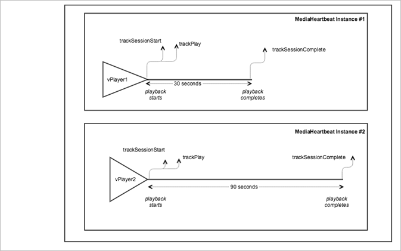

# VOD multiple trackers in parallel{#vod-multiple-trackers-in-parallel}

## Scenario {#section_1AFCA33B322B46818BA4F1BDD3B40B4E}

In this scenario, there are two sessions running in parallel for two separate videos and using two separate instances of `MediaHeartbeat`.

This scenario is identical to the [VOD playback with no ads](../../sdk-implement/tracking-scenarios/vod-no-intrs-details.md) scenario, except there are two sessions that are running in parallel for two separate videos. Each of these sessions uses a separate instance of `MediaHeartbeat`.

Unless specified, the network calls are the same as the [VOD playback with no ads](../../sdk-implement/tracking-scenarios/vod-no-intrs-details.md) scenario.

## Parameters {#section_45D7B10031524411B91E2C569F7818B0}

### Heartbeat session

|  Parameter  | Value  | Notes&nbsp;&nbsp;  |
|---|---|---|
|  `s:event:sid`  | Unique session ID  | A unique session ID that exists in all of the heartbeat network calls until the `trackSessionEnd` method is called.  |

## Sample Code {#section_qpy_4dj_x2b}



* **Android -** 

  ```java
  public class VideoAnalyticsProvider implements MediaHeartbeatDelegate { 
      private VideoPlayer _player; 
      private MediaHeartbeat _heartbeat; 
   
      public VideoAnalyticsProvider(VideoPlayer player) { 
          if (player == null) { 
              throw new IllegalArgumentException("Player reference cannot be null."); 
   
          } 
          _player = player;  
          _player.addObserver(this); 
   
          // Media Heartbeat initialization 
          MediaHeartbeatConfig config = new MediaHeartbeatConfig(); 
          config.trackingServer = HEARTBEAT_TRACKING_SERVER; 
          config.channel = HEARTBEAT_CHANNEL; 
          config.appVersion = HEARTBEAT_SDK; 
          config.ovp = HEARTBEAT_OVP; 
          config.playerName = PLAYER_NAME; 
          config.ssl = false; 
          config.debugLogging = true;  
   
          _heartbeat = new MediaHeartbeat(this, config); 
      } 
   
      @Override 
      public MediaObject getQoSObject() { 
          return MediaHeartbeat.createQoSObject(BITRATE,  
                                                STARTUP_TIME,  
                                                FPS,  
                                                DROPPED_FRAMES); 
      } 
   
      @Override 
      public Double getCurrentPlaybackTime() { 
          return _player.getCurrentPlaybackTime(); 
      } 
  } 
  ```

  ```java
  @Override 
  protected void onCreate(Bundle savedInstanceState) { 
      super.onCreate(savedInstanceState); 
      setContentView(R.layout.activity_main); 
   
      // Bootstrap the AdobeMobile library.  
      Config.setContext(this.getApplicationContext()); 
   
      // Create first VideoPlayer instance.  
      _player1 = new VideoPlayer(); 
   
      // Create first VideoAnalyticsProvider instance and 
      // attach it to the VideoPlayer instance.  
      _analyticsProvider1 = new VideoAnalyticsProvider(_player1); 
   
      // Load the main video content.  
      Uri uri =  
        Uri.parse("android.resource://" + getPackageName() + "/" + R.raw.video1);  
      _player1.loadContent(uri); 
   
      // Create second VideoPlayer instance.  
      _player2 = new VideoPlayer(); 
   
      // Create second VideoAnalyticsProvider instance and 
      // attach it to the VideoPlayer instance.  
      _analyticsProvider2 = new VideoAnalyticsProvider(_player2); 
   
      // Load the main video content.  
      Uri uri =  
        Uri.parse("android.resource://" + getPackageName() + "/" + R.raw.video2);  
      _player2.loadContent(uri); 
  } 
  ```

  Both instances of `VideoAnalyticsProvider` and `MediaHeartbeat` track two separate sessions, each with its own unique session IDs. The two sessions in the Charles debugging tool or debug logs can be identified by using the session ID value. To display this scenario in Android, set up the following code:

  ```java
  // Set up mediaObject 
  MediaObject mediaInfo = MediaHeartbeat.createMediaObject( 
      Configuration.MEDIA_NAME,  
      Configuration.MEDIA_ID, 
      Configuration.MEDIA_LENGTH,  
      MediaHeartbeat.StreamType.VOD 
  ); 
   
  HashMap<String, String> videoMetadata = new HashMap<String, String>(); 
  videoMetadata.put(CUSTOM_VAL_1, CUSTOM_KEY_1); 
  videoMetadata.put(CUSTOM_VAL_2, CUSTOM_KEY_2); 
   
  // 1. Call trackSessionStart() when the user clicks Play or if autoplay is used,  
  //    i.e., there is an intent to start playback. 
  _mediaHeartbeat.trackSessionStart(mediaInfo, videoMetadata); 
   
  ...... 
  ...... 
   
  // 2. Call trackPlay() when the playback actually starts, i.e., when the first  
  //    frame of main content is rendered on the screen.  
  _mediaHeartbeat.trackPlay(); 
   
  ....... 
  ....... 
   
  // 3. Call trackComplete() when the playback reaches the end, i.e., when the 
  //    video completes and finishes playing.  
  _mediaHeartbeat.trackComplete(); 
   
  ........ 
  ........ 
   
  // 4. Call trackSessionEnd() when the playback session is over. This method must  
  //    be called even if the user does not watch the video to completion. 
  _mediaHeartbeat.trackSessionEnd(); 
   
  ........ 
  ........ 
  ```

* **iOS -** 

  ```
  @interface VideoAnalyticsProvider : NSObject <ADBMediaHeartbeatDelegate> 
   
  @end    
    
  @implementation { 
      VideoPlayer *_player; 
  } 
    
  - (instancetype)initWithPlayer:(AVPlayer *)player { 
      if (self = [super init]) { 
          _player = player; 
    
          ADBMediaHeartbeatConfig *config =  
            [[ADBMediaHeartbeatConfig alloc] init]; 
          config.trackingServer = HEARTBEAT_TRACKING_SERVER; 
          config.channel = HEARTBEAT_CHANNEL; 
          config.appVersion = HEARTBEAT_SDK_VERSION; 
          config.playerName = PLAYER_NAME; 
          config.ssl = SSL_SETTING; 
          config.debugLogging = DEBUG_SETTING; 
    
          ADBMediaHeartbeatConfig *config =  
            [[ADBMediaHeartbeatConfig alloc] init];       
          _mediaHeartbeat =  
            [[ADBMediaHeartbeat alloc] initWithDelegate:self config:config]; 
            
          [self setupPlayerNotifications]; 
      } 
    
      return self; 
  } 
    
  - (ADBMediaObject *)getQoSInfo { 
      return [ADBMediaHeartbeat createQoSObjectWithBitrate:CURRENT_BITRATE_VALUE  
                                startupTime:CALCULATED_STARTED_TIME  
                                fps:CALCULATED_FPS  
                                droppedFrames:DROPPED_FRAMES_COUNT]; 
  } 
    
  - (NSTimeInterval)getCurrentPlaybackTime { 
      return CMTimeGetSeconds(_player.currentTime); 
  } 
    
  @end 
   
  - (void)viewDidAppear:(BOOL)animated { 
      [super viewDidAppear:animated]; 
      [ADBMobile setDebugLogging:YES]; 
    
      // Setup the first video player 
      NSURL *streamUrl = [NSURL URLWithString:CONTENT_URL_1]; 
    
      if (!self.videoPlayer1) { 
          self.videoPlayer1 = [[VideoPlayer alloc] initWithContentURL:streamUrl]; 
          //setup player 
      } 
    
      // Create the VideoAnalyticsProvider instance and attach it to the first  
      // VideoPlayer instance. 
      if (!self.videoAnalyticsProvider1) { 
          self.videoAnalyticsProvider1 =  
            [[VideoAnalyticsProvider alloc] initWithPlayerDelegate:self.videoPlayer1]; 
      } 
    
      // Setup the second video player 
      NSURL *streamUrl2 = [NSURL URLWithString:CONTENT_URL_2]; 
    
      if (!self.videoPlayer2) { 
          self.videoPlayer2 = [[VideoPlayer alloc] initWithContentURL:streamUrl2]; 
          //setup player 
      } 
    
      // Create the VideoAnalyticsProvider instance and attach it to the second  
      // VideoPlayer instance. 
      if (!self.videoAnalyticsProvider2) { 
          self.videoAnalyticsProvider2 =  
            [[VideoAnalyticsProvider alloc] initWithPlayerDelegate:self.videoPlayer2]; 
      } 
  } 
  ```

  ```
  - (void)viewDidAppear:(BOOL)animated { 
      [super viewDidAppear:animated]; 
      [ADBMobile setDebugLogging:YES]; 
    
      // Setup the first video player 
      NSURL *streamUrl = [NSURL URLWithString:CONTENT_URL_1]; 
    
      if (!self.videoPlayer1) { 
          self.videoPlayer1 = [[VideoPlayer alloc] initWithContentURL:streamUrl]; 
          //setup player 
      } 
    
      // Create the VideoAnalyticsProvider instance and attach it to the first  
      // VideoPlayer instance. 
      if (!self.videoAnalyticsProvider1) { 
          self.videoAnalyticsProvider1 =  
            [[VideoAnalyticsProvider alloc] initWithPlayerDelegate:self.videoPlayer1]; 
      } 
    
      // Setup the second video player 
      NSURL *streamUrl2 = [NSURL URLWithString:CONTENT_URL_2]; 
    
      if (!self.videoPlayer2) { 
          self.videoPlayer2 = [[VideoPlayer alloc] initWithContentURL:streamUrl2]; 
          //setup player 
      } 
    
      // Create the VideoAnalyticsProvider instance and attach it to the second VideoPlayer instance. 
      if (!self.videoAnalyticsProvider2) { 
          self.videoAnalyticsProvider2 =  
            [[VideoAnalyticsProvider alloc] initWithPlayerDelegate:self.videoPlayer2]; 
      } 
  } 
  ```

  Both instances of `VideoAnalyticsProvider` and `ADBMediaHeartbeat` track two separate sessions, each with its own unique session IDs. The two sessions in the Charles debugging tool or debug logs can be identified by using the session ID value.

  To display this scenario in iOS, set up the following code: 

  ```
  // Set up mediaObject 
  ADBMediaObject *mediaObject =  
    [ADBMediaHeartbeat createMediaObjectWithName:MEDIA_NAME  
                       length:MEDIA_LENGTH  
                       streamType:ADBMediaHeartbeatStreamTypeVOD]; 
      
  NSMutableDictionary *videoContextData = [[NSMutableDictionary alloc] init]; 
  [videoContextData setObject:CUSTOM_VAL_1 forKey:CUSTOM_KEY_1]; 
  [videoContextData setObject:CUSTOM_VAL_2 forKey:CUSTOM_KEY_2]; 
     
  // 1. Call trackSessionStart when the user clicks Play or if autoplay is used,  
  //    i.e., there is an intent to start playback. 
  [_mediaHeartbeat trackSessionStart:mediaObject data:videoContextData]; 
  ....... 
  ....... 
    
  // 2. Call trackPlay when the playback actually starts, i.e., when the first  
  //    frame of the main content is rendered on the screen. 
  [_mediaHeartbeat trackPlay]; 
  ....... 
  ....... 
    
  // 3. Call trackComplete when the playback reaches the end, i.e., when the 
  //    video completes and finishes playing. 
  [_mediaHeartbeat trackComplete]; 
  ....... 
  ....... 
     
  // 4. Call trackSessionEnd when the playback session is over. This method  
  //    must be called even if the user does not watch the video to completion. 
  [_mediaHeartbeat trackSessionEnd]; 
  ....... 
  ....... 
  ```

* **JavaScript -** 

  ```js
  var MediaHeartbeat = ADB.va.MediaHeartbeat; 
  var MediaHeartbeatConfig = ADB.va.MediaHeartbeatConfig; 
  var MediaHeartbeatDelegate = ADB.va.MediaHeartbeatDelegate; 
   
  function VideoAnalyticsProvider(player) { 
      if (!player) { 
          throw new Error("Illegal argument. Player reference cannot be null.") 
   
      } 
      this._player = player; 
   
      //Media Heartbeat initialization 
      var mediaConfig = new MediaHeartbeatConfig(); 
      mediaConfig.trackingServer = Configuration.HEARTBEAT.TRACKING_SERVER; 
      mediaConfig.playerName = Configuration.PLAYER.NAME; 
      mediaConfig.channel = Configuration.HEARTBEAT.CHANNEL; 
      mediaConfig.debugLogging = true; 
      mediaConfig.appVersion = Configuration.HEARTBEAT.SDK; 
      mediaConfig.ssl = false; 
      mediaConfig.ovp = Configuration.HEARTBEAT.OVP; 
   
      var mediaDelegate = new MediaHeartbeatDelegate(); 
   
      mediaDelegate.getCurrentPlaybackTime = function() { 
          return player.getCurrentPlaybackTime(); 
      }; 
   
      mediaDelegate.prototype.getQoSObject = function() { 
          return player.getQoSInfo(); 
      }; 
   
      this._mediaHeartbeat =  
        new MediaHeartbeat(mediaDelegate, mediaConfig, appMeasurement); 
  } 
  ```

  ```js
  // Create first VideoPlayer instance.  
  var _player1 = new VideoPlayer(); 
   
  // Create the first VideoAnalyticsProvider instance  
  // and attach it to the VideoPlayer instance.  
  analyticsProvider1 = new VideoAnalyticsProvider(_player1); 
   
  // Load the main video content.  
  _player1.loadContent(URL_TO_MEDIA_1); 
   
  // Create second VideoPlayer instance.  
  var _player2 = new VideoPlayer(); 
   
  // Create second VideoAnalyticsProvider instance and 
  // attach it to the VideoPlayer instance.  
  analyticsProvider2 = new VideoAnalyticsProvider(_player2); 
   
  // Load the main video content for the 2nd player.  
  _player2.loadContent(URL_TO_MEDIA_2); 
  ```

  Both instances of `VideoAnalyticsProvider` and `MediaHeartbeat` track two separate sessions, each with its own unique session IDs. You can see the two sessions in the Charles debugging tool.

