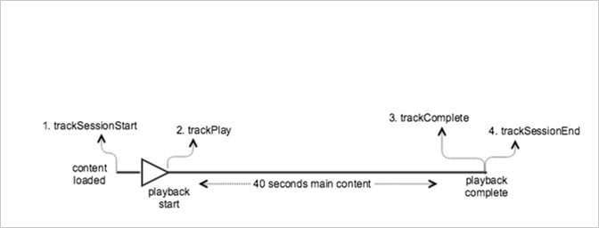

# VOD playback with no ads{#vod-playback-with-no-ads}

## Scenario {#scenario}

This scenario has one VOD asset, with no ads, which is played once from beginning to end. 

|  Trigger  | Heartbeat method  | Network calls  | Notes&nbsp;&nbsp;  |
|---|---|---|---|
|  User clicks **[!UICONTROL Play]** | `trackSessionStart`  | Analytics Content Start, Heartbeat Content Start  | This can be either a user clicking Play or an auto-play event.  |
|  First frame of the media  | `trackPlay`  | Heartbeat Content Play  | This method triggers the timer, and from this point forward, heartbeats will be sent every 10 seconds for the duration of the playback.  |
|  Content plays  |  | Content Heartbeats  |  |
|  Content is complete  | `trackComplete`  | Heartbeat Content Complete  | *Complete* means that the end of the playhead was reached.  |

## Parameters {#parameters}

Many of the same values that you see on Heartbeat Content Start Calls are also seen on Adobe Analytics `Content Start` Calls. There are many parameters that Adobe uses to populate the various media reports, but only the most important parameters are listed in the following table: 

### Heartbeat Content Start

|  Parameter  | Value  | Notes&nbsp;&nbsp;  |
|---|---|---|
|  `s:sc:rsid`  | &lt;Your Adobe Report Suite ID&gt;  |  |
|  `s:sc:tracking_server`  | &lt;Your Analytics Tracking Server URL&gt;  |  |
|  `s:user:mid`  | must be set  | Should match the mid value on the `Adobe Analytics Content Start` call.  |
|  `s:event:type`  | `"start"`  |  |
|  `s:asset:type`  | `"main"`  |  |
|  `s:asset:media_id`  | &lt;Your Media Name&gt;  |  |
|  `s:meta:*`  | optional  | Custom metadata that is set on the media.  |

## Heartbeat Content Play {#heartbeat-content-play}

These parameters should look nearly identical to the `Heartbeat Content Start` call, but the key difference is the `s:event:type` parameter. All of the other parameters should still exist.

|  Parameter  | Value  | Notes&nbsp;&nbsp;  |
|---|---|---|
|  `s:event:type`  | `"play"`  |  |
|  `s:asset:type`  | `"main"`  |  |

## Content heartbeats {#content-heartbeats}

During media playback, a timer sends at least one heartbeat every 10 seconds. These heartbeats contain information about playback, ads, buffering, and so on. The exact content of each heartbeat is beyond the scope of this document, but the critical issue is that heartbeats are triggered consistently while playback continues.

In the content heartbeats, look for the following parameters: 

|  Parameters  | Value  | Notes&nbsp;&nbsp;  |
|---|---|---|
|  `s:event:type`  | `"play"`  |  |
|  `l:event:playhead`  | &lt;playhead position&gt; e.g., 50,60,70  | This parameter reflects the current position of the playhead.  |

## Heartbeat Content Complete {#heartbeat-content-complete}

When playback has completed, which means that the end of the playhead is reached, a `Heartbeat Content Complete` call is sent. This call looks like other Heartbeat calls, but it contains some specific parameters:

|  Parameters  | Value  | Notes&nbsp;&nbsp;  |
|---|---|---|
|  `s:event:type`  | `"complete"`  |  |
|  `s:asset:type`  | `"main"`  |  |

## Sample Code {#sample-code}

In this scenario, the content is 40 seconds long. It is played until the end without any interruptions.



### Android

```java
// Set up  mediaObject 
MediaObject mediaInfo = MediaHeartbeat.createMediaObject( 
  Configuration.MEDIA_NAME,  
  Configuration.MEDIA_ID,  
  Configuration.MEDIA_LENGTH,  
  MediaHeartbeat.StreamType.VOD 
); 

HashMap<String, String> mediaMetadata = new HashMap<String, String>(); 
mediaMetadata.put(CUSTOM_VAL_1, CUSTOM_KEY_1); 
mediaMetadata.put(CUSTOM_VAL_2, CUSTOM_KEY_2); 

// 1. Call trackSessionStart() when the user clicks Play or if autoplay  
//    is used, i.e., there's an intent to start playback.  
_mediaHeartbeat.trackSessionStart(mediaInfo, mediaMetadata); 

...... 
...... 

// 2. Call trackPlay() when the playback actually starts,  
//    i.e., the first frame of media is rendered on the screen.  
_mediaHeartbeat.trackPlay(); 

....... 
....... 

// 3. Call trackComplete() when the playback reaches the end,  
//    i.e., when the media completes and finishes playing.  
_mediaHeartbeat.trackComplete(); 

........ 
........ 

// 4. Call trackSessionEnd() when the playback session is over.  
//    This method must be called even if the user does not watch  
//    the media to completion.  
_mediaHeartbeat.trackSessionEnd(); 

........ 
........ 

```

### iOS

```
when the user clicks Play 
ADBMediaObject *mediaObject =  
[ADBMediaHeartbeat createMediaObjectWithName:MEDIA_NAME  
                   length:MEDIA_LENGTH  
                   streamType:ADBMediaHeartbeatStreamTypeVOD]; 

NSMutableDictionary *mediaContextData = [[NSMutableDictionary alloc] init]; 
[mediaContextData setObject:CUSTOM_VAL_1 forKey:CUSTOM_KEY_1]; 
[mediaContextData setObject:CUSTOM_VAL_2 forKey:CUSTOM_KEY_2]; 

// 1. Call trackSessionStart when the user clicks Play or if autoplay is used,  
//    i.e., there's an intent to start playback. 
[_mediaHeartbeat trackSessionStart:mediaObject data:mediaContextData]; 
...... 
...... 

// 2. Call trackPlay when the playback actually starts, i.e., when the  
//    first frame of main content is rendered on the screen. 
[_mediaHeartbeat trackPlay]; 
....... 
....... 

// 3. Call trackComplete when the playback reaches the end, i.e.,  
//    when the media completes and finishes playing. 
[_mediaHeartbeat trackComplete]; 
........ 
........ 

// 4. Call trackSessionEnd when the playback session is over. This method  
//    must be called even if the user does not watch the media to completion. 
[_mediaHeartbeat trackSessionEnd]; 
........ 
........ 

```

### JavaScript

```js
// Set up mediaObject 

var mediaInfo = MediaHeartbeat.createMediaObject(Configuration.MEDIA_NAME, Configuration.MEDIA_ID,  
Configuration.MEDIA_LENGTH,MediaHeartbeat.StreamType.VOD); 
var mediaMetadata = { 
  CUSTOM_KEY_1 : CUSTOM_VAL_1,  
  CUSTOM_KEY_2 : CUSTOM_VAL_2,  
  CUSTOM_KEY_3 : CUSTOM_VAL_3 

}; 

// 1. Call trackSessionStart() when the user clicks play, or when autoplay is used,  
//    i.e., there's an intent to start playback. 
this._mediaHeartbeat.trackSessionStart(mediaInfo, mediaMetadata); 

...... 
...... 

// 2. Call trackPlay() when the main content starts, i.e.,  
//    the first frame of the media content is rendered on the screen. 
this._mediaHeartbeat.trackPlay(); 

....... 
....... 

// 3. Call trackComplete() when the playback reaches the end,  
    i.e., the media completes and finishes playing. 
this._mediaHeartbeat.trackComplete(); 

........ 
........ 

// 4. Call trackSessionEnd() when the playback session is over.  
//    This method must be called even if the user does not  
//    watch the media to completion. 
this._mediaHeartbeat.trackSessionEnd(); 

........ 
........
```
