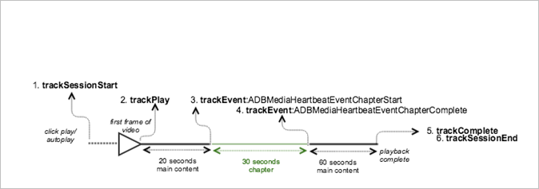
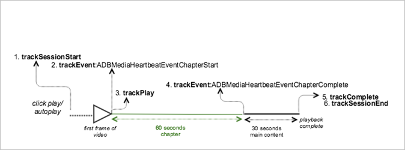

# VOD playback with one chapter{#vod-playback-with-one-chapter}

## Scenario {#scenario}

In this scenario, a portion of the VOD content is marked as a chapter.

Unless specified, the network calls in this scenario are the same as the calls in the [VOD playback with no ads](/help/sdk-implement/tracking-scenarios/vod-no-intrs-details.md) scenario. The network call happens at the same time, but the payload is different. 

|  Trigger&nbsp;&nbsp;  | Heartbeat method&nbsp;&nbsp;  | Network calls&nbsp;&nbsp;  | Notes&nbsp;&nbsp;  |
|---|---|---|---|
|  User clicks **[!UICONTROL Play]** | `trackSessionStart`  | Analytics Content Start, Heartbeat Content Start  | We have not yet told the measurement library that there is a pre-roll ad, so these network calls are still exactly the same as Single VoD.  |
|  The chapter starts.  | `trackEvent:ChapterStart`  | Heartbeat Chapter Start  |  |
|  First frame of the chapter plays.  | `trackPlay`  | Heartbeat Content Play  | When chapter content plays before main content, the Heartbeats start when the chapter starts.  |
|  The chapter plays.  |  | Chapter Heartbeats  |  |
|  The chapter is complete.  | `trackEvent:trackChapterComplete`  | Heartbeat Chapter Complete  | This is when the end of the chapter is reached.  |
|  The content plays.  |  | Content Heartbeats  | This network call is exactly the same as the [VOD playback with no ads](/help/sdk-implement/tracking-scenarios/vod-no-intrs-details.md) scenario.  |
|  The content is complete.  | `trackComplete`  | Heartbeat Content Complete  | This network call is exactly the same as the [VOD playback with no ads](/help/sdk-implement/tracking-scenarios/vod-no-intrs-details.md) scenario.  |
|  The session is over.  | `trackSessionEnd`  |  | `SessionEnd` means that the end of a viewing session has been reached. This API must be called even if the user does not watch the media to completion.  |

## Parameters {#parameters}

When chapter playback begins, a `Heartbeat Chapter Start` call is sent. If the beginning of the chapter does not coincide with the 10-second timer, the `Heartbeat Chapter Start` call is delayed by a few seconds, and the call goes to the next 10-second interval.

When this happens, a `Content Heartbeat` call goes out in the same interval. You can differentiate between the two by examining the event type and the asset type: 

### Heartbeat Chapter Start

|  Parameter  | Value  | Notes  |
|---|---|---|
|  `s:event:type`  | `"chapter_start"`  |  |
|  `s:asset:type`  | `"main"`  |  |
|  `s:stream:chapter_*`  |  | Stream information that is specific to the chapter data.  |
|  `s:meta:*`  |  | Chapter with specific context data.  |

## Sample code, chapter in the middle {#sample-code-chapter-in-the-middle}

In this scenario, part of the VOD content is a chapter.



### Android 

To view this scenario in Android, set up the following code: 

```java
// Set up mediaObject 
MediaObject mediaInfo = MediaHeartbeat.createMediaObject( 
  Configuration.MEDIA_NAME,  
  Configuration.MEDIA_ID,  
  Configuration.MEDIA_LENGTH,  
  MediaHeartbeat.StreamType.VOD 
); 

HashMap<String, String> mediaMetadata = new HashMap<String, String>(); 
mediaMetadata.put(CUSTOM_KEY_1, CUSTOM_VAL_1); 
mediaMetadata.put(CUSTOM_KEY_2, CUSTOM_VAL_2); 

// 1. Call trackSessionStart() when the user clicks Play or if autoplay is used,  
//    i.e., there is an intent to start playback.  
_mediaHeartbeat.trackSessionStart(mediaInfo, mediaMetadata); 

...... 
...... 

// 2. Call trackPlay() when the playback actually starts, i.e., first frame of the  
//    ad media is rendered on the screen. 
_mediaHeartbeat.trackPlay(); 

....... 
....... 

// Chapter 
HashMap<String, String> chapterMetadata = new HashMap<String, String>(); 
chapterMetadata.put(CUSTOM_KEY_1, CUSTOM_VAL_1); 
MediaObject chapterDataInfo =  
MediaHeartbeat.createChapterObject(CHAPTER_NAME,  
                                   CHAPTER_POSITION,  
                                   CHAPTER_LENGTH,  
                                   CHAPTER_START_TIME); 

// 3. Track the MediaHeartbeat.Event.ChapterStart event when the chapter starts to play.  
_mediaHeartbeat.trackEvent(MediaHeartbeat.Event.ChapterStart, chapterDataInfo, chapterMetadata); 

....... 
....... 

// 4. Track the MediaHeartbeat.Event.ChapterComplete event when the chapter finishes playing. 
_mediaHeartbeat.trackEvent(MediaHeartbeat.Event.ChapterComplete, null, null); 

....... 
....... 

// 5. Call trackComplete() when the playback reaches the end, i.e., completes and finishes playing. 
_mediaHeartbeat.trackComplete(); 

........ 
........ 

// 6. Call trackSessionEnd() when the playback session is over. This method must be called even  
//    if the user does not watch the media to completion.  
_mediaHeartbeat.trackSessionEnd(); 

........ 
........ 
```

### iOS 

To view this scenario in iOS, set up the following code: 

```
when the user clicks Play 
ADBMediaObject *mediaObject =  
[ADBMediaHeartbeat createMediaObjectWithName:MEDIA_NAME  
                   length:MEDIA_LENGTH  
                   streamType:ADBMediaHeartbeatStreamTypeVOD]; 
  
NSMutableDictionary *mediaContextData = [[NSMutableDictionary alloc] init]; 
[mediaContextData setObject:CUSTOM_VAL_1 forKey:CUSTOM_KEY_1]; 
[mediaContextData setObject:CUSTOM_VAL_2 forKey:CUSTOM_KEY_2]; 
 
// 1. Call trackSessionStart when the user clicks Play or if autoplay is used,  
//    i.e., when there is an intent to start playback. 
[_mediaHeartbeat trackSessionStart:mediaObject data:mediaContextData]; 
....... 
....... 

// 2. Call trackPlay when the playback actually starts, i.e., when the  
//    first frame of the main content is rendered on the screen. 
[_mediaHeartbeat trackPlay]; 
....... 
....... 

// Chapter 
NSMutableDictionary *chapterContextData = [[NSMutableDictionary alloc] init]; 
[chapterContextData setObject:CONTEXT_DATA_VALUE forKey:CONTEXT_DATA_KEY]; 

id chapterInfo =  
[ADBMediaHeartbeat createChapterObjectWithName:CHAPTER_NAME  
                   position:CHAPTER_POSITION  
                   length:CHAPTER_LENGTH  
                   startTime:CHAPTER_START_TIME]; 
    
// 3. Track the ADBMediaHeartbeatEventChapterStart event when the chapter  
//    starts to play. 
[_mediaHeartbeat trackEvent:ADBMediaHeartbeatEventChapterStart  
               mediaObject:chapterInfo  
               data:chapterContextData]; 
....... 
....... 

// 4. Track the ADBMediaHeartbeatEventChapterComplete event when the chapter  
//    finishes playing. 
[_mediaHeartbeat trackEvent:ADBMediaHeartbeatEventChapterComplete  
               mediaObject:nil  
               data:nil];  
....... 
....... 
// 5. Call trackComplete when the playback reaches the end, i.e., when the  
//    media completes and finishes playing. 
[_mediaHeartbeat trackComplete]; 
....... 
....... 
// 6. Call trackSessionEnd when the playback session is over. This method must  
//    be called even if the user does not watch the media to completion. 
[_mediaHeartbeat trackSessionEnd]; 
....... 
....... 
```

### JavaScript 

To view this scenario in JavaScript, enter the following text: 

```js
// Set up mediaObject 
var mediaInfo = MediaHeartbeat.createMediaObject( 
 Configuration.MEDIA_NAME,  
 Configuration.MEDIA_ID,  
 Configuration.MEDIA_LENGTH,  
 MediaHeartbeat.StreamType.VOD 

); 

var mediaMetadata = { 
  CUSTOM_KEY_1 : CUSTOM_VAL_1,  
  CUSTOM_KEY_2 : CUSTOM_VAL_2,  
  CUSTOM_KEY_3 : CUSTOM_VAL_3 
}; 

// 1. Call trackSessionStart when Play is clicked or if autoplay is used,  
//    i.e., when there's an intent to start playback. 
this._mediaHeartbeat.trackSessionStart(mediaInfo, mediaMetadata); 

...... 
...... 

// Chapter 
var chapterMetadata = { 
  CUSTOM_KEY_1 : CUSTOM_VAL_1 
}; 

var chapterDataInfo =  
MediaHeartbeat.createChapterObject(CHAPTER_NAME,  
                                   CHAPTER_POSITION,  
                                   CHAPTER_LENGTH,  
                                   CHAPTER_START_TIME); 

// 2. Track the MediaHeartbeat.Event.ChapterStart event when the chapter  
//    starts to play. 
this._mediaHeartbeat.trackEvent(MediaHeartbeat.Event.ChapterStart,  
                              chapterDataInfo,  
                              chapterMetadata); 

....... 
....... 

// 3. Call trackPlay() when the playback actually starts, i.e., when the first  
//    frame of the main content is rendered on the screen. 
this._mediaHeartbeat.trackPlay(); 

....... 
....... 

// 4. Track the MediaHeartbeat.Event.ChapterComplete event when the chapter  
//    finishes playing. 
this._mediaHeartbeat.trackEvent(MediaHeartbeat.Event.ChapterComplete); 

....... 
....... 

// 5. Call trackComplete() when the playback reaches the end, i.e., when playback   
//    completes and finishes playing. 
this._mediaHeartbeat.trackComplete(); 

........ 
........ 

// 6. Call trackSessionEnd() when the playback session is over. This method must be  
//    called even if the user does not watch the media to completion. 
this._mediaHeartbeat.trackSessionEnd(); 

........ 
........ 
```

## Sample code, chapter at the beginning {#sample-code-chapter-at-the-beginning}

In this scenario, VOD content is played back with one chapter at the beginning of the playback.



### Android 

To view this scenario in Android, set up the following code:

```java
// Set up mediaObject 
MediaObject mediaInfo = MediaHeartbeat.createMediaObject( 
  Configuration.MEDIA_NAME,  
  Configuration.MEDIA_ID,  
  Configuration.MEDIA_LENGTH,  
  MediaHeartbeat.StreamType.VOD 
); 

HashMap<String, String> mediaMetadata = new HashMap<String, String>(); 
mediaMetadata.put(CUSTOM_KEY_1, CUSTOM_VAL_1); 
mediaMetadata.put(CUSTOM_KEY_2, CUSTOM_VAL_2); 

// 1. Call trackSessionStart() when the user clicks Play or if autoplay is used,  
//    i.e., there is an intent to start playback.  
_mediaHeartbeat.trackSessionStart(mediaInfo, mediaMetadata); 

...... 
...... 

// 2. Call trackPlay() when the playback actually starts, i.e., first frame of the  
//    main content is rendered on the screen. 
_mediaHeartbeat.trackPlay(); 

....... 
....... 

// Chapter 
HashMap<String, String> chapterMetadata = new HashMap<String, String>(); 
chapterMetadata.put(CUSTOM_KEY_1, CUSTOM_VAL_1); 
MediaObject chapterDataInfo =  
MediaHeartbeat.createChapterObject(CHAPTER_NAME,  
                                   CHAPTER_POSITION,  
                                   CHAPTER_LENGTH,  
                                   CHAPTER_START_TIME); 

// 3. Track the MediaHeartbeat.Event.ChapterStart event when the chapter starts to play.  
_mediaHeartbeat.trackEvent(MediaHeartbeat.Event.ChapterStart, chapterDataInfo, chapterMetadata); 

....... 
....... 

// 4. Track the MediaHeartbeat.Event.ChapterComplete event when the chapter finishes playing. 
_mediaHeartbeat.trackEvent(MediaHeartbeat.Event.ChapterComplete, null, null); 

....... 
....... 

// 5. Call trackComplete() when the playback reaches the end, i.e., when the media completes  
//    and finishes playing. 
_mediaHeartbeat.trackComplete(); 

........ 
........ 

// 6. Call trackSessionEnd() when the playback session is over. This method must be called even  
//    if the user does not watch the media to completion.  
_mediaHeartbeat.trackSessionEnd(); 

........ 
........ 
```

### iOS 

To view this scenario in iOS, set up the following code: 

```
when the user clicks Play 
ADBMediaObject *mediaObject =  
[ADBMediaHeartbeat createMediaObjectWithName:MEDIA_NAME  
                   length:MEDIA_LENGTH  
                   streamType:ADBMediaHeartbeatStreamTypeVOD]; 
 
NSMutableDictionary *mediaContextData = [[NSMutableDictionary alloc] init]; 
[mediaContextData setObject:CUSTOM_VAL_1 forKey:CUSTOM_KEY_1]; 
[mediaContextData setObject:CUSTOM_VAL_2 forKey:CUSTOM_KEY_2]; 

// 1. Call trackSessionStart when the user clicks Play or if autoplay is used,  
//    i.e., there is an intent to start playback. 
[_mediaHeartbeat trackSessionStart:mediaObject data:mediaContextData]; 
....... 
....... 

// Chapter 
NSMutableDictionary *chapterContextData = [[NSMutableDictionary alloc] init]; 
[chapterContextData setObject:CONTEXT_DATA_VALUE forKey:CONTEXT_DATA_KEY]; 

id chapterInfo =  
[ADBMediaHeartbeat createChapterObjectWithName:CHAPTER_NAME  
                   position:CHAPTER_POSITION  
                   length:CHAPTER_LENGTH  
                   startTime:CHAPTER_START_TIME]; 
    
// 2. Call ADBMediaHeartbeatEventChapterStart when the chapter starts. 
[_mediaHeartbeat trackEvent:ADBMediaHeartbeatEventChapterStart  
               mediaObject:chapterInfo  
               data:chapterContextData]; 
....... 
....... 

// 3. Call trackPlay when the playback actually starts, i.e., when the 
//    first frame of the main content is rendered on the screen. 
[_mediaHeartbeat trackPlay];  
....... 
....... 

// 4. Call ADBMediaHeartbeatEventChapterComplete when the chapter starts. 
[_mediaHeartbeat trackEvent:ADBMediaHeartbeatEventChapterComplete  
               mediaObject:nil  
               data:nil];  
....... 
....... 

// 5. Call trackComplete when the playback reaches the end, i.e., when the 
//    media completes and finishes playing. 
[_mediaHeartbeat trackComplete]; 
....... 
....... 

// 6. Call trackSessionEnd when the playback session is over. This method  
//    must be called even if the user does not watch the media to completion. 
[_mediaHeartbeat trackSessionEnd]; 
....... 
....... 
```

### JavaScript 

To view this scenario in JavaScript, enter the following text: 

```js
// Set up mediaObject 
var mediaInfo = MediaHeartbeat.createMediaObject( 
 Configuration.MEDIA_NAME,  
 Configuration.MEDIA_ID,  
 Configuration.MEDIA_LENGTH,  
 MediaHeartbeat.StreamType.VOD 

); 

var mediaMetadata = { 
  CUSTOM_KEY_1 : CUSTOM_VAL_1,  
  CUSTOM_KEY_2 : CUSTOM_VAL_2,  
  CUSTOM_KEY_3 : CUSTOM_VAL_3 
}; 

// 1. Call trackSessionStart() when Play is clicked or if autoplay is used,  
//    i.e., when there's an intent to start playback. 
this._mediaHeartbeat.trackSessionStart(mediaInfo, mediaMetadata); 

...... 
...... 

// Chapter 
var chapterMetadata = { 
  CUSTOM_KEY_1 : CUSTOM_VAL_1 
}; 

var chapterDataInfo =  
MediaHeartbeat.createChapterObject(CHAPTER_NAME,  
                                   CHAPTER_POSITION,  
                                   CHAPTER_LENGTH,  
                                   CHAPTER_START_TIME); 

// 2. Track the MediaHeartbeat.Event.ChapterStart event when the chapter starts to play. 
this._mediaHeartbeat.trackEvent(MediaHeartbeat.Event.ChapterStart,  
                              chapterDataInfo,  
                              chapterMetadata); 

....... 
....... 

// 3. Call trackPlay() when the playback actually starts, i.e., when the first  
//    frame of the main content is rendered on the screen. 
this._mediaHeartbeat.trackPlay(); 

....... 
....... 

// 4. Track the MediaHeartbeat.Event.ChapterComplete event when the chapter  
//    finishes playing. 
this._mediaHeartbeat.trackEvent(MediaHeartbeat.Event.ChapterComplete); 

....... 
....... 

// 5. Call trackComplete() when the playback reaches the end, i.e., when playback   
//    completes and finishes playing. 
this._mediaHeartbeat.trackComplete(); 

........ 
........ 

// 6. Call trackSessionEnd() when the playback session is over. This method must be  
//    called even if the user does not watch the media to completion. 
this._mediaHeartbeat.trackSessionEnd(); 

........ 
........ 
```

