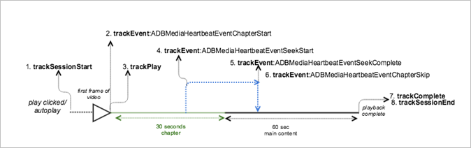

# VOD playback with a skipped chapter{#vod-playback-with-a-skipped-chapter}

## Scenario {#scenario}

In this scenario, the user skips a chapter in the main content.

This is the same scenario as [VOD playback with one chapter](/help/sdk-implement/tracking-scenarios/vod-one-chapter.md), except the user in this case intends to seek out of the chapter thereby skipping it to land into main content. 

|  Trigger  | Heartbeat method  | Network calls&nbsp;&nbsp;  | Notes  |
|---|---|---|---|
|  User clicks **[!UICONTROL Play]** | `trackSessionStart`  | Analytics Content Start, Heartbeat Content Start  | The measurement library is unaware that there is a pre-roll ad. These network calls are still exactly the same as [Playback with no interruptions in iOS](vod-no-intrs-details.md) scenario.  |
|  The chapter starts.  | `trackEvent:ChapterStart`  | Heartbeat Chapter Start  |  |
|  The first frame of the chapter is played.  | `trackPlay`  | Heartbeat Chapter Play  | When chapter content plays before main content, we want to start the heartbeats when the chapter starts.  |
|  The chapter plays.  |  | Chapter Heartbeats  |  |
|  Seek begins to skip the first chapter.  | `trackEvent:trackSeekStart`  |  | No heartbeats during seeking  |
|  The seek is complete.  | `trackEvent:trackSeekComplete`  |  | Heartbeats would resume post this.  |
|  The application realizes that the user has seeked out of the regular chapter boundary.  | `trackEvent:trackChapterSkip`  |  |  |
|  The content plays.  |  | Content Heartbeats  |  |
|  The content completes playing.  | `trackComplete`  | Heartbeat Content Complete  | This network call is exactly the same as the [Playback with no interruptions in iOS](vod-no-intrs-details.md) scenario.  |
|  The session is over.  | `trackSessionEnd`  |  | `SessionEnd` means the end of a viewing session. This API must be called even if the user does not watch the media to completion.  |

## Parameters {#parameters}

The parameters used during chapter playback are identical to the parameters in the [VOD playback with one chapter](/help/sdk-implement/tracking-scenarios/vod-one-chapter.md) scenario, except that there is no chapter complete network call.

## Sample code {#sample-code}



### Android 

To view this scenario in Android, set up the following code:

```java
// Set up mediaObject 
MediaObject mediaInfo = MediaHeartbeat.createMediaObject( 
  Configuration.MEDIA_NAME,  
  Configuration.MEDIA_ID,  
  Configuration.MEDIA_LENGTH,  
  MediaHeartbeat.StreamType.VOD 

); 

HashMap<String, String> mediaMetadata = new HashMap<String, String>(); 
mediaMetadata.put(CUSTOM_KEY_1, CUSTOM_VAL_1); 
mediaMetadata.put(CUSTOM_KEY_2, CUSTOM_VAL_2); 

// 1. Call trackSessionStart() when the user clicks Play or if autoplay is used,  
//    i.e., there is an intent to start playback.  
_mediaHeartbeat.trackSessionStart(mediaInfo, mediaMetadata); 

...... 
...... 

// Chapter 
HashMap<String, String> chapterMetadata = new HashMap<String, String>(); 
chapterMetadata.put(CUSTOM_KEY_1, CUSTOM_VAL_1); 
MediaObject chapterDataInfo =  
MediaHeartbeat.createChapterObject(CHAPTER_NAME,  
                                   CHAPTER_POSITION,  
                                   CHAPTER_LENGTH,  
                                   CHAPTER_START_TIME); 

// 2. Track the MediaHeartbeat.Event.ChapterStart event when the chapter starts to play.  
_mediaHeartbeat.trackEvent(MediaHeartbeat.Event.ChapterStart,  
                         chapterDataInfo,  
                         chapterMetadata); 

....... 
....... 

// 3. Call trackPlay() when the playback actually starts, i.e., when the first frame  
//    of the main content is rendered on the screen.  
_mediaHeartbeat.trackPlay(); 

....... 
....... 

// 4. Track the MediaHeartbeat.Event.SeekStart event when the user begins to seek out  
//    of the chapter with the intent to skip it.  
_mediaHeartbeat.trackEvent(MediaHeartbeat.Event.SeekStart, null, null); 

....... 
....... 

// 5. Track the MediaHeartbeat.Event.SeekComplete event when the user seeks out of the  
//    chapter with the intent to skip it.  
_mediaHeartbeat.trackEvent(MediaHeartbeat.Event.SeekComplete, null, null); 

....... 
....... 

// 6. Track the MediaHeartbeat.Event.ChapterSkip event because the user skipped the  
//    chapter by seeking out of it in the steps above.  
_mediaHeartbeat.trackEvent(MediaHeartbeat.Event.ChapterSkip, null, null); 

....... 
....... 

// 7. Call trackComplete() when the playback reaches the end, i.e., when the media 
//    completes and finishes playing.  
_mediaHeartbeat.trackComplete(); 

........ 

........ 

// 8. Call trackSessionEnd() when the playback session is over. This method must be  
//    called even if the user does not watch the media to completion.  
_mediaHeartbeat.trackSessionEnd(); 

........ 
........ 
```

### iOS 

To view this scenario in iOS, set up the following code: 

```
// Set up mediaObject 
ADBMediaObject *mediaObject =  
[ADBMediaHeartbeat createMediaObjectWithName:MEDIA_NAME  
                   length:MEDIA_LENGTH  
                   streamType:ADBMediaHeartbeatStreamTypeVOD]; 
 
NSMutableDictionary *mediaContextData = [[NSMutableDictionary alloc] init]; 
[mediaContextData setObject:CUSTOM_VAL_1 forKey:CUSTOM_KEY_1]; 
[mediaContextData setObject:CUSTOM_VAL_2 forKey:CUSTOM_KEY_2]; 

// 1. Call trackSessionStart when the user clicks Play or if autoplay is used,  
//    i.e., there's an intent to start playback. 
[_mediaHeartbeat trackSessionStart:mediaObject data:mediaContextData]; 
....... 
....... 
 
// Chapter 
NSMutableDictionary *chapterContextData = [[NSMutableDictionary alloc] init]; 
[chapterContextData setObject:CONTEXT_DATA_VALUE forKey:CONTEXT_DATA_KEY]; 
 
id chapterInfo =  
[ADBMediaHeartbeat createChapterObjectWithName:CHAPTER_NAME  
                   position:CHAPTER_POSITION  
                   length:CHAPTER_LENGTH  
                   startTime:CHAPTER_START_TIME]; 
    
// 2. Track the ADBMediaHeartbeatEventChapterStart event when the chapter starts. 
[_mediaHeartbeat trackEvent:ADBMediaHeartbeatEventChapterStart  
               mediaObject:chapterInfo  
               data:chapterContextData]; 
....... 
....... 

// 3. Call trackPlay when the playback actually starts, i.e., when the first  
//    frame of the main content is rendered on the screen. 
[_mediaHeartbeat trackPlay]; 
....... 
....... 

// 4. Track the trackEvent:ADBMediaHeartbeatEventSeekStart event when the user  
//    begins to seek out of the chapter with the intent to skip it. 
[_mediaHeartbeat trackEvent:ADBMediaHeartbeatEventSeekStart mediaObject:nil data:nil]; 
....... 
....... 

// 5. Track the trackEvent:ADBMediaHeartbeatEventSeekComplete event when the  
//    user seeks out of the chapter with the intent to skip it. 
[_mediaHeartbeat trackEvent:ADBMediaHeartbeatEventSeekComplete mediaObject:nil data:nil]; 
....... 
....... 

// 6. Track the trackEvent:ADBMediaHeartbeatEventChapterSkip event because the  
//    user skipped the chapter by seeking out of it in the steps above. 
[_mediaHeartbeat trackEvent:ADBMediaHeartbeatEventChapterSkip  
               mediaObject:chapterInfo  
               data:chapterContextData]; 
....... 
....... 
 
// 7. Call trackComplete when the playback reaches the end, i.e., when the media 
//    completes and finishes playing. 
[_mediaHeartbeat trackComplete]; 
....... 
....... 

// 8. Call trackSessionEnd when the playback session is over. This method must  
//    be called even if the user does not watch the media to completion. 
[_mediaHeartbeat trackSessionEnd]; 
....... 
....... 
```

### JavaScript 

To view this scenario in JavaScript, enter the following text: 

```js
// Set up mediaObject 
var mediaInfo = MediaHeartbeat.createMediaObject( 
  Configuration.MEDIA_NAME,  
  Configuration.MEDIA_ID,  
  Configuration.MEDIA_LENGTH,  
  MediaHeartbeat.StreamType.VOD 
); 

var mediaMetadata = { 
  CUSTOM_KEY_1 : CUSTOM_VAL_1,  
  CUSTOM_KEY_2 : CUSTOM_VAL_2,  
  CUSTOM_KEY_3 : CUSTOM_VAL_3 

}; 

// 1. Call trackSessionStart() when Play is clicked or if autoplay is used,  
//    i.e., there's an intent to start playback. 
this._mediaHeartbeat.trackSessionStart(mediaInfo, mediaMetadata); 

...... 
...... 

// Chapter 
var chapterMetadata = { 
  CUSTOM_KEY_1 : CUSTOM_VAL_1 
}; 

var chapterDataInfo =  
MediaHeartbeat.createChapterObject(CHAPTER_NAME,  
                                  CHAPTER_POSITION,  
                                  CHAPTER_LENGTH,  
                                  CHAPTER_START_TIME); 

// 2. Track the MediaHeartbeat.Event.ChapterStart event when the chapter starts to play. 
this._mediaHeartbeat.trackEvent(MediaHeartbeat.Event.ChapterStart,  
                              chapterDataInfo,  
                              chapterMetadata); 

....... 
....... 

// 3. Call trackPlay() when the playback actually starts, i.e., when the  
//    first frame of the main content is rendered on the screen. 
this._mediaHeartbeat.trackPlay(); 

....... 
....... 

// 4. Track the MediaHeartbeat.Event.SeekStart event when the user begins  
//    to seek out of the chapter with the intent to skip it. 
this._mediaHeartbeat.trackEvent(MediaHeartbeat.Event.SeekStart); 

....... 
....... 

// 5. Track the MediaHeartbeat.Event.SeekComplete event when the user seeks  
//    out of the chapter with the intent to skip it. 
this._mediaHeartbeat.trackEvent(MediaHeartbeat.Event.SeekComplete); 

....... 
....... 

// 6. Track the MediaHeartbeat.Event.ChapterSkip event because the user  
//    skipped the chapter by seeking out of it in the steps above. 
this._mediaHeartbeat.trackEvent(MediaHeartbeat.Event.ChapterSkip); 

....... 
....... 

// 7. Call trackComplete() when the playback reaches the end, i.e., completes  
//    and finishes playing. 
this._mediaHeartbeat.trackComplete(); 

........ 
........ 

// 8. Call trackSessionEnd() when the playback session is over. This method must be  
//    called even if the user does not watch the media to completion. 
this._mediaHeartbeat.trackSessionEnd(); 

........ 
........ 
```
