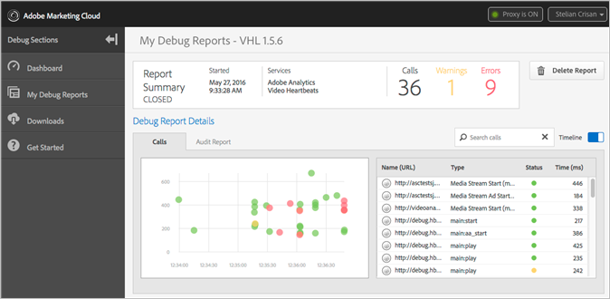

# Debug dashboards and reports{#debug-dashboards-and-reports}

Adobe Debug provides reporting, in real-time, so you can view hits and metadata that are being sent during video playback. Each of these reports can be saved within Debug.

For certification, these reports can be shared by simply copying the URL and sending the link, e.g., within a ZenDesk ticket.

>[!NOTE]
>
>Only one session can be active at a time. The active session can be opened from the Dashboard.

